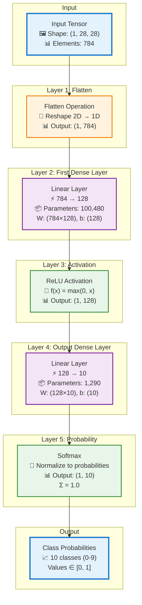
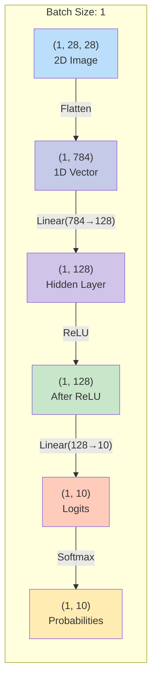
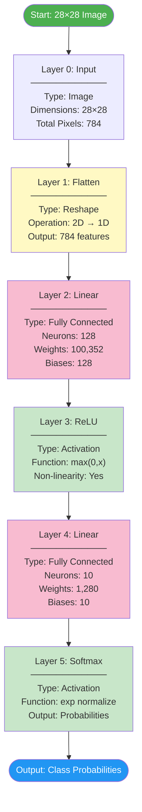
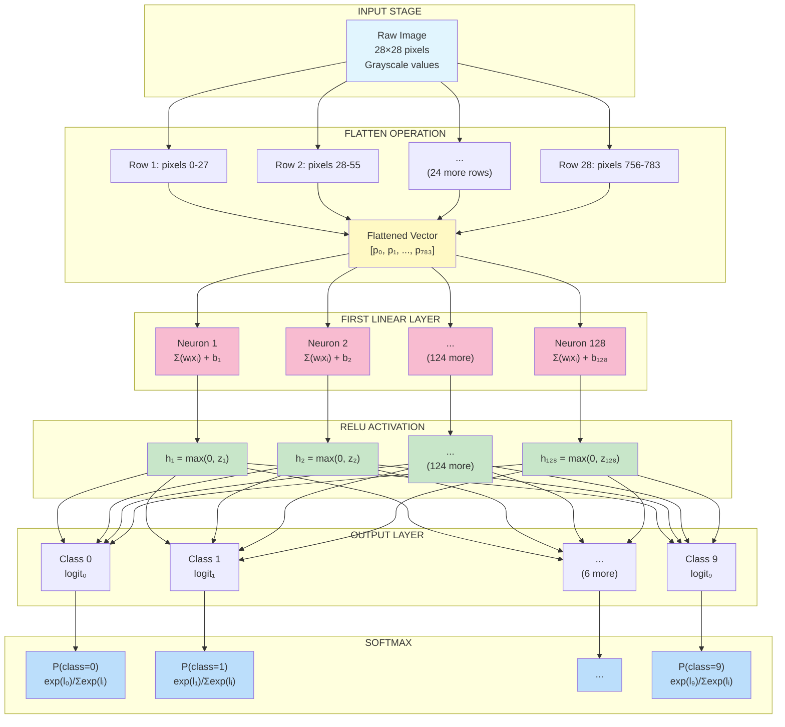
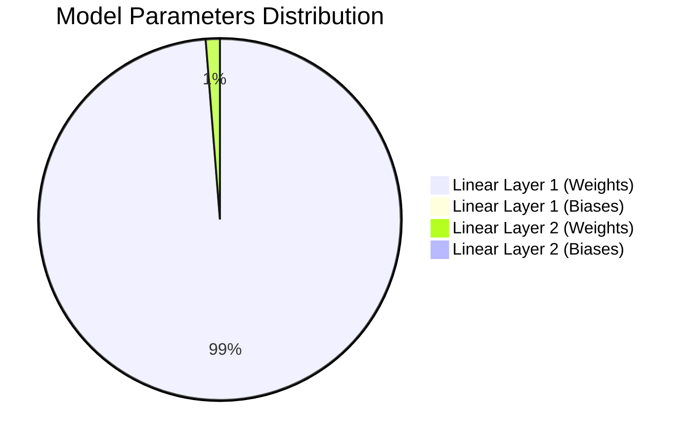
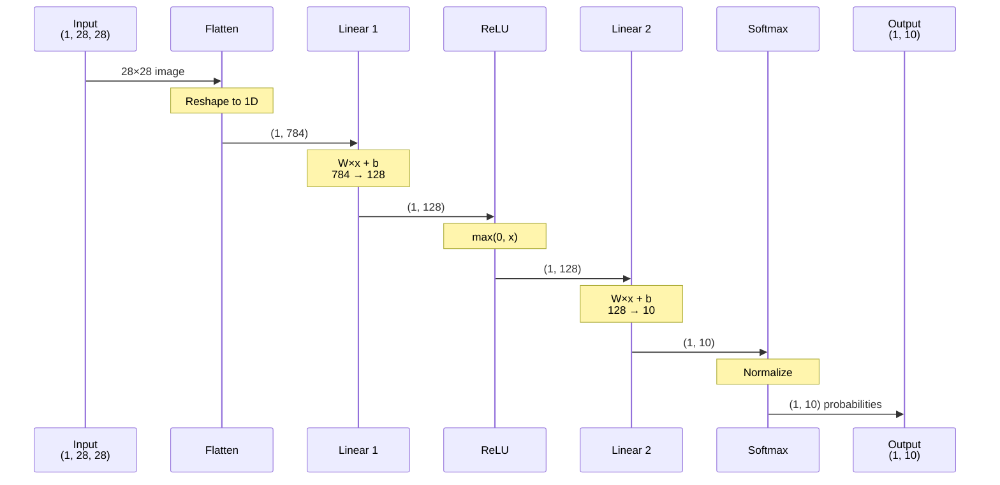
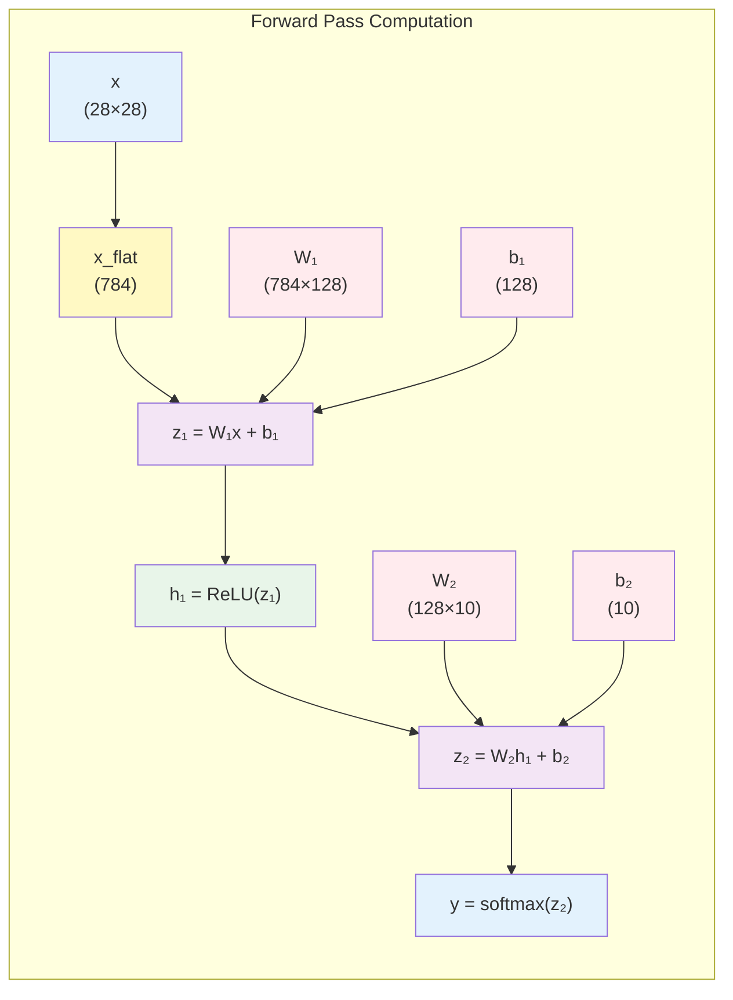
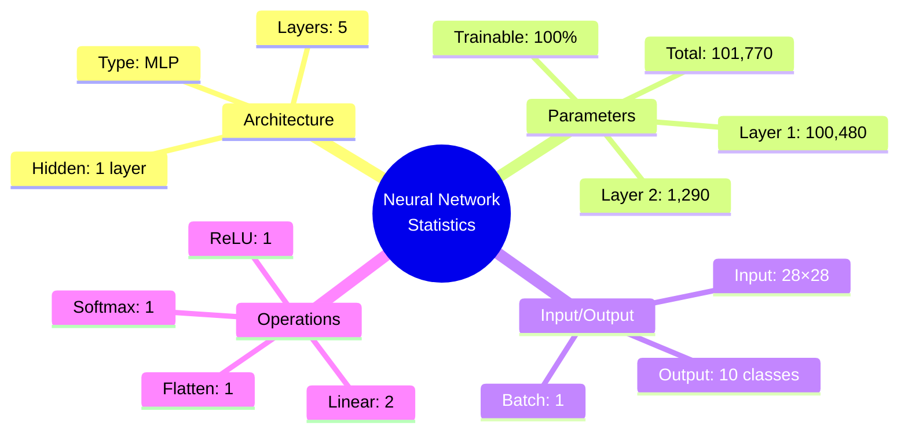
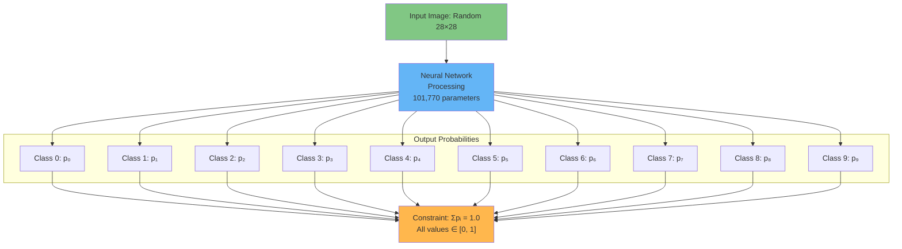

# Neural Network Visualization - Mermaid Diagrams

## Complete Architecture Flow



---

## Tensor Shape Transformations



---

## Network Layer Stack



---

## Detailed Layer Operations



---

## Parameter Distribution



---

## Information Flow with Dimensions



---

## Computation Graph



---

## Network Statistics Summary



---

## Class Output Representation



---

## Summary Table

| Layer | Type | Input Shape | Output Shape | Parameters | Activation |
|-------|------|-------------|--------------|------------|------------|
| 0 | Input | - | (1, 28, 28) | 0 | - |
| 1 | Flatten | (1, 28, 28) | (1, 784) | 0 | - |
| 2 | Linear | (1, 784) | (1, 128) | 100,480 | - |
| 3 | ReLU | (1, 128) | (1, 128) | 0 | max(0,x) |
| 4 | Linear | (1, 128) | (1, 10) | 1,290 | - |
| 5 | Softmax | (1, 10) | (1, 10) | 0 | normalize |

**Total Trainable Parameters: 101,770**

---

## Key Formulas

**Layer 2 (First Linear):**
```
z₁ = W₁ · x_flat + b₁
where W₁ ∈ ℝ^(128×784), b₁ ∈ ℝ^128
```

**Layer 3 (ReLU):**
```
h₁ = max(0, z₁)
```

**Layer 4 (Second Linear):**
```
z₂ = W₂ · h₁ + b₂
where W₂ ∈ ℝ^(10×128), b₂ ∈ ℝ^10
```

**Layer 5 (Softmax):**
```
yᵢ = exp(z₂ᵢ) / Σⱼ exp(z₂ⱼ)
```

---

## Network Characteristics

✅ **Designed for**: MNIST-style digit classification (0-9)  
✅ **Architecture**: Feedforward Neural Network (Multi-Layer Perceptron)  
✅ **Depth**: 5 processing layers  
✅ **Width**: Maximum 128 neurons in hidden layer  
⚠️ **Note**: Including Softmax in model definition may conflict with CrossEntropyLoss (which already includes softmax)

---

Generated for PyTorch Sequential Model
