## Context Optimization and Management via Reinforcement Learning

Context prioritization is a sequential decision problem with unique characteristics:

* Variable-length inputs (available information)

* Limited budget (token/context limit)

* Complex state representation (text embeddings)

* Delayed/sparse rewards (response quality)


**Most Suitable Methods (ranked)**

| Rank | Method | Description | Complexity |
| --- | --- | --- | -- |
| 1 | Attention-Based Policy Networks | Natural fit for selecting from variable sequence; attention weights = prioritization scores | High | 
| 2 | PPO with Learned Embeddings | Handles continuous relevance scores; stable training | Medium-High |
| 3 | DQN with Prioritized Replay | Good for discrete include/exclude decisions | Medium |
| 4 | Contextual Bandits | Simple, fast; good for initial deployment | Low |

**Recommended Approach: Attention-based Policy Gradient (PPO)**

```mermaid
flowchart TB
    subgraph inputs["Input Layer"]
        direction LR
        doc1["📄 Doc 1"]
        doc2["📄 Doc 2"]
        doc3["📄 Doc 3"]
        docN["📄 ..."]
        query["🔍 Query"]
    end

    subgraph attention["Cross-Attention Network"]
        ca["Query attends to<br/>available contexts"]
    end

    subgraph policy["Policy Network - Actor"]
        pn["Outputs priority scores<br/>for each context item"]
    end

    subgraph selection["Knapsack Selection"]
        ks["Select top items<br/>within token budget"]
    end

    subgraph inference["LLM Inference"]
        ctx["Selected Context"]
        llm["LLM"]
        resp["Response"]
        ctx --> llm --> resp
    end

    subgraph reward["Reward Signal"]
        r1["📊 Response quality<br/>user feedback"]
        r2["✅ Task success rate"]
        r3["🎯 Relevance score"]
        r4["💰 Cost efficiency<br/>tokens used"]
    end

    doc1 & doc2 & doc3 & docN --> ca
    query --> ca
    ca --> pn
    pn --> ks
    ks --> ctx
    resp --> r1 & r2 & r3 & r4
    r1 & r2 & r3 & r4 -.->|backprop| pn

    style inputs fill:#e1f5fe,stroke:#01579b
    style attention fill:#fff3e0,stroke:#e65100
    style policy fill:#f3e5f5,stroke:#7b1fa2
    style selection fill:#e8f5e9,stroke:#2e7d32
    style inference fill:#fce4ec,stroke:#c2185b
    style reward fill:#fff8e1,stroke:#f57f17
```




**Method Details**

**1. Attention-based Policy Network** 

```python
# Conceptual architecture
class ContextPrioritizationPolicy(nn.Module):
    def __init__(self, embed_dim=768):
        self.query_encoder = TransformerEncoder(...)
        self.context_encoder = TransformerEncoder(...)
        self.cross_attention = MultiHeadAttention(embed_dim)
        self.priority_head = nn.Linear(embed_dim, 1)  # Relevance score
        
    def forward(self, query, context_items):
        q_emb = self.query_encoder(query)
        c_embs = self.context_encoder(context_items)  # [N, embed_dim]
        
        # Cross-attention: query attends to contexts
        attended = self.cross_attention(q_emb, c_embs, c_embs)
        
        # Priority scores for each context item
        priorities = self.priority_head(attended).squeeze()  # [N]
        return F.softmax(priorities, dim=-1)
```

Attention handles variable-length inputs and learns which contexts are relevant to the query.

**2. PPO (for continuous priority scores)**

**State**: `[query_embedding, context_embeddings, token_budget, history_embedding]`

**Action**: Continuous priority scores [0,1] for each context item

**Reward**:

```python
reward = (
    alpha * response_quality      # From user feedback or automated eval
    + beta * relevance_score      # Semantic similarity of response to query  
    - gamma * token_waste         # Penalty for including irrelevant content
    + delta * task_success        # Did it answer the question?
)
```

**3. Contextual Bandits (simpler)**

Good for discrete selection from predefined context categories:

```python
# State/Context features
context_features = {
    'query_type': one_hot(query_classification),
    'query_complexity': complexity_score,
    'available_sources': source_types,
    'history_length': len(conversation),
}

# Arms = different prioritization strategies
arms = [
    'recent_first',      # Prioritize recent context
    'relevant_first',    # Prioritize semantic similarity
    'diverse_coverage',  # Maximize topic coverage
    'user_history',      # Prioritize user-specific info
    'hybrid_balanced',   # Weighted combination
]

# Learn which strategy works best for each context

```

**4. DQN (best for sequential selection modeling)**

Model as sequential item selection until budget exhausted:

```python
# State: (remaining_budget, selected_items, candidate_items, query)
# Action: Select next item to include (discrete)
# Reward: Sparse - given after LLM response

class ContextDQN:
    def select_context(self, query, candidates, budget):
        selected = []
        remaining = budget
        
        while remaining > 0 and candidates:
            state = encode_state(query, selected, candidates, remaining)
            q_values = self.network(state)
            action = epsilon_greedy(q_values)
            
            item = candidates[action]
            if item.tokens <= remaining:
                selected.append(item)
                remaining -= item.tokens
            candidates.remove(item)
            
        return selected
```

**Plan for future research**

**1. Practical Recommendation**

Start simple, iterate:

| Phase	| Method |	When to Use |
| -- | -- | -- |
| MVP |	Contextual Bandit |	Quick deployment, limited data |
| V2  |	DQN	| More data, discrete selection |
| Production | PPO + Attention | Large scale, continuous optimization |

**2. Key considerations:**

1. **Cold start**: Use heuristic (BM25/semantic similarity) initially

2. **Exploration**: Thompson Sampling or ε-greedy for bandits

3. **Reward shaping**: Combine immediate (relevance) + delayed (user feedback)

4. **Offline RL**: Train on logged interaction data first

