# Multi-Agent RL Workflow with Real LLM Calls — Architecture Diagrams

Comprehensive UML class diagrams, sequence diagrams, flowcharts, and state machines for `agentic_rl_workflow_LLM_calls.ipynb`.

## Table of Contents

1. [System Overview Flowchart](#1-system-overview-flowchart)
2. [Class Diagrams](#2-class-diagrams)
   - [Enums and Data Models](#21-enums-and-data-models)
   - [LLM Service Layer](#22-llm-service-layer)
   - [RL Coordinator and Agent Pool](#23-rl-coordinator-and-agent-pool)
   - [LangGraph Workflow State](#24-langgraph-workflow-state)
   - [Production System](#25-production-system)
   - [Full System Relationships](#26-full-system-relationships)
3. [Sequence Diagrams](#3-sequence-diagrams)
   - [Single Training Iteration](#31-single-training-iteration)
   - [LLM Service Call](#32-llm-service-call)
   - [LLM-as-Judge Evaluation](#33-llm-as-judge-evaluation)
   - [Q-Learning Update](#34-q-learning-update)
   - [Production Request Processing](#35-production-request-processing)
4. [LangGraph Workflow Flowchart](#4-langgraph-workflow-flowchart)
5. [RL Training Loop Flowchart](#5-rl-training-loop-flowchart)
6. [Q-Learning Decision Flowchart](#6-q-learning-decision-flowchart)
7. [Reward Computation Flowchart](#7-reward-computation-flowchart)
8. [State Machine Diagrams](#8-state-machine-diagrams)
   - [Training State Machine](#81-training-state-machine)
   - [Production State Machine](#82-production-state-machine)
9. [Data Flow Diagram](#9-data-flow-diagram)
10. [Component Interaction Overview](#10-component-interaction-overview)

---

## 1. System Overview Flowchart

High-level view of the entire system: setup, training via LangGraph, and production serving.

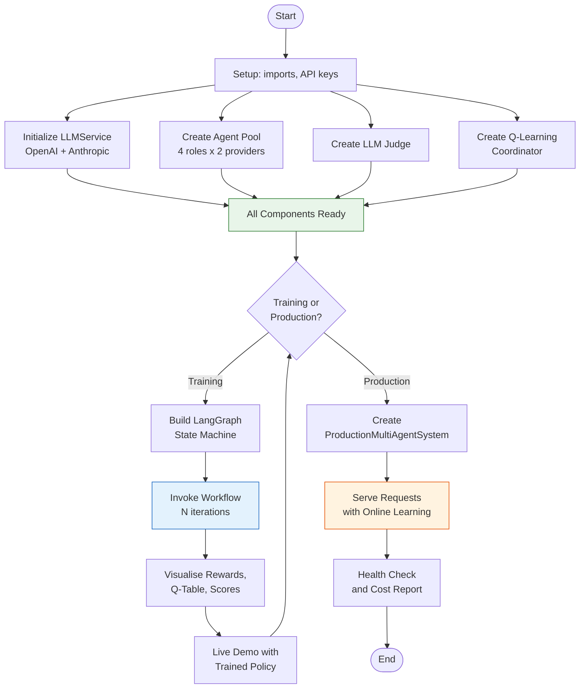
```mermaid
flowchart TB
    Start([Start]) --> Setup[Setup: imports, API keys]

    Setup --> InitLLM[Initialize LLMService<br/>OpenAI + Anthropic]
    Setup --> InitAgents[Create Agent Pool<br/>4 roles x 2 providers]
    Setup --> InitJudge[Create LLM Judge]
    Setup --> InitRL[Create Q-Learning<br/>Coordinator]

    InitLLM --> Ready
    InitAgents --> Ready
    InitJudge --> Ready
    InitRL --> Ready

    Ready[All Components Ready] --> Mode{Training or<br/>Production?}

    Mode -->|Training| BuildGraph[Build LangGraph<br/>State Machine]
    BuildGraph --> RunLoop[Invoke Workflow<br/>N iterations]
    RunLoop --> Visualise[Visualise Rewards,<br/>Q-Table, Scores]
    Visualise --> Demo[Live Demo with<br/>Trained Policy]
    Demo --> Mode

    Mode -->|Production| ProdInit[Create<br/>ProductionMultiAgentSystem]
    ProdInit --> Serve[Serve Requests<br/>with Online Learning]
    Serve --> HealthCheck[Health Check<br/>and Cost Report]
    HealthCheck --> Done([End])

    style Ready fill:#e8f5e9,stroke:#2e7d32
    style RunLoop fill:#e3f2fd,stroke:#1565c0
    style Serve fill:#fff3e0,stroke:#e65100
```

**Explanation.** The system has two operating modes. In *training mode*, a LangGraph state machine runs a configurable number of RL iterations — each iteration picks a task, assigns an agent via Q-Learning, calls a real LLM, judges the output with a second LLM call, and feeds the reward back into the Q-table. In *production mode*, the trained coordinator greedily routes incoming tasks to the best agent+provider combination, with optional online learning from live judge scores.

---

## 2. Class Diagrams

### 2.1 Enums and Data Models

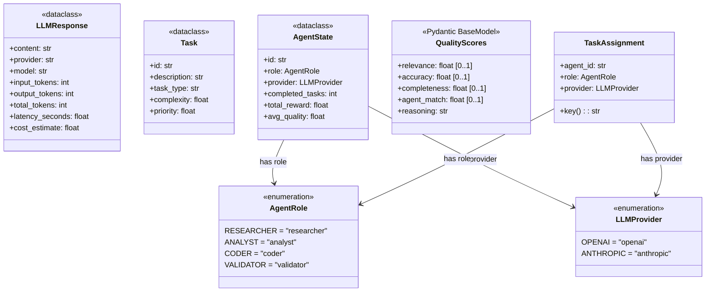
```mermaid
classDiagram
    class LLMProvider {
        <<enumeration>>
        OPENAI = "openai"
        ANTHROPIC = "anthropic"
    }

    class AgentRole {
        <<enumeration>>
        RESEARCHER = "researcher"
        ANALYST = "analyst"
        CODER = "coder"
        VALIDATOR = "validator"
    }

    class LLMResponse {
        <<dataclass>>
        +content: str
        +provider: str
        +model: str
        +input_tokens: int
        +output_tokens: int
        +total_tokens: int
        +latency_seconds: float
        +cost_estimate: float
    }

    class Task {
        <<dataclass>>
        +id: str
        +description: str
        +task_type: str
        +complexity: float
        +priority: float
    }

    class AgentState {
        <<dataclass>>
        +id: str
        +role: AgentRole
        +provider: LLMProvider
        +completed_tasks: int
        +total_reward: float
        +avg_quality: float
    }

    class QualityScores {
        <<Pydantic BaseModel>>
        +relevance: float [0..1]
        +accuracy: float [0..1]
        +completeness: float [0..1]
        +agent_match: float [0..1]
        +reasoning: str
    }

    class TaskAssignment {
        +agent_id: str
        +role: AgentRole
        +provider: LLMProvider
        +key(): str
    }

    AgentState --> AgentRole : has role
    AgentState --> LLMProvider : default provider
    TaskAssignment --> AgentRole : has role
    TaskAssignment --> LLMProvider : has provider
```

**Explanation.** Two enums (`LLMProvider`, `AgentRole`) define the discrete choices. `LLMResponse` is a value object capturing every detail of a single LLM call. `Task` represents work items from the task bank. `AgentState` tracks cumulative statistics per agent. `QualityScores` is a Pydantic model with validated [0, 1] fields returned by the LLM judge. `TaskAssignment` packages an RL action — which agent and provider to route a task to.

---

### 2.2 LLM Service Layer

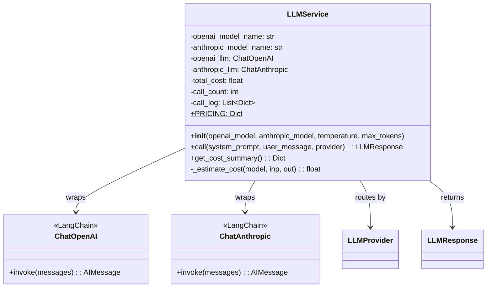
```mermaid
classDiagram
    class LLMService {
        -openai_model_name: str
        -anthropic_model_name: str
        -openai_llm: ChatOpenAI
        -anthropic_llm: ChatAnthropic
        -total_cost: float
        -call_count: int
        -call_log: List~Dict~
        +PRICING: Dict$ 
        +__init__(openai_model, anthropic_model, temperature, max_tokens)
        +call(system_prompt, user_message, provider): LLMResponse
        +get_cost_summary(): Dict
        -_estimate_cost(model, inp, out): float
    }

    class ChatOpenAI {
        <<LangChain>>
        +invoke(messages): AIMessage
    }

    class ChatAnthropic {
        <<LangChain>>
        +invoke(messages): AIMessage
    }

    LLMService --> ChatOpenAI : wraps
    LLMService --> ChatAnthropic : wraps
    LLMService --> LLMProvider : routes by
    LLMService --> LLMResponse : returns
```

**Explanation.** `LLMService` is the single gateway for all LLM calls. It holds two pre-configured LangChain chat models (`ChatOpenAI` and `ChatAnthropic`), selects between them based on the `LLMProvider` enum, and wraps every call with latency timing, token counting, and USD cost estimation. A persistent `call_log` list powers the end-of-run cost summary.

---

### 2.3 RL Coordinator and Agent Pool

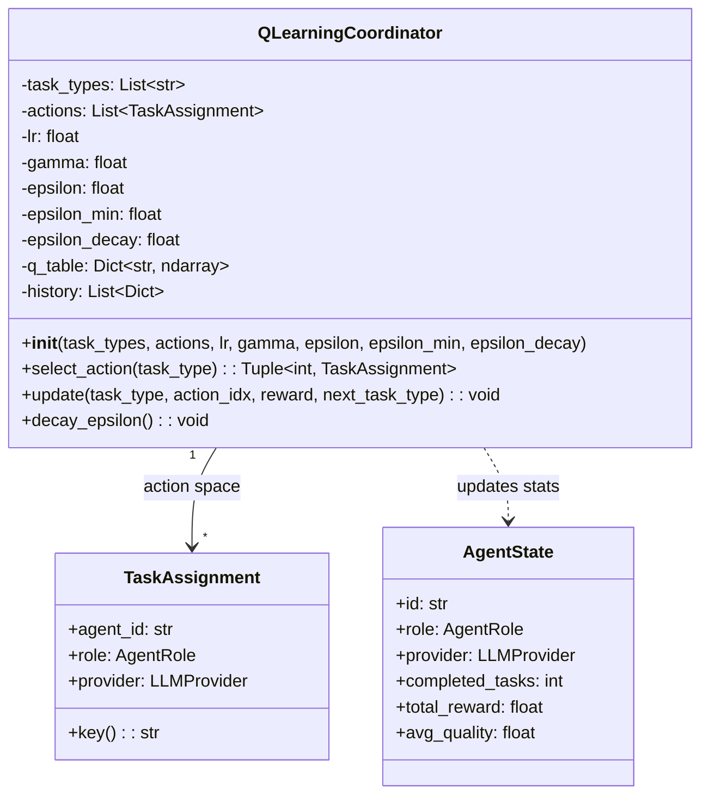
```mermaid
classDiagram
    class QLearningCoordinator {
        -task_types: List~str~
        -actions: List~TaskAssignment~
        -lr: float
        -gamma: float
        -epsilon: float
        -epsilon_min: float
        -epsilon_decay: float
        -q_table: Dict~str, ndarray~
        -history: List~Dict~
        +__init__(task_types, actions, lr, gamma, epsilon, epsilon_min, epsilon_decay)
        +select_action(task_type): Tuple~int, TaskAssignment~
        +update(task_type, action_idx, reward, next_task_type): void
        +decay_epsilon(): void
    }

    class TaskAssignment {
        +agent_id: str
        +role: AgentRole
        +provider: LLMProvider
        +key(): str
    }

    class AgentState {
        +id: str
        +role: AgentRole
        +provider: LLMProvider
        +completed_tasks: int
        +total_reward: float
        +avg_quality: float
    }

    QLearningCoordinator "1" --> "*" TaskAssignment : action space
    QLearningCoordinator ..> AgentState : updates stats
```

**Explanation.** The `QLearningCoordinator` maintains a Q-table indexed by `task_type` (state) with one Q-value per `TaskAssignment` (action). During training it uses epsilon-greedy exploration; in production it acts greedily. The `update()` method applies the standard Q-Learning TD update with a bootstrap estimate from the next task type. Epsilon decays by a factor of 0.97 after each iteration.

---

### 2.4 LangGraph Workflow State

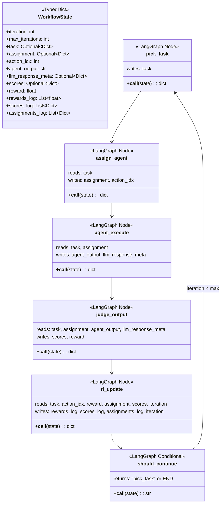
```mermaid
classDiagram
    class WorkflowState {
        <<TypedDict>>
        +iteration: int
        +max_iterations: int
        +task: Optional~Dict~
        +assignment: Optional~Dict~
        +action_idx: int
        +agent_output: str
        +llm_response_meta: Optional~Dict~
        +scores: Optional~Dict~
        +reward: float
        +rewards_log: List~float~
        +scores_log: List~Dict~
        +assignments_log: List~Dict~
    }

    class pick_task {
        <<LangGraph Node>>
        +__call__(state): dict
        writes: task
    }

    class assign_agent {
        <<LangGraph Node>>
        +__call__(state): dict
        reads: task
        writes: assignment, action_idx
    }

    class agent_execute {
        <<LangGraph Node>>
        +__call__(state): dict
        reads: task, assignment
        writes: agent_output, llm_response_meta
    }

    class judge_output {
        <<LangGraph Node>>
        +__call__(state): dict
        reads: task, assignment, agent_output, llm_response_meta
        writes: scores, reward
    }

    class rl_update {
        <<LangGraph Node>>
        +__call__(state): dict
        reads: task, action_idx, reward, assignment, scores, iteration
        writes: rewards_log, scores_log, assignments_log, iteration
    }

    class should_continue {
        <<LangGraph Conditional>>
        +__call__(state): str
        returns: "pick_task" or END
    }

    pick_task --> assign_agent
    assign_agent --> agent_execute
    agent_execute --> judge_output
    judge_output --> rl_update
    rl_update --> should_continue
    should_continue --> pick_task : iteration < max
```

**Explanation.** `WorkflowState` is a `TypedDict` that flows through the LangGraph state machine. Each node function receives the full state and returns a partial dict of only the keys it changes — the idiomatic LangGraph pattern. The three list fields (`rewards_log`, `scores_log`, `assignments_log`) are accumulated by constructing new lists (e.g. `prev + [new_item]`) in the `rl_update` node, avoiding in-place mutation. The `should_continue` conditional either loops back to `pick_task` or terminates the graph.

---

### 2.5 Production System

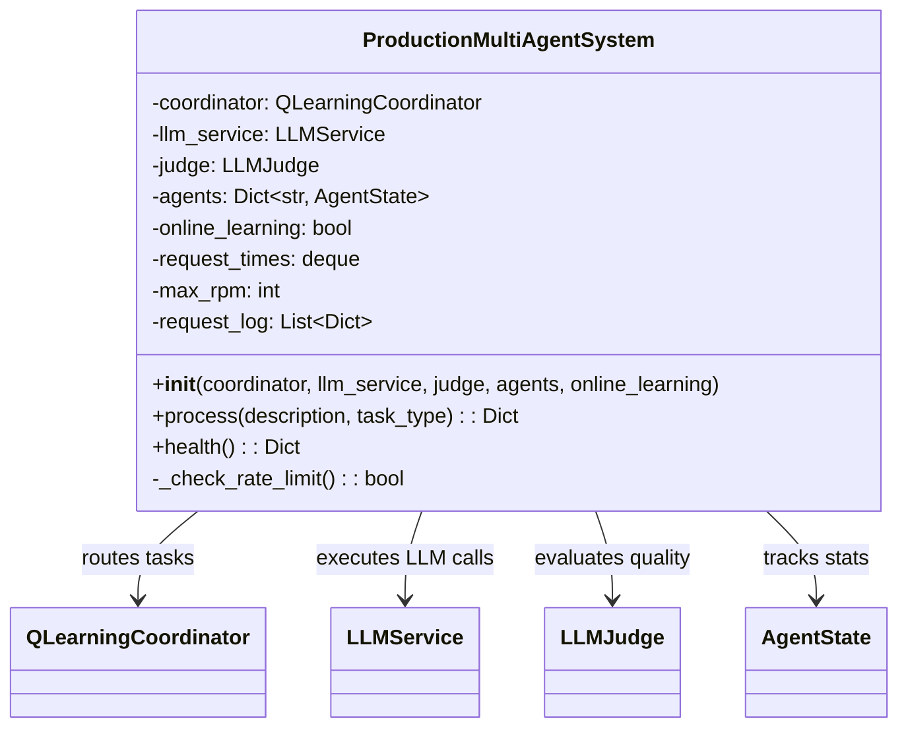
```mermaid
classDiagram
    class ProductionMultiAgentSystem {
        -coordinator: QLearningCoordinator
        -llm_service: LLMService
        -judge: LLMJudge
        -agents: Dict~str, AgentState~
        -online_learning: bool
        -request_times: deque
        -max_rpm: int
        -request_log: List~Dict~
        +__init__(coordinator, llm_service, judge, agents, online_learning)
        +process(description, task_type): Dict
        +health(): Dict
        -_check_rate_limit(): bool
    }

    ProductionMultiAgentSystem --> QLearningCoordinator : routes tasks
    ProductionMultiAgentSystem --> LLMService : executes LLM calls
    ProductionMultiAgentSystem --> LLMJudge : evaluates quality
    ProductionMultiAgentSystem --> AgentState : tracks stats
```

**Explanation.** `ProductionMultiAgentSystem` wraps all trained components into a single entry-point. It enforces rate limiting (max 60 requests per minute via a sliding-window deque), sets epsilon to 0 for greedy exploitation, and optionally feeds live rewards back into the Q-table for online learning. The `health()` method returns a JSON-friendly status dict.

---

### 2.6 Full System Relationships

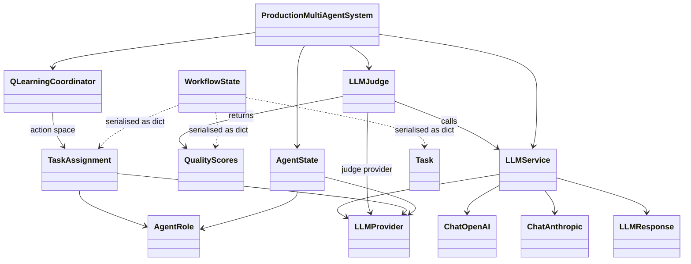
```mermaid
classDiagram
    LLMService --> ChatOpenAI
    LLMService --> ChatAnthropic
    LLMService --> LLMResponse
    LLMService --> LLMProvider

    LLMJudge --> LLMService : calls
    LLMJudge --> QualityScores : returns
    LLMJudge --> LLMProvider : judge provider

    QLearningCoordinator --> TaskAssignment : action space
    TaskAssignment --> AgentRole
    TaskAssignment --> LLMProvider

    AgentState --> AgentRole
    AgentState --> LLMProvider

    ProductionMultiAgentSystem --> QLearningCoordinator
    ProductionMultiAgentSystem --> LLMService
    ProductionMultiAgentSystem --> LLMJudge
    ProductionMultiAgentSystem --> AgentState

    WorkflowState ..> Task : serialised as dict
    WorkflowState ..> TaskAssignment : serialised as dict
    WorkflowState ..> QualityScores : serialised as dict
```

**Explanation.** This shows every dependency in the system. The key architectural insight is the **separation of concerns**: `LLMService` handles transport, `LLMJudge` handles evaluation, `QLearningCoordinator` handles routing decisions, and `ProductionMultiAgentSystem` composes them all. The LangGraph `WorkflowState` passes data between nodes as plain dicts (serialised from the dataclasses/models above).

---

## 3. Sequence Diagrams

### 3.1 Single Training Iteration

One pass through the LangGraph pipeline: pick task, assign agent, call LLM, judge, update Q-table.

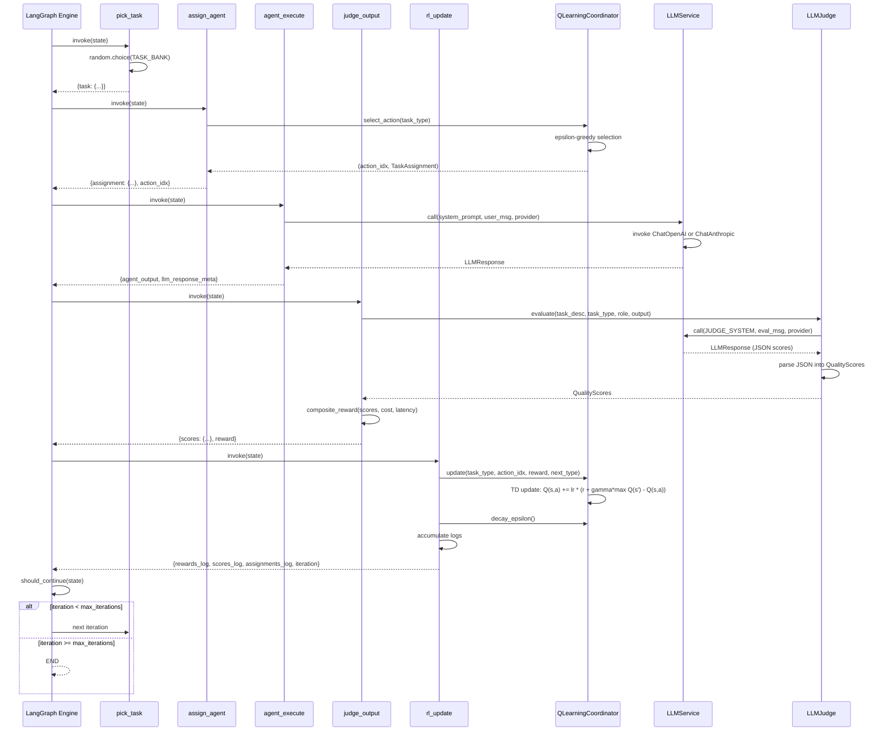
```mermaid
sequenceDiagram
    participant Graph as LangGraph Engine
    participant Pick as pick_task
    participant Assign as assign_agent
    participant Exec as agent_execute
    participant Judge as judge_output
    participant Update as rl_update
    participant QLearn as QLearningCoordinator
    participant LLM as LLMService
    participant JudgeLLM as LLMJudge

    Graph->>Pick: invoke(state)
    Pick->>Pick: random.choice(TASK_BANK)
    Pick-->>Graph: {task: {...}}

    Graph->>Assign: invoke(state)
    Assign->>QLearn: select_action(task_type)
    QLearn->>QLearn: epsilon-greedy selection
    QLearn-->>Assign: (action_idx, TaskAssignment)
    Assign-->>Graph: {assignment: {...}, action_idx}

    Graph->>Exec: invoke(state)
    Exec->>LLM: call(system_prompt, user_msg, provider)
    LLM->>LLM: invoke ChatOpenAI or ChatAnthropic
    LLM-->>Exec: LLMResponse
    Exec-->>Graph: {agent_output, llm_response_meta}

    Graph->>Judge: invoke(state)
    Judge->>JudgeLLM: evaluate(task_desc, task_type, role, output)
    JudgeLLM->>LLM: call(JUDGE_SYSTEM, eval_msg, provider)
    LLM-->>JudgeLLM: LLMResponse (JSON scores)
    JudgeLLM->>JudgeLLM: parse JSON into QualityScores
    JudgeLLM-->>Judge: QualityScores
    Judge->>Judge: composite_reward(scores, cost, latency)
    Judge-->>Graph: {scores: {...}, reward}

    Graph->>Update: invoke(state)
    Update->>QLearn: update(task_type, action_idx, reward, next_type)
    QLearn->>QLearn: TD update: Q(s,a) += lr * (r + gamma*max Q(s') - Q(s,a))
    Update->>QLearn: decay_epsilon()
    Update->>Update: accumulate logs
    Update-->>Graph: {rewards_log, scores_log, assignments_log, iteration}

    Graph->>Graph: should_continue(state)
    alt iteration < max_iterations
        Graph->>Pick: next iteration
    else iteration >= max_iterations
        Graph-->>Graph: END
    end
```

**Explanation.** Each iteration produces exactly **two real LLM API calls**: one in `agent_execute` (the agent doing work) and one inside `judge_output` (the judge scoring the work). The `rl_update` node performs the Q-Learning TD update and constructs new accumulator lists for the next iteration. The LangGraph engine handles state merging between nodes automatically.

---

### 3.2 LLM Service Call

Detail of a single `LLMService.call()` invocation.

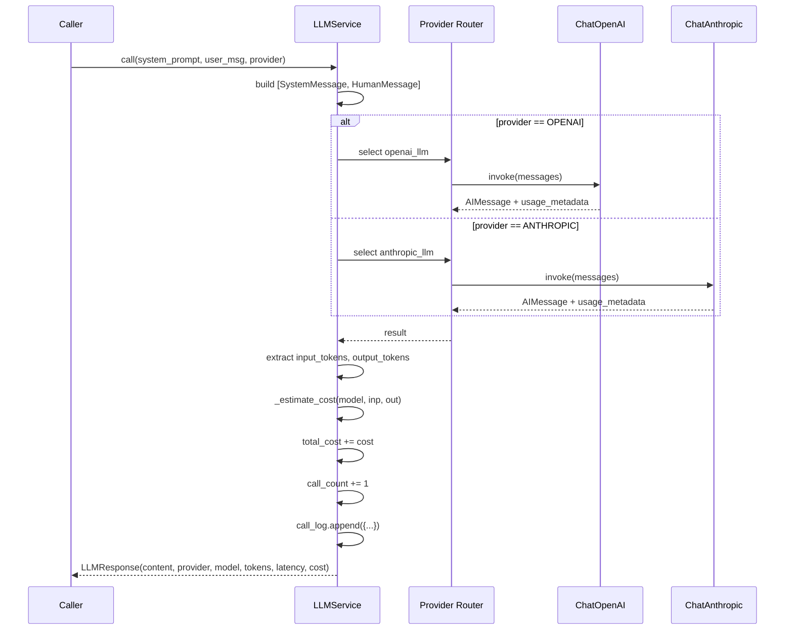
```mermaid
sequenceDiagram
    participant Caller
    participant Service as LLMService
    participant Router as Provider Router
    participant OAI as ChatOpenAI
    participant ANT as ChatAnthropic

    Caller->>Service: call(system_prompt, user_msg, provider)
    Service->>Service: build [SystemMessage, HumanMessage]

    alt provider == OPENAI
        Service->>Router: select openai_llm
        Router->>OAI: invoke(messages)
        OAI-->>Router: AIMessage + usage_metadata
    else provider == ANTHROPIC
        Service->>Router: select anthropic_llm
        Router->>ANT: invoke(messages)
        ANT-->>Router: AIMessage + usage_metadata
    end

    Router-->>Service: result

    Service->>Service: extract input_tokens, output_tokens
    Service->>Service: _estimate_cost(model, inp, out)
    Service->>Service: total_cost += cost
    Service->>Service: call_count += 1
    Service->>Service: call_log.append({...})

    Service-->>Caller: LLMResponse(content, provider, model, tokens, latency, cost)
```

**Explanation.** The `call()` method abstracts away the provider difference. It routes to the correct LangChain model based on the `LLMProvider` enum, measures wall-clock latency, extracts token counts from the response metadata, and computes a USD cost estimate using per-model pricing. Every call is appended to the persistent `call_log` for end-of-run reporting.

---

### 3.3 LLM-as-Judge Evaluation

Detail of how `LLMJudge.evaluate()` scores an agent output.

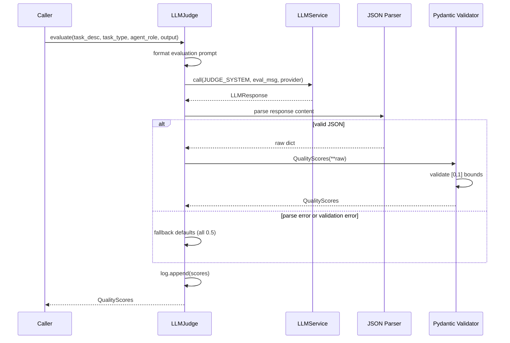
```mermaid
sequenceDiagram
    participant Caller
    participant Judge as LLMJudge
    participant Service as LLMService
    participant Parser as JSON Parser
    participant Validator as Pydantic Validator

    Caller->>Judge: evaluate(task_desc, task_type, agent_role, output)
    Judge->>Judge: format evaluation prompt
    Judge->>Service: call(JUDGE_SYSTEM, eval_msg, provider)
    Service-->>Judge: LLMResponse

    Judge->>Parser: parse response content

    alt valid JSON
        Parser-->>Judge: raw dict
        Judge->>Validator: QualityScores(**raw)
        Validator->>Validator: validate [0,1] bounds
        Validator-->>Judge: QualityScores
    else parse error or validation error
        Judge->>Judge: fallback defaults (all 0.5)
    end

    Judge->>Judge: log.append(scores)
    Judge-->>Caller: QualityScores
```

**Explanation.** The judge sends a structured evaluation prompt to the LLM, requesting JSON output with four numeric scores and a reasoning string. The response is parsed with a fallback for malformed JSON — if parsing fails, all scores default to 0.5 so the system never crashes on a single bad judge response. Scores are validated via Pydantic's `ge=0, le=1` constraints.

---

### 3.4 Q-Learning Update

Detail of the TD update inside `QLearningCoordinator.update()`.

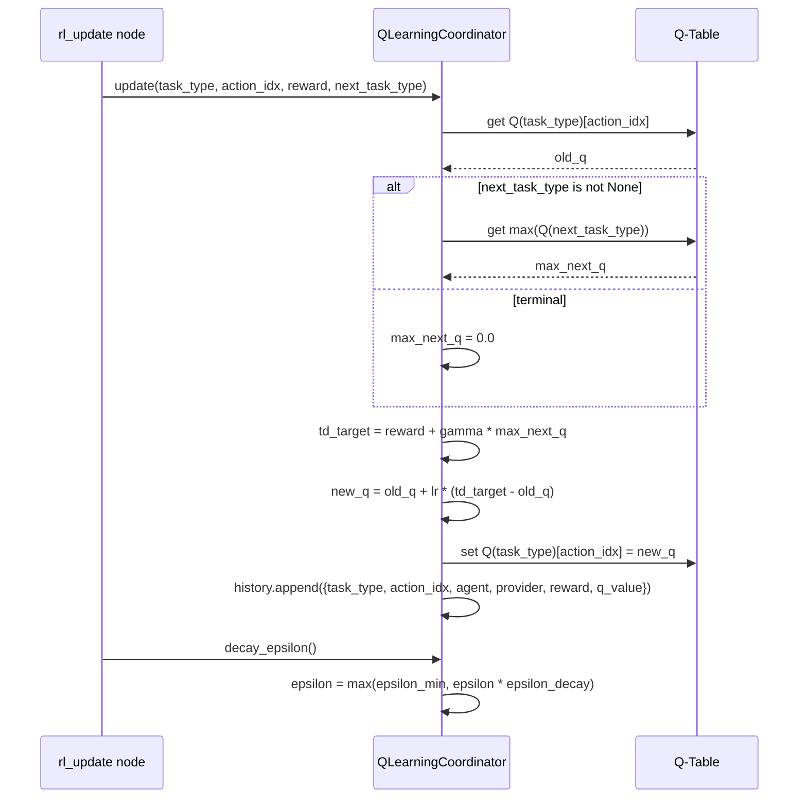
```mermaid
sequenceDiagram
    participant Node as rl_update node
    participant QL as QLearningCoordinator
    participant QTable as Q-Table

    Node->>QL: update(task_type, action_idx, reward, next_task_type)

    QL->>QTable: get Q(task_type)[action_idx]
    QTable-->>QL: old_q

    alt next_task_type is not None
        QL->>QTable: get max(Q(next_task_type))
        QTable-->>QL: max_next_q
    else terminal
        QL->>QL: max_next_q = 0.0
    end

    QL->>QL: td_target = reward + gamma * max_next_q
    QL->>QL: new_q = old_q + lr * (td_target - old_q)

    QL->>QTable: set Q(task_type)[action_idx] = new_q

    QL->>QL: history.append({task_type, action_idx, agent, provider, reward, q_value})

    Node->>QL: decay_epsilon()
    QL->>QL: epsilon = max(epsilon_min, epsilon * epsilon_decay)
```

**Explanation.** The Q-Learning update follows the standard off-policy TD(0) rule. The `next_task_type` is sampled randomly to provide a bootstrap target — since the task bank is sampled i.i.d., this gives an unbiased estimate of future value. Epsilon decays by 3% each iteration (factor 0.97), transitioning from exploration to exploitation over the course of training.

---

### 3.5 Production Request Processing

End-to-end flow of `ProductionMultiAgentSystem.process()`.

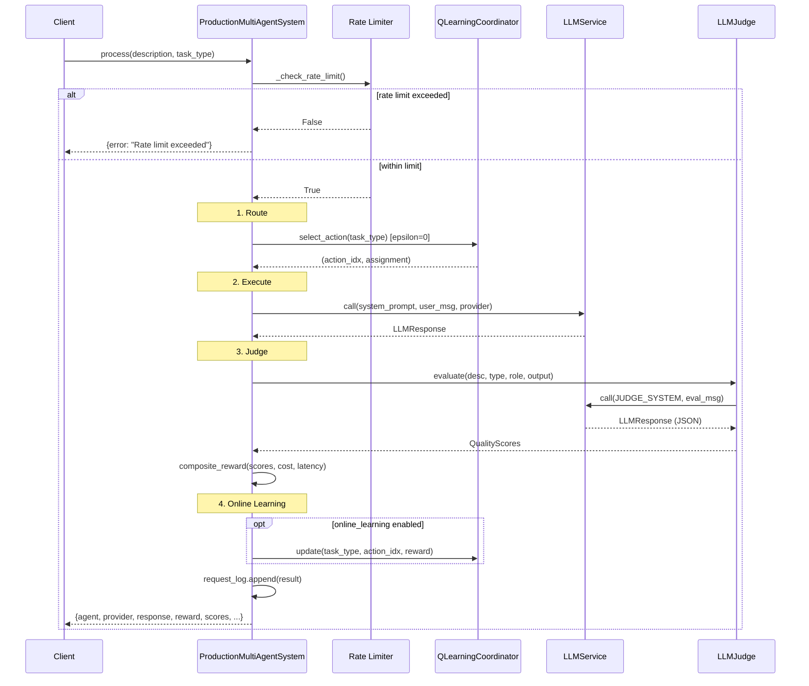
```mermaid
sequenceDiagram
    participant Client
    participant Prod as ProductionMultiAgentSystem
    participant RateLimit as Rate Limiter
    participant QL as QLearningCoordinator
    participant LLM as LLMService
    participant Judge as LLMJudge

    Client->>Prod: process(description, task_type)

    Prod->>RateLimit: _check_rate_limit()
    alt rate limit exceeded
        RateLimit-->>Prod: False
        Prod-->>Client: {error: "Rate limit exceeded"}
    else within limit
        RateLimit-->>Prod: True

        Note over Prod: 1. Route
        Prod->>QL: select_action(task_type) [epsilon=0]
        QL-->>Prod: (action_idx, assignment)

        Note over Prod: 2. Execute
        Prod->>LLM: call(system_prompt, user_msg, provider)
        LLM-->>Prod: LLMResponse

        Note over Prod: 3. Judge
        Prod->>Judge: evaluate(desc, type, role, output)
        Judge->>LLM: call(JUDGE_SYSTEM, eval_msg)
        LLM-->>Judge: LLMResponse (JSON)
        Judge-->>Prod: QualityScores
        Prod->>Prod: composite_reward(scores, cost, latency)

        Note over Prod: 4. Online Learning
        opt online_learning enabled
            Prod->>QL: update(task_type, action_idx, reward)
        end

        Prod->>Prod: request_log.append(result)
        Prod-->>Client: {agent, provider, response, reward, scores, ...}
    end
```

**Explanation.** In production, the coordinator always acts greedily (epsilon = 0). Each request goes through rate-limiting, greedy routing, a real LLM call, an LLM judge call, and optionally an online Q-table update. This means the system continuously improves from live traffic without explicit retraining.

---

## 4. LangGraph Workflow Flowchart

The five-node state machine that orchestrates each training iteration.

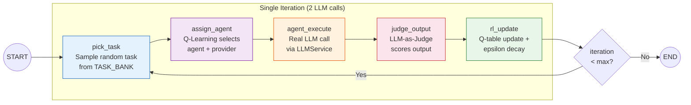
```mermaid
flowchart LR
    START((START)) --> pick_task

    subgraph iteration["Single Iteration (2 LLM calls)"]
        pick_task["pick_task<br/>Sample random task<br/>from TASK_BANK"]
        assign_agent["assign_agent<br/>Q-Learning selects<br/>agent + provider"]
        agent_execute["agent_execute<br/>Real LLM call<br/>via LLMService"]
        judge_output["judge_output<br/>LLM-as-Judge<br/>scores output"]
        rl_update["rl_update<br/>Q-table update +<br/>epsilon decay"]

        pick_task --> assign_agent
        assign_agent --> agent_execute
        agent_execute --> judge_output
        judge_output --> rl_update
    end

    rl_update --> check{iteration <br/> < max?}
    check -->|Yes| pick_task
    check -->|No| STOP((END))

    style pick_task fill:#e3f2fd,stroke:#1565c0
    style assign_agent fill:#f3e5f5,stroke:#7b1fa2
    style agent_execute fill:#fff3e0,stroke:#e65100
    style judge_output fill:#fce4ec,stroke:#c62828
    style rl_update fill:#e8f5e9,stroke:#2e7d32
```

**Explanation.** The LangGraph `StateGraph` compiles into this five-node pipeline with a single conditional edge at the end. Each node reads from and writes to the shared `WorkflowState` TypedDict. The conditional `should_continue` function checks whether the iteration counter has reached `max_iterations`; if so, the graph terminates and the final state (containing all accumulated logs) is returned to the caller.

---

## 5. RL Training Loop Flowchart

Detailed flowchart showing the complete training procedure including setup and post-training analysis.

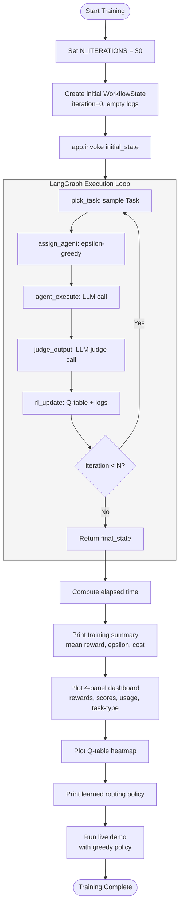
```mermaid
flowchart TD
    Start([Start Training]) --> Config[Set N_ITERATIONS = 30]
    Config --> InitState[Create initial WorkflowState<br/>iteration=0, empty logs]

    InitState --> Invoke[app.invoke initial_state]

    subgraph LangGraph["LangGraph Execution Loop"]
        direction TB
        PT[pick_task: sample Task] --> AA[assign_agent: epsilon-greedy]
        AA --> AE[agent_execute: LLM call]
        AE --> JO[judge_output: LLM judge call]
        JO --> RU[rl_update: Q-table + logs]
        RU --> Check{iteration < N?}
        Check -->|Yes| PT
        Check -->|No| Return[Return final_state]
    end

    Invoke --> LangGraph
    Return --> Elapsed[Compute elapsed time]

    Elapsed --> PrintSummary[Print training summary<br/>mean reward, epsilon, cost]
    PrintSummary --> Viz[Plot 4-panel dashboard<br/>rewards, scores, usage, task-type]
    Viz --> QHeat[Plot Q-table heatmap]
    QHeat --> Policy[Print learned routing policy]
    Policy --> LiveDemo[Run live demo<br/>with greedy policy]
    LiveDemo --> Done([Training Complete])

    style LangGraph fill:#f5f5f5,stroke:#616161
```

**Explanation.** Training runs as a single `app.invoke()` call that internally loops through the LangGraph nodes. After training completes, the notebook visualises: (1) reward over iterations with a moving average, (2) per-dimension quality scores from the judge, (3) agent-provider utilisation bar chart, (4) mean reward by task type. The Q-table is rendered as a heatmap showing which agent-provider combination the coordinator prefers for each task type.

---

## 6. Q-Learning Decision Flowchart

How the coordinator selects an agent+provider for a given task type.

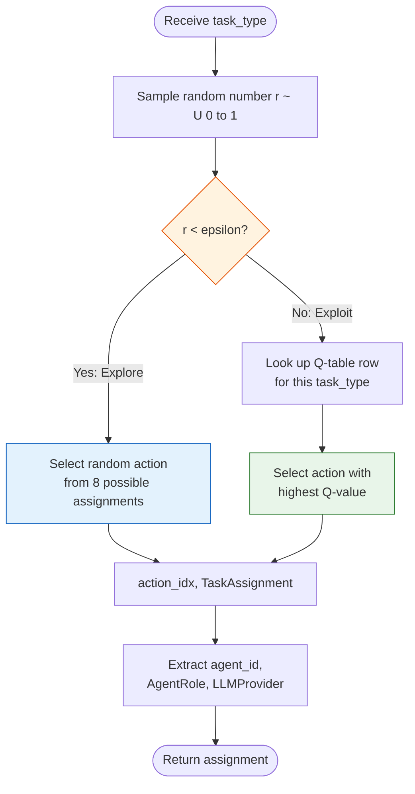
```mermaid
flowchart TD
    Input([Receive task_type]) --> Sample[Sample random number r ~ U 0 to 1]

    Sample --> Compare{r < epsilon?}

    Compare -->|Yes: Explore| Random[Select random action<br/>from 8 possible assignments]
    Compare -->|No: Exploit| Lookup[Look up Q-table row<br/>for this task_type]

    Lookup --> ArgMax[Select action with<br/>highest Q-value]

    Random --> ActionReady[action_idx, TaskAssignment]
    ArgMax --> ActionReady

    ActionReady --> Extract[Extract agent_id,<br/>AgentRole, LLMProvider]
    Extract --> Return([Return assignment])

    style Compare fill:#fff3e0,stroke:#e65100
    style Random fill:#e3f2fd,stroke:#1565c0
    style ArgMax fill:#e8f5e9,stroke:#2e7d32
```

**Explanation.** The action space has 8 entries: 4 agents (researcher, analyst, coder, validator) x 2 providers (OpenAI, Anthropic). Early in training, epsilon is high (~1.0) so nearly all selections are random explorations. As epsilon decays (factor 0.97 per iteration), the coordinator increasingly exploits the best-known assignment. By iteration 30, epsilon is approximately 0.05 * 0.97^30 ≈ 0.40 — still exploring but with a clear preference.

---

## 7. Reward Computation Flowchart

How the composite reward is computed from judge scores, API cost, and latency.

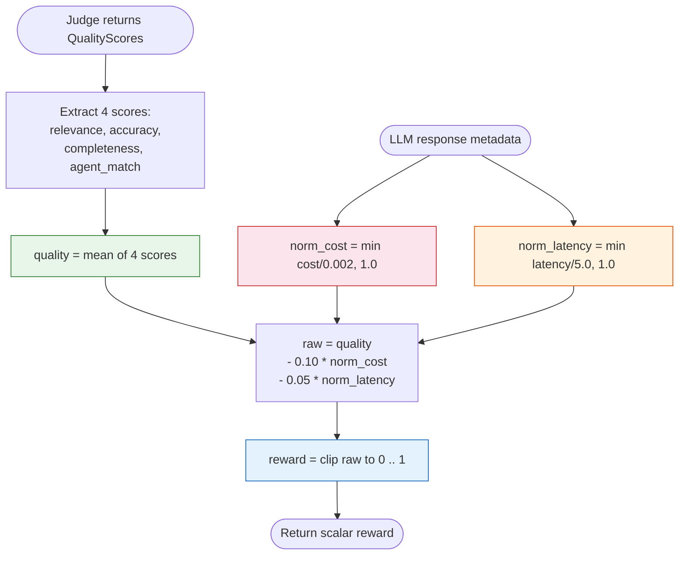
```mermaid
flowchart TD
    Input([Judge returns QualityScores]) --> Extract[Extract 4 scores:<br/>relevance, accuracy,<br/>completeness, agent_match]

    Extract --> Quality["quality = mean of 4 scores"]

    Input2([LLM response metadata]) --> Cost[norm_cost = min cost/0.002, 1.0]
    Input2 --> Latency[norm_latency = min latency/5.0, 1.0]

    Quality --> Combine["raw = quality<br/>- 0.10 * norm_cost<br/>- 0.05 * norm_latency"]
    Cost --> Combine
    Latency --> Combine

    Combine --> Clip["reward = clip raw to 0 .. 1"]
    Clip --> Return([Return scalar reward])

    style Quality fill:#e8f5e9,stroke:#2e7d32
    style Cost fill:#fce4ec,stroke:#c62828
    style Latency fill:#fff3e0,stroke:#e65100
    style Clip fill:#e3f2fd,stroke:#1565c0
```

**Explanation.** The composite reward heavily weights quality (mean of four judge scores) while applying small penalties for cost (10% weight, normalised against a $0.002 reference) and latency (5% weight, normalised against 5 seconds). This ensures the RL coordinator primarily optimises for output quality but learns to prefer cheaper/faster options when quality is equal. The final reward is clipped to [0, 1].

---

## 8. State Machine Diagrams

### 8.1 Training State Machine

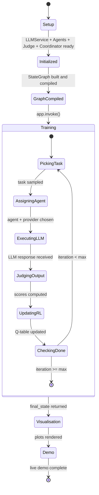
```mermaid
stateDiagram-v2
    [*] --> Setup

    Setup --> Initialized : LLMService + Agents + Judge + Coordinator ready

    Initialized --> GraphCompiled : StateGraph built and compiled

    state Training {
        [*] --> PickingTask
        PickingTask --> AssigningAgent : task sampled
        AssigningAgent --> ExecutingLLM : agent + provider chosen
        ExecutingLLM --> JudgingOutput : LLM response received
        JudgingOutput --> UpdatingRL : scores computed
        UpdatingRL --> CheckingDone : Q-table updated

        CheckingDone --> PickingTask : iteration < max
        CheckingDone --> [*] : iteration >= max
    }

    GraphCompiled --> Training : app.invoke()

    Training --> Visualisation : final_state returned
    Visualisation --> Demo : plots rendered
    Demo --> [*] : live demo complete
```

**Explanation.** The training state machine shows three phases: *setup* (initialising all components), *training* (the LangGraph loop), and *post-training* (visualisation and demo). Within the training loop, the system cycles through five states corresponding to the five LangGraph nodes, terminating when the iteration counter reaches the maximum.

---

### 8.2 Production State Machine

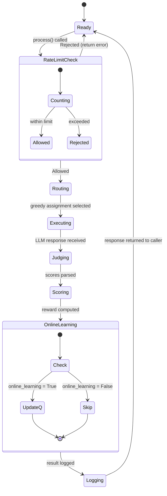
```mermaid
stateDiagram-v2
    [*] --> Ready

    Ready --> RateLimitCheck : process() called

    state RateLimitCheck {
        [*] --> Counting
        Counting --> Allowed : within limit
        Counting --> Rejected : exceeded
    }

    RateLimitCheck --> Routing : Allowed
    RateLimitCheck --> Ready : Rejected (return error)

    Routing --> Executing : greedy assignment selected
    Executing --> Judging : LLM response received
    Judging --> Scoring : scores parsed

    Scoring --> OnlineLearning : reward computed

    state OnlineLearning {
        [*] --> Check
        Check --> UpdateQ : online_learning = True
        Check --> Skip : online_learning = False
        UpdateQ --> [*]
        Skip --> [*]
    }

    OnlineLearning --> Logging : result logged
    Logging --> Ready : response returned to caller
```

**Explanation.** In production, every request first passes through rate-limit checking (sliding window of 60 seconds, max 60 requests). If allowed, the system performs greedy routing, execution, judging, and optionally an online Q-table update. The system returns to `Ready` after each request — there is no circuit breaker in the current implementation (unlike the original simulated notebook), keeping the production class focused.

---

## 9. Data Flow Diagram

How data moves through the system from task bank to final outputs.

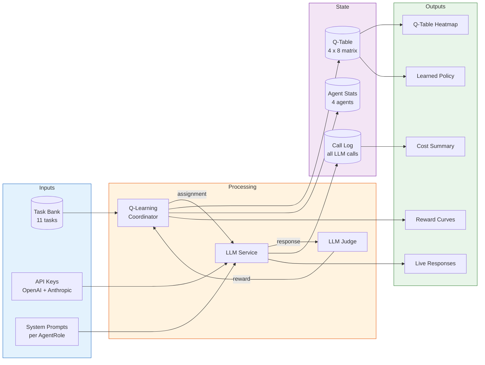
```mermaid
flowchart LR
    subgraph Inputs
        TB[(Task Bank<br/>11 tasks)]
        AK[API Keys<br/>OpenAI + Anthropic]
        SP[System Prompts<br/>per AgentRole]
    end

    subgraph Processing
        QL[Q-Learning<br/>Coordinator]
        LS[LLM Service]
        JD[LLM Judge]

        TB --> QL
        QL -->|assignment| LS
        SP --> LS
        AK --> LS
        LS -->|response| JD
        JD -->|reward| QL
    end

    subgraph State
        QT[(Q-Table<br/>4 x 8 matrix)]
        AS[(Agent Stats<br/>4 agents)]
        CL[(Call Log<br/>all LLM calls)]

        QL --> QT
        QL --> AS
        LS --> CL
    end

    subgraph Outputs
        RW[Reward Curves]
        QH[Q-Table Heatmap]
        LP[Learned Policy]
        CS[Cost Summary]
        LR[Live Responses]

        QT --> QH
        QT --> LP
        CL --> CS
        QL --> RW
        LS --> LR
    end

    style Inputs fill:#e3f2fd,stroke:#1565c0
    style Processing fill:#fff3e0,stroke:#e65100
    style State fill:#f3e5f5,stroke:#7b1fa2
    style Outputs fill:#e8f5e9,stroke:#2e7d32
```

**Explanation.** Data flows from left to right: inputs (task bank, API keys, role-specific system prompts) feed into the processing layer (coordinator, LLM service, judge). The processing layer updates persistent state (Q-table, agent statistics, call log), which in turn drives the outputs (visualisations, policy reports, cost summaries, live responses).

---

## 10. Component Interaction Overview

Birds-eye view showing how all components connect across training and production modes.

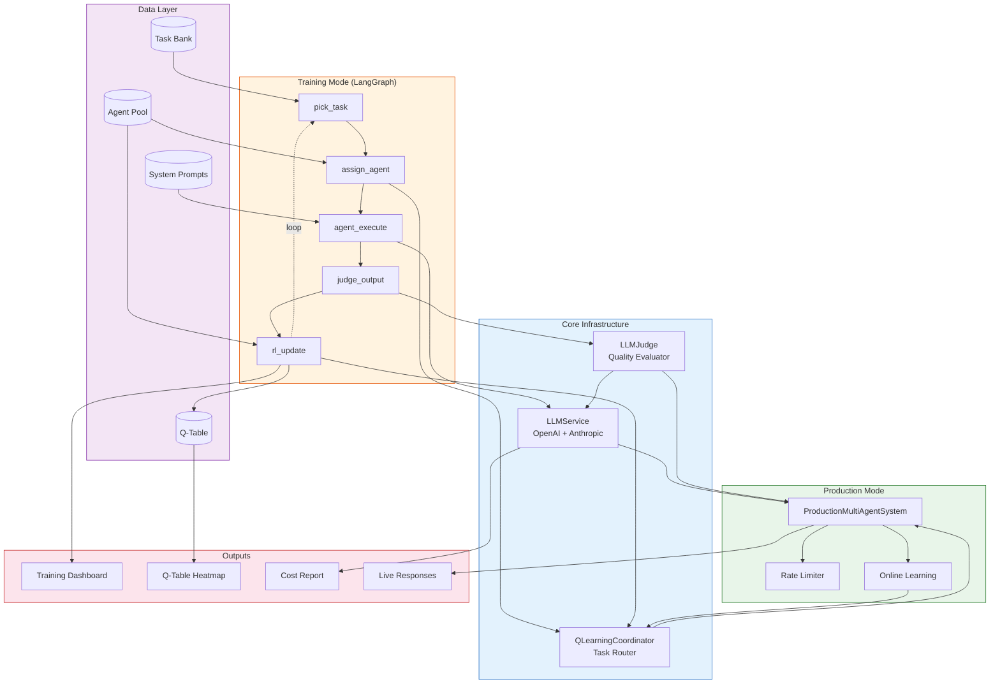
```mermaid
graph TB
    subgraph Core["Core Infrastructure"]
        LLMSvc[LLMService<br/>OpenAI + Anthropic]
        Judge[LLMJudge<br/>Quality Evaluator]
        Coord[QLearningCoordinator<br/>Task Router]
    end

    subgraph Data["Data Layer"]
        Tasks[(Task Bank)]
        Prompts[(System Prompts)]
        Agents[(Agent Pool)]
        QTable[(Q-Table)]
    end

    subgraph Training["Training Mode (LangGraph)"]
        N1[pick_task]
        N2[assign_agent]
        N3[agent_execute]
        N4[judge_output]
        N5[rl_update]
        N1 --> N2 --> N3 --> N4 --> N5
        N5 -.->|loop| N1
    end

    subgraph Production["Production Mode"]
        Prod[ProductionMultiAgentSystem]
        RL[Rate Limiter]
        OL[Online Learning]
    end

    subgraph Outputs["Outputs"]
        Plots[Training Dashboard]
        Heatmap[Q-Table Heatmap]
        CostRpt[Cost Report]
        LiveResp[Live Responses]
    end

    Tasks --> N1
    Prompts --> N3
    Agents --> N2
    Agents --> N5

    N2 --> Coord
    N3 --> LLMSvc
    N4 --> Judge
    Judge --> LLMSvc
    N5 --> Coord
    N5 --> QTable

    Coord --> Prod
    LLMSvc --> Prod
    Judge --> Prod
    Prod --> RL
    Prod --> OL
    OL --> Coord

    QTable --> Heatmap
    N5 --> Plots
    LLMSvc --> CostRpt
    Prod --> LiveResp

    style Core fill:#e3f2fd,stroke:#1565c0
    style Data fill:#f3e5f5,stroke:#7b1fa2
    style Training fill:#fff3e0,stroke:#e65100
    style Production fill:#e8f5e9,stroke:#2e7d32
    style Outputs fill:#fce4ec,stroke:#c62828
```

---

## Summary

These diagrams provide a comprehensive view of the `agentic_rl_workflow_LLM_calls.ipynb` architecture:

| Diagram Type | What It Shows | Count |
|---|---|---|
| **Flowcharts** | System overview, LangGraph pipeline, training loop, Q-Learning decision, reward computation | 5 |
| **Class Diagrams** | Enums, data models, LLM service, RL coordinator, production system, full relationships | 6 |
| **Sequence Diagrams** | Training iteration, LLM call, judge evaluation, Q-Learning update, production request | 5 |
| **State Machine Diagrams** | Training lifecycle, production request lifecycle | 2 |
| **Data Flow Diagrams** | End-to-end data movement, component interaction overview | 2 |

Key architectural properties:

- **2 LLM calls per iteration**: one for the agent (work), one for the judge (evaluation)
- **Idiomatic LangGraph**: nodes return partial dicts; lists accumulated via new-list construction
- **Provider-agnostic**: the same pipeline supports OpenAI and Anthropic transparently
- **Online learning ready**: the production class can continuously improve from live traffic
- **Cost-aware**: every LLM call is tracked with token counts and USD estimates

All diagrams use Mermaid syntax and render in any compatible viewer (GitHub, GitLab, VS Code, Jupyter, etc.).
