# Multi-Agent RL Workflow with Load Balancing — Architecture Diagrams

Comprehensive UML class diagrams, sequence diagrams, flowcharts, and a deep-dive into agent utilization tracking for `agentic_rl_workflow_LLM_calls_lb.ipynb`.

## Table of Contents

1. [System Overview Flowchart](#1-system-overview-flowchart)
2. [Class Diagrams](#2-class-diagrams)
   - [Enums and Data Models](#21-enums-and-data-models)
   - [LLM Service Layer](#22-llm-service-layer)
   - [Load Tracker](#23-load-tracker)
   - [Load-Aware Q-Learning Coordinator](#24-load-aware-q-learning-coordinator)
   - [LangGraph Workflow State](#25-langgraph-workflow-state)
   - [Production System (Load-Balanced)](#26-production-system-load-balanced)
   - [Full System Relationships](#27-full-system-relationships)
3. [Sequence Diagrams](#3-sequence-diagrams)
   - [Single Training Iteration (Load-Balanced)](#31-single-training-iteration-load-balanced)
   - [Load-Aware Agent Assignment](#32-load-aware-agent-assignment)
   - [LLM-as-Judge Evaluation](#33-llm-as-judge-evaluation)
   - [Load-Aware RL Update](#34-load-aware-rl-update)
   - [Production Request Processing (Load-Balanced)](#35-production-request-processing-load-balanced)
4. [LangGraph Workflow Flowchart](#4-langgraph-workflow-flowchart)
5. [RL Training Loop Flowchart](#5-rl-training-loop-flowchart)
6. [Q-Learning Decision Flowchart (Load-Aware)](#6-q-learning-decision-flowchart-load-aware)
7. [Reward Computation Flowchart (with Load Penalty)](#7-reward-computation-flowchart-with-load-penalty)
8. [Agent Utilization Tracking — Deep Dive](#8-agent-utilization-tracking--deep-dive)
   - [LoadTracker Architecture](#81-loadtracker-architecture)
   - [Sliding Window Mechanism](#82-sliding-window-mechanism)
   - [Load State Computation](#83-load-state-computation)
   - [Load Penalty Calculation](#84-load-penalty-calculation)
   - [Utilization Feedback Loop](#85-utilization-feedback-loop)
   - [Imbalance Score Computation](#86-imbalance-score-computation)
9. [State Machine Diagrams](#9-state-machine-diagrams)
   - [Training State Machine](#91-training-state-machine)
   - [Production State Machine](#92-production-state-machine)
10. [Data Flow Diagram](#10-data-flow-diagram)
11. [Component Interaction Overview](#11-component-interaction-overview)

---

## 1. System Overview Flowchart

High-level view of the load-balanced system: setup, training via LangGraph, and production serving with load-aware routing.

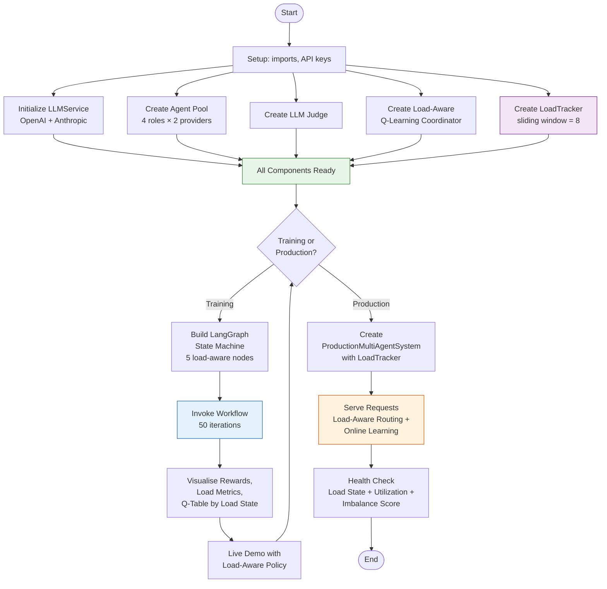
```mermaid
flowchart TB
    Start([Start]) --> Setup[Setup: imports, API keys]

    Setup --> InitLLM[Initialize LLMService<br/>OpenAI + Anthropic]
    Setup --> InitAgents[Create Agent Pool<br/>4 roles × 2 providers]
    Setup --> InitJudge[Create LLM Judge]
    Setup --> InitRL[Create Load-Aware<br/>Q-Learning Coordinator]
    Setup --> InitLT[Create LoadTracker<br/>sliding window = 8]

    InitLLM --> Ready
    InitAgents --> Ready
    InitJudge --> Ready
    InitRL --> Ready
    InitLT --> Ready

    Ready[All Components Ready] --> Mode{Training or<br/>Production?}

    Mode -->|Training| BuildGraph[Build LangGraph<br/>State Machine<br/>5 load-aware nodes]
    BuildGraph --> RunLoop[Invoke Workflow<br/>50 iterations]
    RunLoop --> Visualise[Visualise Rewards,<br/>Load Metrics,<br/>Q-Table by Load State]
    Visualise --> Demo[Live Demo with<br/>Load-Aware Policy]
    Demo --> Mode

    Mode -->|Production| ProdInit[Create<br/>ProductionMultiAgentSystem<br/>with LoadTracker]
    ProdInit --> Serve[Serve Requests<br/>Load-Aware Routing +<br/>Online Learning]
    Serve --> HealthCheck[Health Check<br/>Load State + Utilization +<br/>Imbalance Score]
    HealthCheck --> Done([End])

    style Ready fill:#e8f5e9,stroke:#2e7d32
    style RunLoop fill:#e3f2fd,stroke:#1565c0
    style Serve fill:#fff3e0,stroke:#e65100
    style InitLT fill:#f3e5f5,stroke:#7b1fa2
```

**Explanation.** Compared to the base Q-Learning version, this system adds a **LoadTracker** component that feeds load state information into the Q-Learning coordinator. The training loop runs for 50 iterations (up from 30) to adequately explore the expanded 20-state space (4 task types × 5 load states). The production system exposes load metrics—utilization, imbalance score, and current load state—through the `health()` endpoint.

---

## 2. Class Diagrams

### 2.1 Enums and Data Models

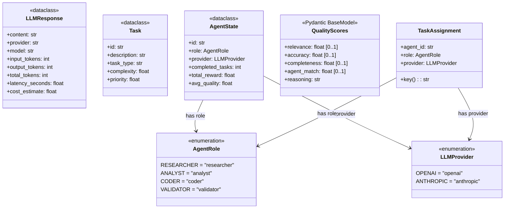
```mermaid
classDiagram
    class LLMProvider {
        <<enumeration>>
        OPENAI = "openai"
        ANTHROPIC = "anthropic"
    }

    class AgentRole {
        <<enumeration>>
        RESEARCHER = "researcher"
        ANALYST = "analyst"
        CODER = "coder"
        VALIDATOR = "validator"
    }

    class LLMResponse {
        <<dataclass>>
        +content: str
        +provider: str
        +model: str
        +input_tokens: int
        +output_tokens: int
        +total_tokens: int
        +latency_seconds: float
        +cost_estimate: float
    }

    class Task {
        <<dataclass>>
        +id: str
        +description: str
        +task_type: str
        +complexity: float
        +priority: float
    }

    class AgentState {
        <<dataclass>>
        +id: str
        +role: AgentRole
        +provider: LLMProvider
        +completed_tasks: int
        +total_reward: float
        +avg_quality: float
    }

    class QualityScores {
        <<Pydantic BaseModel>>
        +relevance: float [0..1]
        +accuracy: float [0..1]
        +completeness: float [0..1]
        +agent_match: float [0..1]
        +reasoning: str
    }

    class TaskAssignment {
        +agent_id: str
        +role: AgentRole
        +provider: LLMProvider
        +key(): str
    }

    AgentState --> AgentRole : has role
    AgentState --> LLMProvider : default provider
    TaskAssignment --> AgentRole : has role
    TaskAssignment --> LLMProvider : has provider
```

**Explanation.** These data models are shared with the base Q-Learning version. Two enums (`LLMProvider`, `AgentRole`) define discrete choices. `LLMResponse` captures every detail of a single LLM call. `Task` represents work items from the task bank (11 tasks across 4 types). `AgentState` tracks cumulative per-agent statistics. `QualityScores` is a Pydantic model with validated [0, 1] fields returned by the LLM judge. `TaskAssignment` encodes a single RL action—which agent and provider to route a task to—yielding an action space of 8 (4 agents × 2 providers).

---

### 2.2 LLM Service Layer

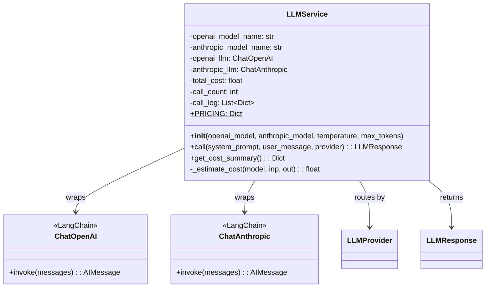
```mermaid
classDiagram
    class LLMService {
        -openai_model_name: str
        -anthropic_model_name: str
        -openai_llm: ChatOpenAI
        -anthropic_llm: ChatAnthropic
        -total_cost: float
        -call_count: int
        -call_log: List~Dict~
        +PRICING: Dict$
        +__init__(openai_model, anthropic_model, temperature, max_tokens)
        +call(system_prompt, user_message, provider): LLMResponse
        +get_cost_summary(): Dict
        -_estimate_cost(model, inp, out): float
    }

    class ChatOpenAI {
        <<LangChain>>
        +invoke(messages): AIMessage
    }

    class ChatAnthropic {
        <<LangChain>>
        +invoke(messages): AIMessage
    }

    LLMService --> ChatOpenAI : wraps
    LLMService --> ChatAnthropic : wraps
    LLMService --> LLMProvider : routes by
    LLMService --> LLMResponse : returns
```

**Explanation.** `LLMService` is the single gateway for all LLM calls (both agent execution and judge evaluation). It wraps two LangChain chat models (`ChatOpenAI` and `ChatAnthropic`), selects between them based on the `LLMProvider` enum, and instruments every call with latency timing, token counting, and USD cost estimation via per-model pricing tables. The persistent `call_log` list powers the end-of-run cost summary. In the load-balanced notebook, default models are `gpt-4o-mini` (OpenAI) and `claude-3-5-haiku-latest` (Anthropic) with `max_tokens=768`.

---

### 2.3 Load Tracker

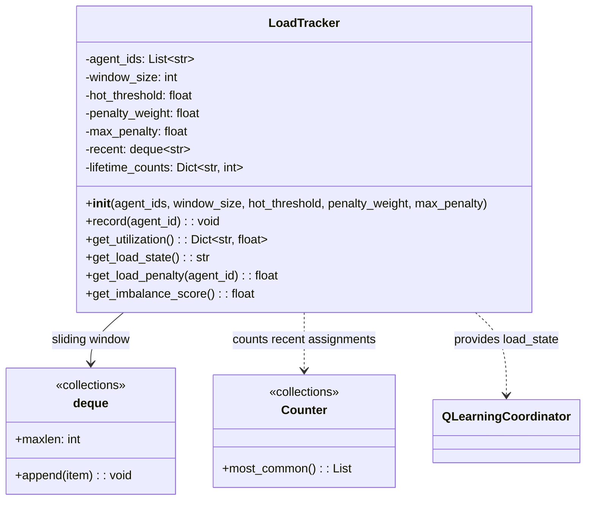
```mermaid
classDiagram
    class LoadTracker {
        -agent_ids: List~str~
        -window_size: int
        -hot_threshold: float
        -penalty_weight: float
        -max_penalty: float
        -recent: deque~str~
        -lifetime_counts: Dict~str, int~
        +__init__(agent_ids, window_size, hot_threshold, penalty_weight, max_penalty)
        +record(agent_id): void
        +get_utilization(): Dict~str, float~
        +get_load_state(): str
        +get_load_penalty(agent_id): float
        +get_imbalance_score(): float
    }

    class deque {
        <<collections>>
        +maxlen: int
        +append(item): void
    }

    class Counter {
        <<collections>>
        +most_common(): List
    }

    LoadTracker --> deque : sliding window
    LoadTracker ..> Counter : counts recent assignments
    LoadTracker ..> QLearningCoordinator : provides load_state
```

**Explanation.** `LoadTracker` is the **central new component** in the load-balanced version. It maintains a fixed-size deque (default `maxlen=8`) of recent agent assignment IDs, acting as a sliding window over the assignment history. Four public methods expose different views of the load:

| Method | Returns | Used By |
|--------|---------|---------|
| `get_utilization()` | `Dict[str, float]` — fraction of window per agent | Visualisation, health check |
| `get_load_state()` | `str` — `"balanced"` or `"<agent>_hot"` | Q-Learning state key |
| `get_load_penalty(agent_id)` | `float` — penalty for assigning to this agent | Reward shaping in `rl_update` |
| `get_imbalance_score()` | `float` — coefficient of variation across agents | Monitoring, logging |

The `record()` method is called **after** computing the load penalty for the current step but **before** computing the next iteration's load state, ensuring the penalty reflects the state at decision time, not after the assignment.

---

### 2.4 Load-Aware Q-Learning Coordinator

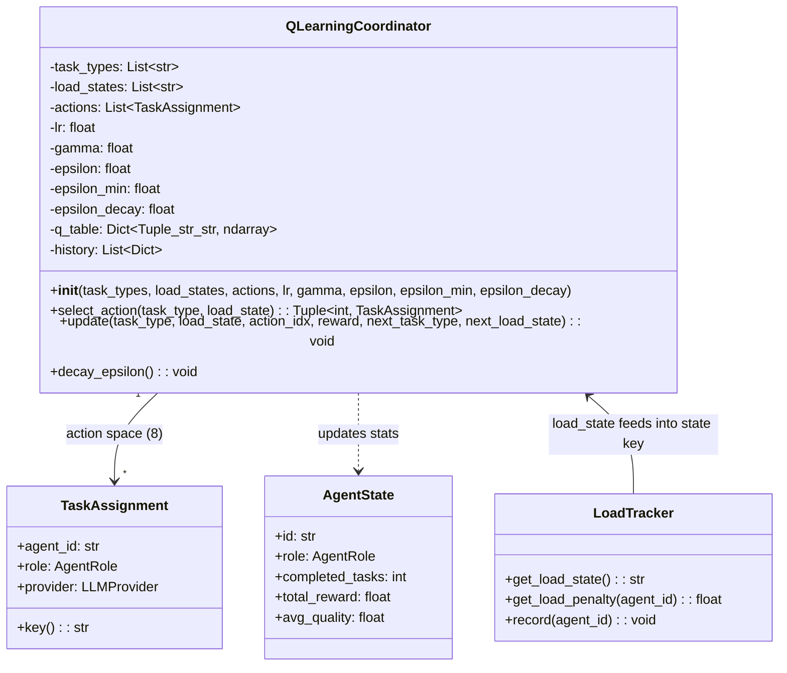
```mermaid
classDiagram
    class QLearningCoordinator {
        -task_types: List~str~
        -load_states: List~str~
        -actions: List~TaskAssignment~
        -lr: float
        -gamma: float
        -epsilon: float
        -epsilon_min: float
        -epsilon_decay: float
        -q_table: Dict~Tuple_str_str, ndarray~
        -history: List~Dict~
        +__init__(task_types, load_states, actions, lr, gamma, epsilon, epsilon_min, epsilon_decay)
        +select_action(task_type, load_state): Tuple~int, TaskAssignment~
        +update(task_type, load_state, action_idx, reward, next_task_type, next_load_state): void
        +decay_epsilon(): void
    }

    class TaskAssignment {
        +agent_id: str
        +role: AgentRole
        +provider: LLMProvider
        +key(): str
    }

    class AgentState {
        +id: str
        +role: AgentRole
        +completed_tasks: int
        +total_reward: float
        +avg_quality: float
    }

    class LoadTracker {
        +get_load_state(): str
        +get_load_penalty(agent_id): float
        +record(agent_id): void
    }

    QLearningCoordinator "1" --> "*" TaskAssignment : action space (8)
    QLearningCoordinator ..> AgentState : updates stats
    QLearningCoordinator <-- LoadTracker : load_state feeds into state key
```

**Explanation.** The load-balanced `QLearningCoordinator` differs from the base version in three critical ways:

| Aspect | Base Version | Load-Balanced Version |
|--------|-------------|----------------------|
| **State key** | `task_type` only | `(task_type, load_state)` tuple |
| **Q-table shape** | 4 rows × 8 columns = 32 cells | 20 rows × 8 columns = **160 cells** |
| **`select_action` signature** | `select_action(task_type)` | `select_action(task_type, load_state)` |
| **`update` signature** | `update(task_type, action_idx, reward, next_task_type)` | `update(task_type, load_state, action_idx, reward, next_task_type, next_load_state)` |
| **Hyperparameters** | lr=0.15, γ=0.95, ε_decay=0.97 | lr=0.15, γ=0.95, ε_decay=**0.98** |

The 5 load states are: `["balanced", "analyst_hot", "coder_hot", "researcher_hot", "validator_hot"]`. Combined with 4 task types (`analysis`, `coding`, `research`, `validation`), this produces 20 unique states, allowing the coordinator to learn **conditional policies** — e.g., "when the coder is overloaded, route coding tasks to the analyst instead."

---

### 2.5 LangGraph Workflow State

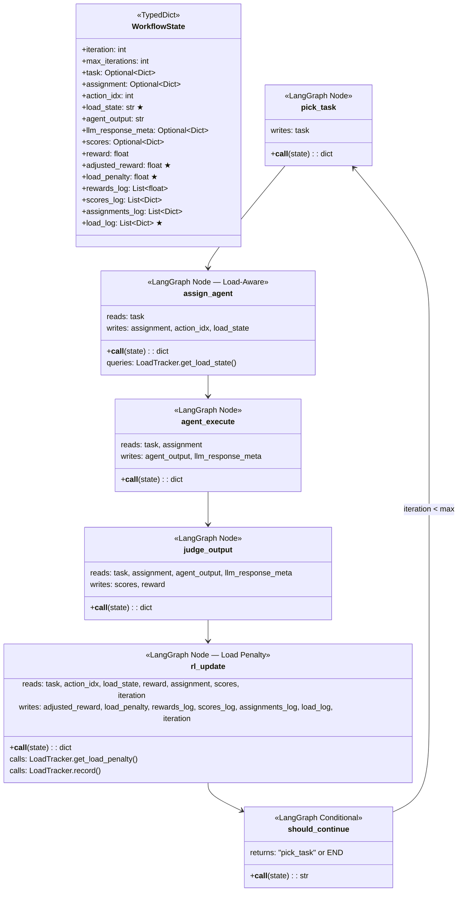
```mermaid
classDiagram
    class WorkflowState {
        <<TypedDict>>
        +iteration: int
        +max_iterations: int
        +task: Optional~Dict~
        +assignment: Optional~Dict~
        +action_idx: int
        +load_state: str ★
        +agent_output: str
        +llm_response_meta: Optional~Dict~
        +scores: Optional~Dict~
        +reward: float
        +adjusted_reward: float ★
        +load_penalty: float ★
        +rewards_log: List~float~
        +scores_log: List~Dict~
        +assignments_log: List~Dict~
        +load_log: List~Dict~ ★
    }

    class pick_task {
        <<LangGraph Node>>
        +__call__(state): dict
        writes: task
    }

    class assign_agent {
        <<LangGraph Node — Load-Aware>>
        +__call__(state): dict
        reads: task
        queries: LoadTracker.get_load_state()
        writes: assignment, action_idx, load_state
    }

    class agent_execute {
        <<LangGraph Node>>
        +__call__(state): dict
        reads: task, assignment
        writes: agent_output, llm_response_meta
    }

    class judge_output {
        <<LangGraph Node>>
        +__call__(state): dict
        reads: task, assignment, agent_output, llm_response_meta
        writes: scores, reward
    }

    class rl_update {
        <<LangGraph Node — Load Penalty>>
        +__call__(state): dict
        reads: task, action_idx, load_state, reward, assignment, scores, iteration
        calls: LoadTracker.get_load_penalty()
        calls: LoadTracker.record()
        writes: adjusted_reward, load_penalty, rewards_log, scores_log, assignments_log, load_log, iteration
    }

    class should_continue {
        <<LangGraph Conditional>>
        +__call__(state): str
        returns: "pick_task" or END
    }

    pick_task --> assign_agent
    assign_agent --> agent_execute
    agent_execute --> judge_output
    judge_output --> rl_update
    rl_update --> should_continue
    should_continue --> pick_task : iteration < max
```

**Explanation.** Fields marked with ★ are **new** in the load-balanced version. The `WorkflowState` TypedDict gains four fields:

- **`load_state`** (`str`) — the discrete load state at the time of assignment (`"balanced"` or `"<agent>_hot"`)
- **`adjusted_reward`** (`float`) — `reward − load_penalty`, used for the Q-table update
- **`load_penalty`** (`float`) — the penalty applied for assigning to an over-utilized agent
- **`load_log`** (`List[Dict]`) — per-iteration snapshots of agent utilization and imbalance score

Two nodes are modified: `assign_agent` now queries the `LoadTracker` for the current load state before consulting the Q-table, and `rl_update` applies a load penalty to the reward and calls `LoadTracker.record()` after penalty computation. All list fields are accumulated by constructing new lists (`prev + [new_item]`), following idiomatic LangGraph immutability.

---

### 2.6 Production System (Load-Balanced)

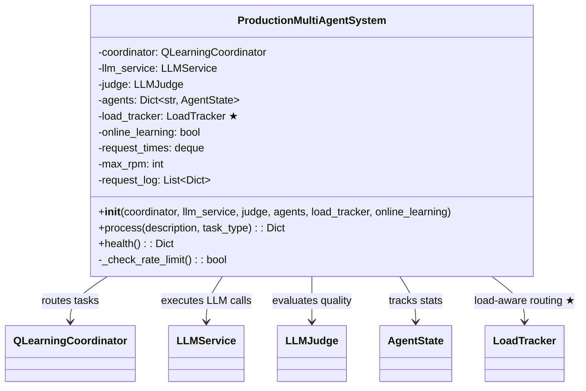
```mermaid
classDiagram
    class ProductionMultiAgentSystem {
        -coordinator: QLearningCoordinator
        -llm_service: LLMService
        -judge: LLMJudge
        -agents: Dict~str, AgentState~
        -load_tracker: LoadTracker ★
        -online_learning: bool
        -request_times: deque
        -max_rpm: int
        -request_log: List~Dict~
        +__init__(coordinator, llm_service, judge, agents, load_tracker, online_learning)
        +process(description, task_type): Dict
        +health(): Dict
        -_check_rate_limit(): bool
    }

    ProductionMultiAgentSystem --> QLearningCoordinator : routes tasks
    ProductionMultiAgentSystem --> LLMService : executes LLM calls
    ProductionMultiAgentSystem --> LLMJudge : evaluates quality
    ProductionMultiAgentSystem --> AgentState : tracks stats
    ProductionMultiAgentSystem --> LoadTracker : load-aware routing ★
```

**Explanation.** The load-balanced `ProductionMultiAgentSystem` (marked with ★) adds a `LoadTracker` dependency. In production:

1. Before routing, it queries `load_tracker.get_load_state()` to get the current load state.
2. After execution and judging, it computes `load_tracker.get_load_penalty(agent_id)` and subtracts it from the raw reward.
3. It calls `load_tracker.record(agent_id)` to update the sliding window.
4. For online learning, the `next_load_state` is obtained from the tracker *after* recording.
5. The `health()` method now returns `current_load_state`, `agent_utilization`, and `imbalance_score`.

---

### 2.7 Full System Relationships

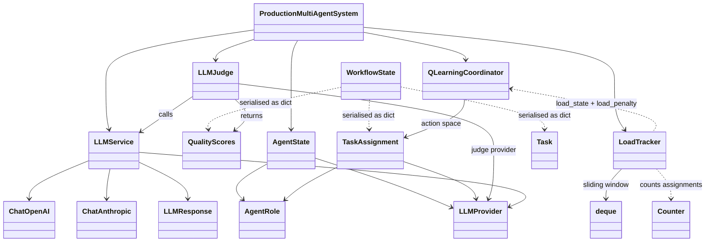
```mermaid
classDiagram
    LLMService --> ChatOpenAI
    LLMService --> ChatAnthropic
    LLMService --> LLMResponse
    LLMService --> LLMProvider

    LLMJudge --> LLMService : calls
    LLMJudge --> QualityScores : returns
    LLMJudge --> LLMProvider : judge provider

    LoadTracker --> deque : sliding window
    LoadTracker ..> Counter : counts assignments

    QLearningCoordinator --> TaskAssignment : action space
    QLearningCoordinator <.. LoadTracker : load_state + load_penalty
    TaskAssignment --> AgentRole
    TaskAssignment --> LLMProvider

    AgentState --> AgentRole
    AgentState --> LLMProvider

    ProductionMultiAgentSystem --> QLearningCoordinator
    ProductionMultiAgentSystem --> LLMService
    ProductionMultiAgentSystem --> LLMJudge
    ProductionMultiAgentSystem --> AgentState
    ProductionMultiAgentSystem --> LoadTracker

    WorkflowState ..> Task : serialised as dict
    WorkflowState ..> TaskAssignment : serialised as dict
    WorkflowState ..> QualityScores : serialised as dict
```

**Explanation.** This diagram shows every dependency in the load-balanced system. The `LoadTracker` sits between the agent pool and the Q-Learning coordinator, providing the additional state dimension (`load_state`) and reward modifier (`load_penalty`). In training, the LangGraph nodes interact with the `LoadTracker` directly (as a module-level singleton); in production, the `ProductionMultiAgentSystem` holds a reference to it.

---

## 3. Sequence Diagrams

### 3.1 Single Training Iteration (Load-Balanced)

One pass through the LangGraph pipeline with load-aware assignment and load-penalised reward.

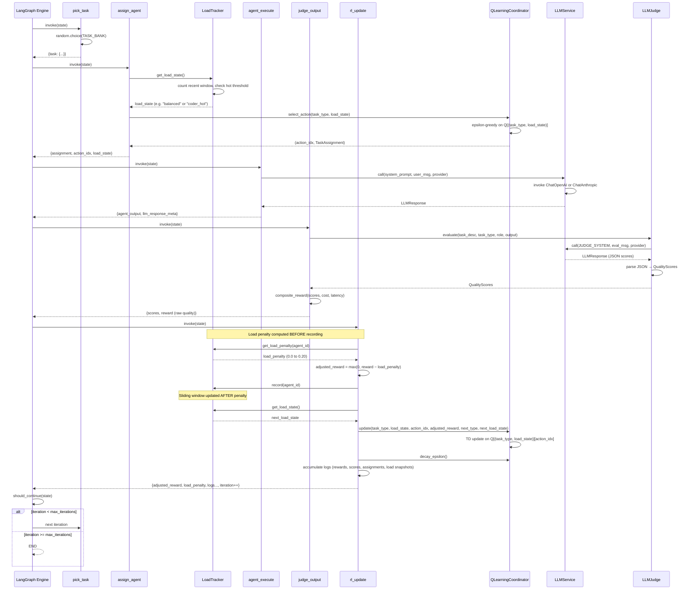
```mermaid
sequenceDiagram
    participant Graph as LangGraph Engine
    participant Pick as pick_task
    participant Assign as assign_agent
    participant LT as LoadTracker
    participant Exec as agent_execute
    participant Judge as judge_output
    participant Update as rl_update
    participant QLearn as QLearningCoordinator
    participant LLM as LLMService
    participant JudgeLLM as LLMJudge

    Graph->>Pick: invoke(state)
    Pick->>Pick: random.choice(TASK_BANK)
    Pick-->>Graph: {task: {...}}

    Graph->>Assign: invoke(state)
    Assign->>LT: get_load_state()
    LT->>LT: count recent window, check hot threshold
    LT-->>Assign: load_state (e.g. "balanced" or "coder_hot")
    Assign->>QLearn: select_action(task_type, load_state)
    QLearn->>QLearn: epsilon-greedy on Q[(task_type, load_state)]
    QLearn-->>Assign: (action_idx, TaskAssignment)
    Assign-->>Graph: {assignment, action_idx, load_state}

    Graph->>Exec: invoke(state)
    Exec->>LLM: call(system_prompt, user_msg, provider)
    LLM->>LLM: invoke ChatOpenAI or ChatAnthropic
    LLM-->>Exec: LLMResponse
    Exec-->>Graph: {agent_output, llm_response_meta}

    Graph->>Judge: invoke(state)
    Judge->>JudgeLLM: evaluate(task_desc, task_type, role, output)
    JudgeLLM->>LLM: call(JUDGE_SYSTEM, eval_msg, provider)
    LLM-->>JudgeLLM: LLMResponse (JSON scores)
    JudgeLLM->>JudgeLLM: parse JSON → QualityScores
    JudgeLLM-->>Judge: QualityScores
    Judge->>Judge: composite_reward(scores, cost, latency)
    Judge-->>Graph: {scores, reward (raw quality)}

    Graph->>Update: invoke(state)
    Note over Update,LT: Load penalty computed BEFORE recording
    Update->>LT: get_load_penalty(agent_id)
    LT-->>Update: load_penalty (0.0 to 0.20)
    Update->>Update: adjusted_reward = max(0, reward − load_penalty)
    Update->>LT: record(agent_id)
    Note over LT: Sliding window updated AFTER penalty
    Update->>LT: get_load_state()
    LT-->>Update: next_load_state
    Update->>QLearn: update(task_type, load_state, action_idx, adjusted_reward, next_type, next_load_state)
    QLearn->>QLearn: TD update on Q[(task_type, load_state)][action_idx]
    Update->>QLearn: decay_epsilon()
    Update->>Update: accumulate logs (rewards, scores, assignments, load snapshots)
    Update-->>Graph: {adjusted_reward, load_penalty, logs..., iteration++}

    Graph->>Graph: should_continue(state)
    alt iteration < max_iterations
        Graph->>Pick: next iteration
    else iteration >= max_iterations
        Graph-->>Graph: END
    end
```

**Explanation.** Each iteration produces exactly **two real LLM API calls**: one in `agent_execute` and one in `judge_output`. The load-balanced version adds three interactions with the `LoadTracker`:

1. **Before assignment** — `get_load_state()` determines which Q-table row to consult.
2. **Before Q-update** — `get_load_penalty()` computes the penalty for the assigned agent.
3. **After recording** — `record()` updates the window, then `get_load_state()` provides the next state for TD bootstrapping.

The ordering is critical: the penalty is computed *before* recording the current assignment, so it reflects the state at decision time.

---

### 3.2 Load-Aware Agent Assignment

Detail of how `assign_agent` queries the `LoadTracker` and `QLearningCoordinator` together.

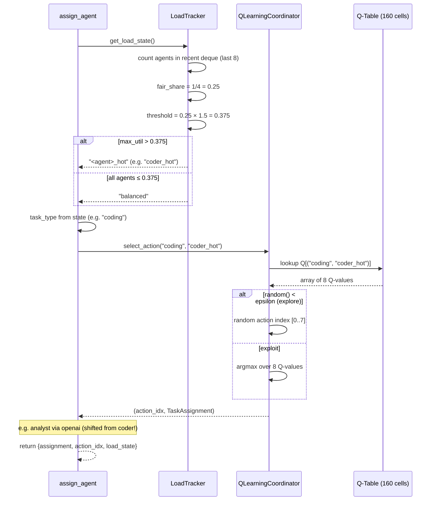
```mermaid
sequenceDiagram
    participant Node as assign_agent
    participant LT as LoadTracker
    participant QL as QLearningCoordinator
    participant QTable as Q-Table (160 cells)

    Node->>LT: get_load_state()
    LT->>LT: count agents in recent deque (last 8)
    LT->>LT: fair_share = 1/4 = 0.25
    LT->>LT: threshold = 0.25 × 1.5 = 0.375

    alt max_util > 0.375
        LT-->>Node: "<agent>_hot" (e.g. "coder_hot")
    else all agents ≤ 0.375
        LT-->>Node: "balanced"
    end

    Node->>Node: task_type from state (e.g. "coding")
    Node->>QL: select_action("coding", "coder_hot")
    QL->>QTable: lookup Q[("coding", "coder_hot")]
    QTable-->>QL: array of 8 Q-values

    alt random() < epsilon (explore)
        QL->>QL: random action index [0..7]
    else exploit
        QL->>QL: argmax over 8 Q-values
    end

    QL-->>Node: (action_idx, TaskAssignment)
    Note over Node: e.g. analyst via openai (shifted from coder!)
    Node-->>Node: return {assignment, action_idx, load_state}
```

**Explanation.** This diagram shows the key innovation: the coordinator's action depends on *both* the task type and the current load state. When the coder is "hot" (> 37.5% of recent tasks), the Q-table for `("coding", "coder_hot")` may have learned to prefer routing coding tasks to the analyst—even though the coder normally produces better quality—because the load penalty would reduce the effective reward for the coder.

---

### 3.3 LLM-as-Judge Evaluation

Detail of how `LLMJudge.evaluate()` scores an agent output.

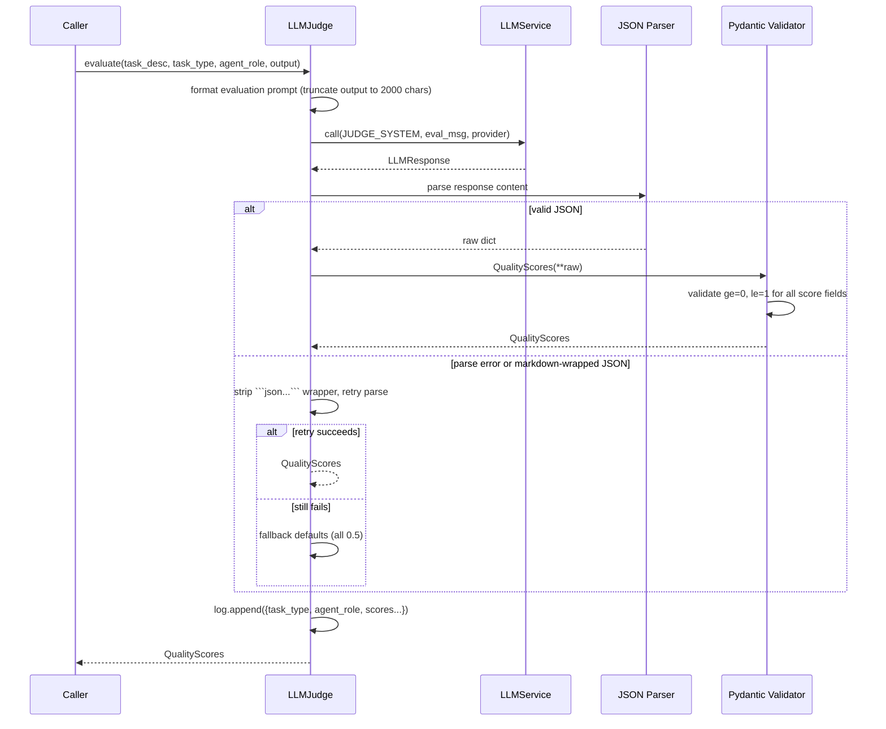
```mermaid
sequenceDiagram
    participant Caller
    participant Judge as LLMJudge
    participant Service as LLMService
    participant Parser as JSON Parser
    participant Validator as Pydantic Validator

    Caller->>Judge: evaluate(task_desc, task_type, agent_role, output)
    Judge->>Judge: format evaluation prompt (truncate output to 2000 chars)
    Judge->>Service: call(JUDGE_SYSTEM, eval_msg, provider)
    Service-->>Judge: LLMResponse

    Judge->>Parser: parse response content

    alt valid JSON
        Parser-->>Judge: raw dict
        Judge->>Validator: QualityScores(**raw)
        Validator->>Validator: validate ge=0, le=1 for all score fields
        Validator-->>Judge: QualityScores
    else parse error or markdown-wrapped JSON
        Judge->>Judge: strip ```json...``` wrapper, retry parse
        alt retry succeeds
            Judge-->>Judge: QualityScores
        else still fails
            Judge->>Judge: fallback defaults (all 0.5)
        end
    end

    Judge->>Judge: log.append({task_type, agent_role, scores...})
    Judge-->>Caller: QualityScores
```

**Explanation.** The judge sends a structured evaluation prompt asking the LLM to return JSON with four numeric scores and a reasoning string. The parser handles markdown-wrapped JSON (common with some models) and falls back to 0.5 defaults if parsing fails entirely, ensuring the system never crashes on a single bad judge response. Scores are validated via Pydantic's `ge=0, le=1` constraints.

---

### 3.4 Load-Aware RL Update

Detail of the `rl_update` node showing load penalty computation, recording, and Q-table update.

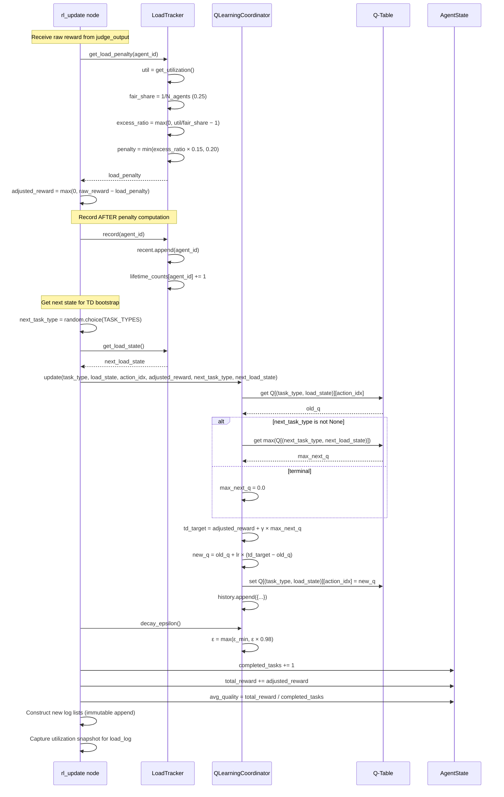
```mermaid
sequenceDiagram
    participant Node as rl_update node
    participant LT as LoadTracker
    participant QL as QLearningCoordinator
    participant QTable as Q-Table
    participant Agent as AgentState

    Note over Node: Receive raw reward from judge_output

    Node->>LT: get_load_penalty(agent_id)
    LT->>LT: util = get_utilization()
    LT->>LT: fair_share = 1/N_agents (0.25)
    LT->>LT: excess_ratio = max(0, util/fair_share − 1)
    LT->>LT: penalty = min(excess_ratio × 0.15, 0.20)
    LT-->>Node: load_penalty

    Node->>Node: adjusted_reward = max(0, raw_reward − load_penalty)

    Note over Node,LT: Record AFTER penalty computation
    Node->>LT: record(agent_id)
    LT->>LT: recent.append(agent_id)
    LT->>LT: lifetime_counts[agent_id] += 1

    Note over Node: Get next state for TD bootstrap
    Node->>Node: next_task_type = random.choice(TASK_TYPES)
    Node->>LT: get_load_state()
    LT-->>Node: next_load_state

    Node->>QL: update(task_type, load_state, action_idx, adjusted_reward, next_task_type, next_load_state)

    QL->>QTable: get Q[(task_type, load_state)][action_idx]
    QTable-->>QL: old_q

    alt next_task_type is not None
        QL->>QTable: get max(Q[(next_task_type, next_load_state)])
        QTable-->>QL: max_next_q
    else terminal
        QL->>QL: max_next_q = 0.0
    end

    QL->>QL: td_target = adjusted_reward + γ × max_next_q
    QL->>QL: new_q = old_q + lr × (td_target − old_q)
    QL->>QTable: set Q[(task_type, load_state)][action_idx] = new_q
    QL->>QL: history.append({...})

    Node->>QL: decay_epsilon()
    QL->>QL: ε = max(ε_min, ε × 0.98)

    Node->>Agent: completed_tasks += 1
    Node->>Agent: total_reward += adjusted_reward
    Node->>Agent: avg_quality = total_reward / completed_tasks

    Node->>Node: Construct new log lists (immutable append)
    Node->>Node: Capture utilization snapshot for load_log
```

**Explanation.** The RL update in the load-balanced version is more involved than the base version. The key additions:

1. **Load penalty** is computed *before* recording the assignment, so it reflects the load state at decision time.
2. The **adjusted reward** (raw − penalty) is used for the Q-table update, not the raw reward.
3. The **next state** for TD bootstrapping is `(next_task_type, next_load_state)`, where `next_load_state` is queried *after* recording — reflecting the updated sliding window.
4. A **load snapshot** is appended to `load_log` each iteration for post-training visualisation.

---

### 3.5 Production Request Processing (Load-Balanced)

End-to-end flow of `ProductionMultiAgentSystem.process()` with load-aware routing.

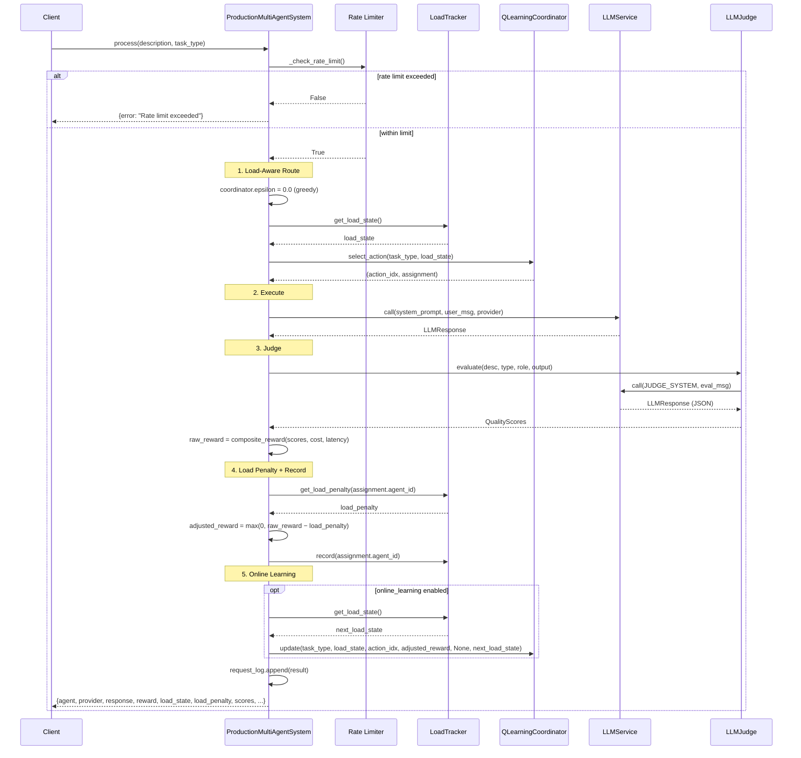
```mermaid
sequenceDiagram
    participant Client
    participant Prod as ProductionMultiAgentSystem
    participant RateLimit as Rate Limiter
    participant LT as LoadTracker
    participant QL as QLearningCoordinator
    participant LLM as LLMService
    participant Judge as LLMJudge

    Client->>Prod: process(description, task_type)

    Prod->>RateLimit: _check_rate_limit()
    alt rate limit exceeded
        RateLimit-->>Prod: False
        Prod-->>Client: {error: "Rate limit exceeded"}
    else within limit
        RateLimit-->>Prod: True

        Note over Prod: 1. Load-Aware Route
        Prod->>Prod: coordinator.epsilon = 0.0 (greedy)
        Prod->>LT: get_load_state()
        LT-->>Prod: load_state
        Prod->>QL: select_action(task_type, load_state)
        QL-->>Prod: (action_idx, assignment)

        Note over Prod: 2. Execute
        Prod->>LLM: call(system_prompt, user_msg, provider)
        LLM-->>Prod: LLMResponse

        Note over Prod: 3. Judge
        Prod->>Judge: evaluate(desc, type, role, output)
        Judge->>LLM: call(JUDGE_SYSTEM, eval_msg)
        LLM-->>Judge: LLMResponse (JSON)
        Judge-->>Prod: QualityScores
        Prod->>Prod: raw_reward = composite_reward(scores, cost, latency)

        Note over Prod: 4. Load Penalty + Record
        Prod->>LT: get_load_penalty(assignment.agent_id)
        LT-->>Prod: load_penalty
        Prod->>Prod: adjusted_reward = max(0, raw_reward − load_penalty)
        Prod->>LT: record(assignment.agent_id)

        Note over Prod: 5. Online Learning
        opt online_learning enabled
            Prod->>LT: get_load_state()
            LT-->>Prod: next_load_state
            Prod->>QL: update(task_type, load_state, action_idx, adjusted_reward, None, next_load_state)
        end

        Prod->>Prod: request_log.append(result)
        Prod-->>Client: {agent, provider, response, reward, load_state, load_penalty, scores, ...}
    end
```

**Explanation.** In production, the coordinator always acts greedily (ε = 0) but the routing still adapts to load conditions via the `LoadTracker`. The load penalty is applied to the reward for online learning, creating a continuous feedback loop that prevents the production system from converging on a single agent. The response includes `load_state` and `load_penalty` for observability.

---

## 4. LangGraph Workflow Flowchart

The five-node state machine that orchestrates each training iteration, with load-aware nodes highlighted.

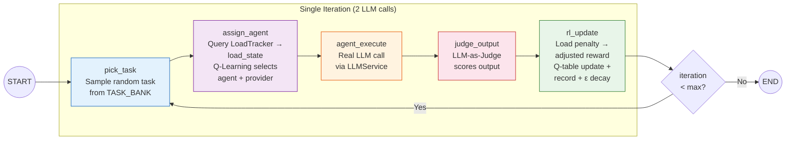
```mermaid
flowchart LR
    START((START)) --> pick_task

    subgraph iteration["Single Iteration (2 LLM calls)"]
        pick_task["pick_task<br/>Sample random task<br/>from TASK_BANK"]
        assign_agent["assign_agent<br/>Query LoadTracker →<br/>load_state<br/>Q-Learning selects<br/>agent + provider"]
        agent_execute["agent_execute<br/>Real LLM call<br/>via LLMService"]
        judge_output["judge_output<br/>LLM-as-Judge<br/>scores output"]
        rl_update["rl_update<br/>Load penalty →<br/>adjusted reward<br/>Q-table update +<br/>record + ε decay"]

        pick_task --> assign_agent
        assign_agent --> agent_execute
        agent_execute --> judge_output
        judge_output --> rl_update
    end

    rl_update --> check{iteration <br/> < max?}
    check -->|Yes| pick_task
    check -->|No| STOP((END))

    style pick_task fill:#e3f2fd,stroke:#1565c0
    style assign_agent fill:#f3e5f5,stroke:#7b1fa2
    style agent_execute fill:#fff3e0,stroke:#e65100
    style judge_output fill:#fce4ec,stroke:#c62828
    style rl_update fill:#e8f5e9,stroke:#2e7d32
```

**Explanation.** The pipeline structure is identical to the base version but `assign_agent` and `rl_update` have load-aware behaviour. `assign_agent` queries `LoadTracker.get_load_state()` to form the composite state key `(task_type, load_state)`. `rl_update` computes the load penalty, subtracts it from the raw reward, records the assignment in the sliding window, and uses the post-recording load state for TD bootstrapping.

---

## 5. RL Training Loop Flowchart

Detailed flowchart showing the complete training procedure including load-balanced setup and 6-panel post-training analysis.

```mermaid
flowchart TD
    Start([Start Training]) --> Config["Set N_ITERATIONS = 50<br/>(increased from 30 for<br/>20-state space coverage)"]
    Config --> InitState["Create initial WorkflowState<br/>iteration=0, load_state='balanced'<br/>empty logs incl. load_log"]

    InitState --> Invoke[app.invoke initial_state]

    subgraph LangGraph["LangGraph Execution Loop"]
        direction TB
        PT[pick_task: sample Task] --> AA["assign_agent:<br/>load_state ← LoadTracker<br/>epsilon-greedy on Q(type, load)"]
        AA --> AE[agent_execute: LLM call]
        AE --> JO[judge_output: LLM judge call]
        JO --> RU["rl_update:<br/>load_penalty ← LoadTracker<br/>adjusted_reward = raw − penalty<br/>record + Q-update + ε decay"]
        RU --> Check{iteration < 50?}
        Check -->|Yes| PT
        Check -->|No| Return[Return final_state]
    end

    Invoke --> LangGraph
    Return --> Elapsed[Compute elapsed time]

    Elapsed --> PrintSummary["Print summary:<br/>mean adjusted reward, mean load penalty,<br/>final epsilon, final imbalance,<br/>LLM calls, total cost USD"]
    PrintSummary --> Viz["Plot 6-panel dashboard<br/>1. raw vs adjusted rewards<br/>2. quality scores<br/>3. agent utilisation vs fair share<br/>4. reward by task type<br/>5. per-agent util over time<br/>6. load penalty + imbalance"]
    Viz --> LoadDist[Plot load state<br/>distribution bar chart]
    LoadDist --> QHeat["Plot Q-table heatmaps<br/>per load state<br/>(balanced + visited hot states)"]
    QHeat --> Policy[Print routing policy<br/>per task type]
    Policy --> Shifts["Print policy shifts<br/>when agents are hot"]
    Shifts --> LiveDemo["Live demo:<br/>load-aware greedy routing"]
    LiveDemo --> Done([Training Complete])

    style LangGraph fill:#f5f5f5,stroke:#616161
    style AA fill:#f3e5f5,stroke:#7b1fa2
    style RU fill:#e8f5e9,stroke:#2e7d32
```

**Explanation.** Training runs 50 iterations (100 LLM calls), producing a 6-panel dashboard. Panels 5 and 6 are new in the load-balanced version: panel 5 plots per-agent utilization over time as a sliding-window time series, and panel 6 overlays load penalty (left axis) with imbalance score (right axis) to show how load distribution evolves during training.

---

## 6. Q-Learning Decision Flowchart (Load-Aware)

How the coordinator selects an agent+provider given both task type and load state.

```mermaid
flowchart TD
    Input1([Receive task_type<br/>e.g. "coding"]) --> GetLoad
    GetLoad["Query LoadTracker<br/>get_load_state()"] --> LoadResult

    LoadResult{Load State?}
    LoadResult -->|"balanced"| CompositeB["state = ('coding', 'balanced')"]
    LoadResult -->|"coder_hot"| CompositeH["state = ('coding', 'coder_hot')"]
    LoadResult -->|other hot| CompositeO["state = ('coding', '<agent>_hot')"]

    CompositeB --> Lookup
    CompositeH --> Lookup
    CompositeO --> Lookup

    Lookup["Lookup Q-table row<br/>for composite state"] --> Sample["Sample r ~ U(0,1)"]
    Sample --> Compare{r < ε ?}

    Compare -->|Yes: Explore| Random["Random action<br/>from 8 assignments"]
    Compare -->|No: Exploit| ArgMax["argmax over 8<br/>Q-values for this state"]

    Random --> Action["(action_idx, TaskAssignment)"]
    ArgMax --> Action

    Action --> Extract["Extract: agent_id,<br/>AgentRole, LLMProvider"]
    Extract --> Return([Return assignment])

    style GetLoad fill:#f3e5f5,stroke:#7b1fa2
    style LoadResult fill:#fff3e0,stroke:#e65100
    style Random fill:#e3f2fd,stroke:#1565c0
    style ArgMax fill:#e8f5e9,stroke:#2e7d32
```

**Explanation.** The action space has 8 entries: 4 agents × 2 providers. The key difference from the base version is the Q-table lookup uses a **composite state** `(task_type, load_state)`. This means the coordinator can learn different routing strategies for the same task type depending on which agent is overloaded. For example, `Q[("coding", "balanced")]` might prefer the coder, while `Q[("coding", "coder_hot")]` might prefer the analyst — these are independent Q-table rows with potentially different learned policies.

---

## 7. Reward Computation Flowchart (with Load Penalty)

How the composite reward is computed and then adjusted for load balancing.

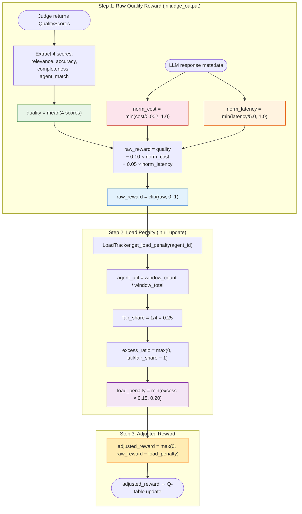
```mermaid
flowchart TD
    subgraph raw_reward["Step 1: Raw Quality Reward (in judge_output)"]
        Input([Judge returns QualityScores]) --> Extract["Extract 4 scores:<br/>relevance, accuracy,<br/>completeness, agent_match"]
        Extract --> Quality["quality = mean(4 scores)"]

        Input2([LLM response metadata]) --> Cost["norm_cost = min(cost/0.002, 1.0)"]
        Input2 --> Latency["norm_latency = min(latency/5.0, 1.0)"]

        Quality --> Combine["raw_reward = quality<br/>− 0.10 × norm_cost<br/>− 0.05 × norm_latency"]
        Cost --> Combine
        Latency --> Combine

        Combine --> Clip["raw_reward = clip(raw, 0, 1)"]
    end

    subgraph load_adjustment["Step 2: Load Penalty (in rl_update)"]
        Clip --> GetPenalty["LoadTracker.get_load_penalty(agent_id)"]
        GetPenalty --> CalcUtil["agent_util = window_count / window_total"]
        CalcUtil --> FairShare["fair_share = 1/4 = 0.25"]
        FairShare --> Excess["excess_ratio = max(0, util/fair_share − 1)"]
        Excess --> PenaltyCalc["load_penalty = min(excess × 0.15, 0.20)"]
    end

    subgraph final_reward["Step 3: Adjusted Reward"]
        PenaltyCalc --> Subtract["adjusted_reward = max(0, raw_reward − load_penalty)"]
        Subtract --> Return([adjusted_reward → Q-table update])
    end

    style Quality fill:#e8f5e9,stroke:#2e7d32
    style Cost fill:#fce4ec,stroke:#c62828
    style Latency fill:#fff3e0,stroke:#e65100
    style Clip fill:#e3f2fd,stroke:#1565c0
    style PenaltyCalc fill:#f3e5f5,stroke:#7b1fa2
    style Subtract fill:#ffecb3,stroke:#ff6f00
```

**Explanation.** The reward computation is a two-stage pipeline split across two LangGraph nodes:

1. **`judge_output`** computes the **raw reward** from quality scores (80% weight), cost (10% weight), and latency (5% weight).
2. **`rl_update`** subtracts the **load penalty** to produce the **adjusted reward** that is used for Q-table updates.

The load penalty ranges from 0.000 (agent at or below fair share) to 0.200 (agent heavily overloaded). Example penalties for 4 agents:

| Agent Utilization | Excess Ratio | Load Penalty |
|:-:|:-:|:-:|
| 25% (fair share) | 0.0 | 0.000 |
| 37.5% (threshold) | 0.5 | 0.075 |
| 50% | 1.0 | 0.150 |
| 75%+ | ≥ 2.0 | 0.200 (capped) |

---

## 8. Agent Utilization Tracking — Deep Dive

This section provides an in-depth analysis of how the `LoadTracker` class monitors and influences agent utilization.

### 8.1 LoadTracker Architecture

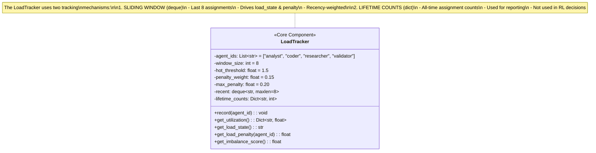
```mermaid
classDiagram
    class LoadTracker {
        <<Core Component>>
        -agent_ids: List~str~ = ["analyst", "coder", "researcher", "validator"]
        -window_size: int = 8
        -hot_threshold: float = 1.5
        -penalty_weight: float = 0.15
        -max_penalty: float = 0.20
        -recent: deque~str, maxlen=8~
        -lifetime_counts: Dict~str, int~
        +record(agent_id): void
        +get_utilization(): Dict~str, float~
        +get_load_state(): str
        +get_load_penalty(agent_id): float
        +get_imbalance_score(): float
    }

    note for LoadTracker "The LoadTracker uses two tracking\nmechanisms:\n\n1. SLIDING WINDOW (deque)\n   - Last 8 assignments\n   - Drives load_state & penalty\n   - Recency-weighted\n\n2. LIFETIME COUNTS (dict)\n   - All-time assignment counts\n   - Used for reporting\n   - Not used in RL decisions"
```

**Explanation.** The `LoadTracker` maintains two parallel tracking mechanisms:

- **Sliding window** (`deque` with `maxlen=8`): captures only the most recent assignments, making the system **adaptive** — if the coordinator shifts away from an overloaded agent, the window eventually clears and the agent becomes available again. This drives all RL-relevant computations (load state, penalty).
- **Lifetime counts** (`Dict[str, int]`): tracks total assignments across all iterations for reporting and visualisation only. These do not affect RL decisions.

The window size of 8 was chosen to be 2× the number of agents (4), providing enough history to detect imbalances while remaining responsive to changes.

---

### 8.2 Sliding Window Mechanism

```mermaid
flowchart LR
    subgraph window["Sliding Window (deque, maxlen=8)"]
        direction LR
        s1["slot 1"] --- s2["slot 2"] --- s3["slot 3"] --- s4["slot 4"] --- s5["slot 5"] --- s6["slot 6"] --- s7["slot 7"] --- s8["slot 8"]
    end

    NewAssignment([New Assignment:<br/>"coder"]) -->|"record()"| window
    window -->|"oldest evicted<br/>when full"| Evicted([Oldest slot<br/>drops off])

    window --> Utilization["get_utilization()<br/>count each agent / total"]
    Utilization --> Example["Example: deque = [coder, coder, coder,<br/>analyst, coder, researcher, analyst, validator]<br/><br/>coder: 4/8 = 50%<br/>analyst: 2/8 = 25%<br/>researcher: 1/8 = 12.5%<br/>validator: 1/8 = 12.5%"]

    style window fill:#e3f2fd,stroke:#1565c0
    style Example fill:#fff9c4,stroke:#f9a825
```

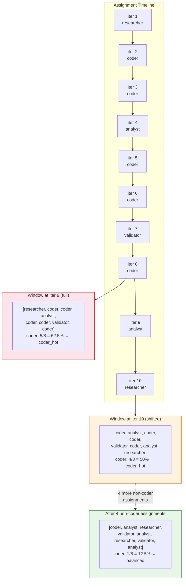
```mermaid
flowchart TD
    subgraph timeline["Assignment Timeline"]
        direction LR
        t1["iter 1<br/>researcher"] --> t2["iter 2<br/>coder"]
        t2 --> t3["iter 3<br/>coder"]
        t3 --> t4["iter 4<br/>analyst"]
        t4 --> t5["iter 5<br/>coder"]
        t5 --> t6["iter 6<br/>coder"]
        t6 --> t7["iter 7<br/>validator"]
        t7 --> t8["iter 8<br/>coder"]
        t8 --> t9["iter 9<br/>analyst"]
        t9 --> t10["iter 10<br/>researcher"]
    end

    subgraph window_at_8["Window at iter 8 (full)"]
        w8["[researcher, coder, coder, analyst,<br/>coder, coder, validator, coder]<br/>coder: 5/8 = 62.5% → coder_hot"]
    end

    subgraph window_at_10["Window at iter 10 (shifted)"]
        w10["[coder, analyst, coder, coder,<br/>validator, coder, analyst, researcher]<br/>coder: 4/8 = 50% → coder_hot"]
    end

    subgraph window_after_balance["After 4 non-coder assignments"]
        wb["[coder, analyst, researcher,<br/>validator, analyst, researcher, validator, analyst]<br/>coder: 1/8 = 12.5% → balanced"]
    end

    t8 --> window_at_8
    t10 --> window_at_10
    window_at_10 -.->|"4 more non-coder<br/>assignments"| window_after_balance

    style window_at_8 fill:#fce4ec,stroke:#c62828
    style window_at_10 fill:#fff3e0,stroke:#e65100
    style window_after_balance fill:#e8f5e9,stroke:#2e7d32
```

**Explanation.** The sliding window acts as a recency filter: only the last 8 assignments matter. When an agent is overloaded, the penalty discourages further assignments to it. As the window slides forward and older assignments to that agent drop off, the agent's utilization naturally decreases, and the load state transitions from `"<agent>_hot"` back to `"balanced"`. This creates a **self-correcting feedback loop**: the penalty causes redistribution, which in turn reduces the penalty.

---

### 8.3 Load State Computation

```mermaid
flowchart TD
    Start([get_load_state called]) --> CheckSize{"len(recent) < 3?"}

    CheckSize -->|Yes| EarlyReturn["Return 'balanced'<br/>(insufficient data)"]

    CheckSize -->|No| CalcUtil["Calculate utilization<br/>for each agent"]
    CalcUtil --> FairShare["fair_share = 1/N_agents<br/>= 1/4 = 0.25"]
    FairShare --> Threshold["threshold = fair_share × hot_threshold<br/>= 0.25 × 1.5 = 0.375"]
    Threshold --> FindMax["Find agent with<br/>highest utilization"]
    FindMax --> Compare{"max_util ><br/>threshold (0.375)?"}

    Compare -->|No| Balanced["Return 'balanced'"]
    Compare -->|Yes| Hot["Return '<max_agent>_hot'<br/>e.g. 'coder_hot'"]

    subgraph examples["Examples (window_size=8, 4 agents)"]
        direction LR
        e1["Window: [R,A,C,V,R,A,C,V]<br/>All at 25% → balanced"]
        e2["Window: [C,C,C,A,C,R,A,V]<br/>Coder at 50% → coder_hot"]
        e3["Window: [A,A,A,A,C,R,V,A]<br/>Analyst at 62.5% → analyst_hot"]
        e4["Window: [R,C]<br/>Only 2 entries → balanced<br/>(early-return: < 3)"]
    end

    style CheckSize fill:#fff3e0,stroke:#e65100
    style Compare fill:#fff3e0,stroke:#e65100
    style Balanced fill:#e8f5e9,stroke:#2e7d32
    style Hot fill:#fce4ec,stroke:#c62828
    style EarlyReturn fill:#e3f2fd,stroke:#1565c0
```

**Explanation.** The load state computation is deliberately simple:

1. **Early return** if fewer than 3 assignments have been recorded — not enough data to judge imbalance.
2. Compute per-agent utilization as `count_in_window / window_total`.
3. If the most-utilized agent exceeds `1.5 × fair_share` (i.e., 37.5% for 4 agents), declare that agent "hot".
4. Only one agent can be "hot" at a time (the one with the highest utilization).

This produces 5 discrete load states: `["balanced", "analyst_hot", "coder_hot", "researcher_hot", "validator_hot"]`. The simplicity is intentional — it keeps the Q-table manageable (160 cells vs thousands for continuous state representations) while providing enough signal for the coordinator to learn load-aware policies.

---

### 8.4 Load Penalty Calculation

```mermaid
flowchart TD
    Start([get_load_penalty agent_id called]) --> GetUtil["util = get_utilization()"]
    GetUtil --> FairShare["fair_share = 1 / N_agents = 0.25"]
    FairShare --> AgentUtil["agent_util = util.get(agent_id, 0.0)"]

    AgentUtil --> ExcessCalc["excess_ratio = max(0, agent_util / fair_share − 1)"]

    ExcessCalc --> PenCalc["penalty = min(excess_ratio × penalty_weight, max_penalty)<br/>= min(excess × 0.15, 0.20)"]

    PenCalc --> Return([Return penalty])

    subgraph penalty_curve["Penalty Curve (4 agents, weight=0.15, max=0.20)"]
        direction LR
        p0["0% util<br/>excess=0<br/>penalty=0.000"]
        p25["25% util<br/>excess=0<br/>penalty=0.000"]
        p37["37.5% util<br/>excess=0.5<br/>penalty=0.075"]
        p50["50% util<br/>excess=1.0<br/>penalty=0.150"]
        p62["62.5% util<br/>excess=1.5<br/>penalty=0.200"]
        p75["75% util<br/>excess=2.0<br/>penalty=0.200"]
        p0 --- p25 --- p37 --- p50 --- p62 --- p75
    end

    style ExcessCalc fill:#f3e5f5,stroke:#7b1fa2
    style PenCalc fill:#fce4ec,stroke:#c62828
    style p25 fill:#e8f5e9,stroke:#2e7d32
    style p37 fill:#fff3e0,stroke:#e65100
    style p50 fill:#fff3e0,stroke:#e65100
    style p62 fill:#fce4ec,stroke:#c62828
    style p75 fill:#fce4ec,stroke:#c62828
```

**Explanation.** The penalty function is a **capped linear ramp**:

- **Below fair share (≤ 25%):** zero penalty — no discouragement.
- **Between fair share and cap:** penalty grows linearly at `0.15 × excess_ratio`.
- **At cap (≥ ~58% utilization):** penalty is clamped at 0.20, preventing excessive punishment.

The penalty is **per-agent** and computed **per-step**: even if the overall system is balanced, assigning one more task to an already-busy agent incurs a penalty proportional to that agent's current utilization.

Key design decisions:
- `penalty_weight = 0.15` provides a moderate incentive to redistribute without completely overriding quality preferences.
- `max_penalty = 0.20` prevents the load penalty from dominating the reward (since raw rewards typically range from 0.5 to 0.9).
- The penalty is computed **before** recording the current assignment, so it reflects the pre-assignment state.

---

### 8.5 Utilization Feedback Loop

This flowchart shows the complete feedback loop through which load tracking influences agent selection and then updates itself.

```mermaid
flowchart TD
    subgraph step_n["Iteration N"]
        direction TB
        Task["New Task Arrives<br/>(task_type)"] --> QueryLoad["LoadTracker.get_load_state()"]
        QueryLoad --> State["state = (task_type, load_state)"]
        State --> QTable["Q-table lookup<br/>Q[(task_type, load_state)]"]
        QTable --> Select["Select agent<br/>(epsilon-greedy)"]
        Select --> Execute["Agent executes task<br/>(real LLM call)"]
        Execute --> Judge["Judge scores output<br/>(raw_reward)"]
        Judge --> Penalty["LoadTracker.get_load_penalty(agent_id)"]
        Penalty --> Adjust["adjusted_reward = raw − penalty"]
        Adjust --> Record["LoadTracker.record(agent_id)<br/>Window shifts →"]
        Record --> UpdateQ["Q-table update with<br/>adjusted_reward"]
    end

    UpdateQ -->|"next iteration"| NextTask["Next Task Arrives"]
    NextTask --> QueryLoad2["LoadTracker.get_load_state()<br/>(may have changed!)"]

    QueryLoad2 -.-> |"if agent was<br/>recorded heavily"| HotState["load_state = '<agent>_hot'<br/>→ Different Q-table row<br/>→ May route to different agent"]

    QueryLoad2 -.-> |"if agents are<br/>evenly distributed"| BalancedState["load_state = 'balanced'<br/>→ Default Q-table row<br/>→ Route to best-quality agent"]

    HotState --> Redistributed["Over time: penalty causes<br/>redistribution → agent cools down<br/>→ returns to 'balanced'"]

    style step_n fill:#f5f5f5,stroke:#616161
    style Penalty fill:#fce4ec,stroke:#c62828
    style Record fill:#f3e5f5,stroke:#7b1fa2
    style HotState fill:#fce4ec,stroke:#c62828
    style BalancedState fill:#e8f5e9,stroke:#2e7d32
    style Redistributed fill:#e8f5e9,stroke:#2e7d32
```

**Explanation.** The feedback loop has three corrective mechanisms:

1. **Load state shifts the Q-table row:** When an agent becomes "hot", the coordinator consults a different row of the Q-table that may have learned to prefer a different agent. This is a *policy-level* correction.

2. **Load penalty reduces the reward:** Even if the coordinator still selects the overloaded agent (e.g., during exploration), the reduced reward will lower the Q-value for that assignment, making it less attractive in future exploitation steps. This is a *learning-level* correction.

3. **Sliding window naturally cools down:** As the coordinator routes tasks to other agents, the overloaded agent's entries in the sliding window are eventually evicted, reducing its utilization and potentially transitioning the load state back to "balanced". This is a *temporal* correction.

Together, these three mechanisms ensure that the system converges toward a balanced distribution of work across agents, while still prioritizing quality when load is balanced.

---

### 8.6 Imbalance Score Computation

```mermaid
flowchart TD
    Start([get_imbalance_score called]) --> GetUtil["util = get_utilization()<br/>{analyst: 0.25, coder: 0.50, researcher: 0.125, validator: 0.125}"]

    GetUtil --> ExtractVals["vals = [0.25, 0.50, 0.125, 0.125]"]

    ExtractVals --> CheckZero{"max(vals) == 0?"}
    CheckZero -->|Yes| RetZero["Return 0.0<br/>(no assignments yet)"]
    CheckZero -->|No| CalcStats["mean = 0.25<br/>std = 0.144"]

    CalcStats --> CV["imbalance = std / mean<br/>= 0.144 / 0.25 = 0.577"]

    CV --> Return([Return imbalance score])

    subgraph interpretation["Interpreting Imbalance Scores"]
        direction LR
        i0["0.000 — Perfect balance<br/>(all agents equal)"]
        i3["~0.3 — Mild imbalance<br/>(some skew)"]
        i6["~0.6 — Significant imbalance<br/>(one agent handles 2× its share)"]
        i10["~1.0+ — Severe imbalance<br/>(most work on one agent)"]
    end

    style CV fill:#f3e5f5,stroke:#7b1fa2
    style i0 fill:#e8f5e9,stroke:#2e7d32
    style i3 fill:#fff3e0,stroke:#e65100
    style i6 fill:#fce4ec,stroke:#c62828
    style i10 fill:#fce4ec,stroke:#c62828
```

**Explanation.** The imbalance score is the **coefficient of variation** (CV = σ/μ) of agent utilizations. It is a unitless measure that is 0 when all agents have equal utilization and increases as the distribution becomes more skewed. This metric is logged each iteration and plotted in the training dashboard (panel 6), providing a global view of how well the load balancing is working. In production, it is exposed via the `health()` endpoint for monitoring.

---

## 9. State Machine Diagrams

### 9.1 Training State Machine

```mermaid
stateDiagram-v2
    [*] --> Setup

    Setup --> Initialized : LLMService + Agents + Judge + Coordinator + LoadTracker ready

    Initialized --> GraphCompiled : StateGraph built (5 load-aware nodes)

    state Training {
        [*] --> PickingTask
        PickingTask --> QueryingLoad : task sampled
        QueryingLoad --> AssigningAgent : load_state determined
        AssigningAgent --> ExecutingLLM : agent + provider chosen
        ExecutingLLM --> JudgingOutput : LLM response received
        JudgingOutput --> ComputingPenalty : raw reward scored
        ComputingPenalty --> RecordingLoad : adjusted_reward computed
        RecordingLoad --> UpdatingRL : assignment recorded in window
        UpdatingRL --> CheckingDone : Q-table updated

        CheckingDone --> PickingTask : iteration < max
        CheckingDone --> [*] : iteration >= max
    }

    GraphCompiled --> Training : app.invoke()

    Training --> Visualisation : final_state returned
    Visualisation --> QTableByLoad : 6-panel dashboard rendered
    QTableByLoad --> PolicyShifts : Q-tables per load state plotted
    PolicyShifts --> Demo : policy shifts printed
    Demo --> [*] : live load-aware demo complete
```

**Explanation.** The training state machine adds three new sub-states compared to the base version: `QueryingLoad` (consulting the LoadTracker before assignment), `ComputingPenalty` (calculating load-adjusted reward), and `RecordingLoad` (updating the sliding window). Post-training analysis now includes Q-table heatmaps for each visited load state and a policy-shift table showing how the coordinator redirects tasks when specific agents are overloaded.

---

### 9.2 Production State Machine

```mermaid
stateDiagram-v2
    [*] --> Ready

    Ready --> RateLimitCheck : process() called

    state RateLimitCheck {
        [*] --> Counting
        Counting --> Allowed : within limit
        Counting --> Rejected : exceeded
    }

    RateLimitCheck --> LoadAwareRouting : Allowed
    RateLimitCheck --> Ready : Rejected (return error)

    state LoadAwareRouting {
        [*] --> QueryLoadState
        QueryLoadState --> GreedySelect : load_state determined
        GreedySelect --> [*] : assignment selected (ε=0)
    }

    LoadAwareRouting --> Executing : agent + provider chosen
    Executing --> Judging : LLM response received
    Judging --> Scoring : scores parsed

    Scoring --> LoadPenaltyCalc : raw reward computed

    state LoadPenaltyCalc {
        [*] --> ComputePenalty
        ComputePenalty --> SubtractPenalty : load_penalty computed
        SubtractPenalty --> RecordAssignment : adjusted_reward = raw − penalty
        RecordAssignment --> [*] : window updated
    }

    LoadPenaltyCalc --> OnlineLearning : adjusted_reward ready

    state OnlineLearning {
        [*] --> Check
        Check --> UpdateQ : online_learning = True
        Check --> Skip : online_learning = False
        UpdateQ --> [*]
        Skip --> [*]
    }

    OnlineLearning --> Logging : result logged
    Logging --> Ready : response returned to caller
```

**Explanation.** The production state machine adds `LoadAwareRouting` and `LoadPenaltyCalc` composite states. Every request flows through load state querying (which may route to a different agent than quality alone would suggest) and load penalty computation (which shapes the reward for online learning). The system returns to `Ready` after each request, continuously adapting to changing load patterns.

---

## 10. Data Flow Diagram

How data moves through the load-balanced system from task bank to outputs.

```mermaid
flowchart LR
    subgraph Inputs
        TB[(Task Bank<br/>11 tasks, 4 types)]
        AK[API Keys<br/>OpenAI + Anthropic]
        SP[System Prompts<br/>per AgentRole]
    end

    subgraph Processing
        QL[Q-Learning<br/>Coordinator<br/>20 states × 8 actions]
        LT[LoadTracker<br/>sliding window = 8]
        LS[LLM Service]
        JD[LLM Judge]

        TB --> QL
        LT -->|load_state| QL
        QL -->|assignment| LS
        SP --> LS
        AK --> LS
        LS -->|response| JD
        JD -->|raw reward| QL
        LT -->|load_penalty| QL
        QL -->|agent_id| LT
    end

    subgraph State
        QT[(Q-Table<br/>20 × 8 = 160 cells)]
        AS[(Agent Stats<br/>4 agents)]
        CL[(Call Log<br/>all LLM calls)]
        LW[(Load Window<br/>deque maxlen=8)]

        QL --> QT
        QL --> AS
        LS --> CL
        LT --> LW
    end

    subgraph Outputs
        RW[Reward Curves<br/>raw vs adjusted]
        QH[Q-Table Heatmaps<br/>per load state]
        LP[Learned Policy<br/>+ policy shifts]
        CS[Cost Summary]
        UT[Utilization<br/>Time Series]
        IM[Imbalance +<br/>Penalty Charts]
        LR[Live Responses]

        QT --> QH
        QT --> LP
        CL --> CS
        QL --> RW
        LS --> LR
        LW --> UT
        LW --> IM
    end

    style Inputs fill:#e3f2fd,stroke:#1565c0
    style Processing fill:#fff3e0,stroke:#e65100
    style State fill:#f3e5f5,stroke:#7b1fa2
    style Outputs fill:#e8f5e9,stroke:#2e7d32
```

**Explanation.** Compared to the base version, the data flow adds the `LoadTracker` in the processing layer and the `Load Window` in the state layer. The `LoadTracker` has a bidirectional relationship with the coordinator: it provides `load_state` and `load_penalty` (inputs to the coordinator), and it receives `agent_id` (the coordinator's chosen assignment) to update its window. Two new output categories — utilization time series and imbalance/penalty charts — provide visibility into load distribution dynamics.

---

## 11. Component Interaction Overview

Birds-eye view showing how all components connect across training and production modes, with load-tracking highlighted.

```mermaid
graph TB
    subgraph Core["Core Infrastructure"]
        LLMSvc[LLMService<br/>OpenAI + Anthropic]
        Judge[LLMJudge<br/>Quality Evaluator]
        Coord[QLearningCoordinator<br/>Load-Aware Router]
        LoadTrk[LoadTracker<br/>Utilization Monitor]
    end

    subgraph Data["Data Layer"]
        Tasks[(Task Bank)]
        Prompts[(System Prompts)]
        Agents[(Agent Pool)]
        QTable[(Q-Table<br/>160 cells)]
        Window[(Sliding Window<br/>deque maxlen=8)]
    end

    subgraph Training["Training Mode (LangGraph)"]
        N1[pick_task]
        N2[assign_agent<br/>load-aware]
        N3[agent_execute]
        N4[judge_output]
        N5[rl_update<br/>load-penalised]
        N1 --> N2 --> N3 --> N4 --> N5
        N5 -.->|loop| N1
    end

    subgraph Production["Production Mode"]
        Prod[ProductionMultiAgentSystem]
        RL[Rate Limiter]
        OL[Online Learning]
    end

    subgraph Outputs["Outputs"]
        Plots[6-Panel Dashboard]
        Heatmap[Q-Table Heatmaps<br/>by Load State]
        CostRpt[Cost Report]
        LiveResp[Live Responses]
        UtilPlot[Utilization Plot]
        ImbalPlot[Imbalance Plot]
    end

    Tasks --> N1
    Prompts --> N3
    Agents --> N2
    Agents --> N5

    N2 --> Coord
    N2 --> LoadTrk
    N3 --> LLMSvc
    N4 --> Judge
    Judge --> LLMSvc
    N5 --> Coord
    N5 --> LoadTrk
    N5 --> QTable

    LoadTrk --> Window
    Coord --> QTable

    Coord --> Prod
    LLMSvc --> Prod
    Judge --> Prod
    LoadTrk --> Prod
    Prod --> RL
    Prod --> OL
    OL --> Coord
    OL --> LoadTrk

    QTable --> Heatmap
    N5 --> Plots
    LLMSvc --> CostRpt
    Prod --> LiveResp
    Window --> UtilPlot
    Window --> ImbalPlot

    style Core fill:#e3f2fd,stroke:#1565c0
    style Data fill:#f3e5f5,stroke:#7b1fa2
    style Training fill:#fff3e0,stroke:#e65100
    style Production fill:#e8f5e9,stroke:#2e7d32
    style Outputs fill:#fce4ec,stroke:#c62828
    style LoadTrk fill:#ffecb3,stroke:#ff6f00
    style Window fill:#ffecb3,stroke:#ff6f00
```

---

## Summary

These diagrams provide a comprehensive view of the `agentic_rl_workflow_LLM_calls_lb.ipynb` architecture, with special attention to the load-balancing mechanism:

| Diagram Type | What It Shows | Count |
|---|---|---|
| **Flowcharts** | System overview, LangGraph pipeline, training loop, Q-Learning decision, reward computation, sliding window, load state, load penalty, feedback loop, imbalance | 10 |
| **Class Diagrams** | Enums, data models, LLM service, **LoadTracker**, RL coordinator, workflow state, production system, full relationships | 8 |
| **Sequence Diagrams** | Training iteration, **load-aware assignment**, judge evaluation, **load-aware RL update**, production request | 5 |
| **State Machine Diagrams** | Training lifecycle, production request lifecycle | 2 |
| **Data Flow Diagrams** | End-to-end data movement, component interaction overview | 2 |

### Key Architectural Properties

- **2 LLM calls per iteration**: one for the agent (work), one for the judge (evaluation) — identical to the base version.
- **20-state Q-table**: `(task_type, load_state)` → 4 task types × 5 load states = 20 states × 8 actions = **160 Q-values**.
- **Self-correcting load balance**: the load penalty + sliding window creates a negative feedback loop that prevents sustained overloading of any single agent.
- **Separation of concerns**: `LoadTracker` owns utilization data, `QLearningCoordinator` owns routing decisions, and the LangGraph nodes orchestrate their interaction.
- **Adaptive in production**: the `LoadTracker` continues to track utilization during production serving, and the coordinator adapts routing based on real-time load conditions.
- **Observable**: load state, utilization, imbalance score, and load penalties are logged per-iteration during training and exposed via `health()` in production.

### Load Tracking Summary

| Mechanism | Purpose | Implementation |
|---|---|---|
| **Sliding Window** | Track recent assignments with recency bias | `deque(maxlen=8)` of agent IDs |
| **Utilization** | Fraction of recent work per agent | `Counter(window) / len(window)` |
| **Load State** | Discrete state for Q-table | `"balanced"` or `"<agent>_hot"` if util > 1.5 × fair_share |
| **Load Penalty** | Reward shaping to discourage overloading | `min(excess_ratio × 0.15, 0.20)` |
| **Imbalance Score** | Global balance metric for monitoring | Coefficient of variation (σ/μ) of utilizations |
| **Lifetime Counts** | All-time reporting | Simple per-agent counter |

All diagrams use Mermaid syntax and render in any compatible viewer (GitHub, GitLab, VS Code, Jupyter, etc.).
