# Why PPO Was Replaced with Q-Learning

## Executive Summary

The original notebook `simulated_agentic_rl_workflow.ipynb` used **Proximal Policy Optimization (PPO)** from `stable-baselines3` with a custom Gymnasium environment, a deep neural-network policy, and fully simulated agent interactions. When the notebook was rewritten to use **real LLM API calls** (`agentic_rl_workflow_LLM_calls.ipynb`), PPO became fundamentally unsuitable. It was replaced with **tabular Q-Learning**, which is a dramatically better fit for this problem.

> **Important clarification:** Both PPO and Q-Learning are **online RL** algorithms — they both learn by actively interacting with a live environment, not from a pre-collected static dataset. The critical difference is **how much** online interaction each algorithm demands before producing a robust policy. PPO's batch-mode, on-policy design requires **tens of thousands** of live environment interactions per policy update, making it economically prohibitive when each interaction is a paid LLM API call. Q-Learning's incremental, off-policy design learns from **every single interaction** and converges with orders of magnitude fewer samples.

This document dissects every dimension of the mismatch — sample efficiency, action-space design, dependency overhead, production viability, and more — with code excerpts from both notebooks and supporting diagrams.

---

## Table of Contents

1. [Problem Summary: PPO vs Q-Learning at a Glance](#1-problem-summary-ppo-vs-q-learning-at-a-glance)
2. [Clarification: Both Algorithms Are Online RL](#2-clarification-both-algorithms-are-online-rl)
3. [Problem 1: Catastrophic Sample Inefficiency with Real API Calls](#3-problem-1-catastrophic-sample-inefficiency-with-real-api-calls)
4. [Problem 2: Continuous Action Space for an Inherently Discrete Decision](#4-problem-2-continuous-action-space-for-an-inherently-discrete-decision)
5. [Problem 3: Massive Neural Network for a Tiny State-Action Space](#5-problem-3-massive-neural-network-for-a-tiny-state-action-space)
6. [Problem 4: Gymnasium Environment Abstraction Becomes Artificial](#6-problem-4-gymnasium-environment-abstraction-becomes-artificial)
7. [Problem 5: Vectorised Training is Incompatible with API Rate Limits](#7-problem-5-vectorised-training-is-incompatible-with-api-rate-limits)
8. [Problem 6: On-Policy Data Hunger Wastes Expensive Experience](#8-problem-6-on-policy-data-hunger-wastes-expensive-experience)
9. [Problem 7: Reward Signal Noise and Non-Stationarity](#9-problem-7-reward-signal-noise-and-non-stationarity)
10. [Problem 8: Dependency Bloat](#10-problem-8-dependency-bloat)
11. [Problem 9: Production Online Learning is Impractical with PPO](#11-problem-9-production-online-learning-is-impractical-with-ppo)
12. [The Q-Learning Solution: Design Rationale](#12-the-q-learning-solution-design-rationale)
13. [Architecture Comparison: Full System Diagrams](#13-architecture-comparison-full-system-diagrams)
14. [Quantitative Impact Summary](#14-quantitative-impact-summary)
15. [When PPO Would Be Appropriate](#15-when-ppo-would-be-appropriate)
16. [On the Future Use of Collaboration Matrix and Possible Implementation](#16-on-the-future-use-of-collaboration-matrix-and-possible-implementation)

---

## 1. Problem Summary: PPO vs Q-Learning at a Glance

```mermaid
flowchart LR
    subgraph PPO_ORIGINAL["❌ Original: PPO"]
        direction TB
        P1["50,000+ timesteps"]
        P2["Continuous action space<br/>Box(0,1, shape=12)"]
        P3["Deep neural network<br/>256→256→128"]
        P4["Gymnasium environment<br/>DummyVecEnv × 4"]
        P5["Simulated agents<br/>(mock tools)"]
        P6["PyTorch + SB3 + Ray<br/>+ TensorBoard + wandb"]
        P7["On-policy<br/>(discards old data)"]
    end

    subgraph QL_REPLACEMENT["✅ Replacement: Q-Learning"]
        direction TB
        Q1["30 iterations"]
        Q2["Discrete action space<br/>8 agent-provider pairs"]
        Q3["Lookup table<br/>4 × 8 = 32 cells"]
        Q4["LangGraph state machine<br/>5 nodes"]
        Q5["Real LLM agents<br/>(OpenAI + Anthropic)"]
        Q6["LangChain + LangGraph<br/>(already needed)"]
        Q7["Off-policy<br/>(learns from all data)"]
    end

    PPO_ORIGINAL -.->|"replaced by"| QL_REPLACEMENT

    style PPO_ORIGINAL fill:#ffebee,stroke:#c62828
    style QL_REPLACEMENT fill:#e8f5e9,stroke:#2e7d32
```

| Dimension | PPO (Original) | Q-Learning (Replacement) | Why It Matters |
|-----------|---------------|-------------------------|----------------|
| **Training samples** | 50,000+ | 30 | Each sample costs ~$0.003 in API calls |
| **State space** | 67-dim continuous vector | 4 discrete task types | Tabular is exact; no function approximation needed |
| **Action space** | 12-dim continuous box | 8 discrete choices | The decision is inherently discrete |
| **Model parameters** | ~200,000 weights | 32 Q-values | 6,250× fewer parameters |
| **Dependencies** | PyTorch, SB3, Gymnasium, Ray, wandb | None beyond LangChain | Already needed for the LLM calls |
| **Training cost** | ~$150+ (at real API prices) | ~$0.09 | 1,600× cheaper |
| **Online update granularity** | Batch: 8,192 transitions → 1 update | Incremental: 1 transition → 1 update | Both are online RL; PPO just needs vastly more live data |

---

## 2. Clarification: Both Algorithms Are Online RL

A common misconception is that PPO is "offline" or "batch RL" because it collects large rollout buffers before updating. **This is incorrect.** Both PPO and Q-Learning are **online RL** algorithms. The distinction lies elsewhere.

### Online vs Offline RL — Definitions

| Category | Definition | Key Question |
|----------|-----------|--------------|
| **Online RL** | Agent learns by actively interacting with a live environment during training | "Does the agent collect new data while learning?" → **Yes** |
| **Offline RL** (Batch RL) | Agent learns from a fixed, pre-collected dataset with no new environment interactions | "Does the agent collect new data while learning?" → **No** |

Both PPO and Q-Learning answer **"Yes"** — they both actively step through the environment, observe rewards, and adjust their policies during training. Neither learns from a frozen dataset.

### The Two-Axis Taxonomy

The terms "on-policy / off-policy" and "online / offline" describe **orthogonal** properties:


| | On-Policy | Off-Policy |
|---|---|---|
| **Online** | **PPO** ✅, SARSA, A2C | **Q-Learning** ✅, DQN, SAC |
| **Offline** | (rare, impractical) | CQL, BCQ, Decision Transformer |

Both PPO and Q-Learning sit in the **top row** (online). PPO is on-policy (left column); Q-Learning is off-policy (right column).

### What Actually Differs: Volume of Online Interaction

The real problem is not that PPO is "offline" — it is emphatically online. The problem is that PPO's **on-policy, batch-mode** design demands an **enormous volume** of live environment interactions to produce each policy update, while Q-Learning needs very few.

```mermaid
flowchart TD
    subgraph PPO_ONLINE["PPO: Online RL (Batch-Mode)"]
        direction TB
        PPO_1["🟢 Actively interacts<br/>with live environment"]
        PPO_1 --> PPO_2["Collects 8,192 transitions<br/>per policy update"]
        PPO_2 --> PPO_3["Uses transitions for<br/>10 SGD epochs"]
        PPO_3 --> PPO_4["🗑️ Discards ALL data<br/>(on-policy constraint)"]
        PPO_4 --> PPO_5["Collects 8,192 FRESH<br/>transitions"]
        PPO_5 --> PPO_6["Needs ~25 update cycles<br/>→ 200,000+ total interactions"]
    end

    subgraph QL_ONLINE["Q-Learning: Online RL (Incremental)"]
        direction TB
        QL_1["🟢 Actively interacts<br/>with live environment"]
        QL_1 --> QL_2["Collects 1 transition"]
        QL_2 --> QL_3["Updates Q-table<br/>immediately"]
        QL_3 --> QL_4["✅ Knowledge RETAINED<br/>(off-policy: all data valid)"]
        QL_4 --> QL_5["Collects next transition"]
        QL_5 --> QL_6["Needs ~30-50 total<br/>interactions for convergence"]
    end

    style PPO_ONLINE fill:#fff3e0,stroke:#e65100
    style QL_ONLINE fill:#e8f5e9,stroke:#2e7d32
    style PPO_1 fill:#e8f5e9,stroke:#2e7d32
    style QL_1 fill:#e8f5e9,stroke:#2e7d32
    style PPO_4 fill:#ffebee,stroke:#c62828
    style QL_4 fill:#e8f5e9,stroke:#2e7d32
```

Both algorithms are online — the green "actively interacts" box is identical. But PPO interacts **thousands of times more** before producing a usable policy.

### Training Data Volume: PPO vs Q-Learning for a Robust Policy

The following analysis quantifies how many live environment interactions each algorithm requires to produce a **robust, converged policy** for this specific problem (4 task types × 8 agent-provider assignments = 32 state-action pairs).

#### PPO's Data Requirements

PPO's data hunger comes from three compounding factors:

```python
# From simulated_agentic_rl_workflow.ipynb — Cell 8
model = PPO(
    "MlpPolicy", self.env,
    n_steps=2048,       # transitions per env per update
    batch_size=64,      # SGD mini-batch
    n_epochs=10,        # passes over rollout buffer
    # ...
)
# n_envs = 4 parallel environments
```

| Factor | Value | Explanation |
|--------|-------|-------------|
| Steps per env per update | 2,048 | Minimum buffer size for stable GAE advantage estimates |
| Parallel environments | 4 | Each stepping independently |
| **Transitions per update** | **8,192** | `2,048 × 4` — before a single gradient step |
| SGD epochs per update | 10 | Re-uses the buffer 10 times (but still discards after) |
| Updates to converge | ~25–50 | Empirically needed for 235K-param network on this problem |
| **Total interactions (minimum)** | **200,000–400,000** | `8,192 × 25` to `8,192 × 50` |
| Evaluation episodes (10 per eval, every 5K steps) | ~2,000 | Additional interactions for performance monitoring |
| **Grand total** | **~200,000–400,000+** | Each interaction = 1 live environment step |

**Why so many?**

1. **Neural network optimisation** — Training a 235K-parameter network to convergence via stochastic gradient descent requires thousands of gradient steps, each needing a fresh batch of transitions.

2. **Variance reduction** — PPO uses GAE (Generalized Advantage Estimation) to reduce gradient variance. GAE requires **long rollout trajectories** (2,048 steps) to accurately estimate the advantage function. Short rollouts produce noisy advantage estimates, making policy gradients unreliable.

3. **On-policy constraint** — After each update, PPO's policy changes (π_old → π_new). Data collected under π_old is no longer valid for computing policy gradients under π_new (the importance sampling ratio becomes unreliable). So all 8,192 transitions must be re-collected from scratch.

4. **Clip range sensitivity** — PPO's clipped surrogate objective `min(ratio × Â, clip(ratio, 1−ε, 1+ε) × Â)` limits how much the policy can change per update. This is a safety mechanism, but it means each update makes only a small policy improvement, requiring many updates to converge.

#### Q-Learning's Data Requirements

Q-Learning's data efficiency stems from three structural advantages:

```python
# From agentic_rl_workflow_LLM_calls.ipynb — Cell 12
class QLearningCoordinator:
    def __init__(self, ..., lr=0.15, gamma=0.95, epsilon=1.0, ...):
        self.q_table: Dict[str, np.ndarray] = {
            tt: np.zeros(len(actions)) for tt in task_types
        }
        # 4 task types × 8 actions = 32 cells
```

| Factor | Value | Explanation |
|--------|-------|-------------|
| State-action pairs | 32 | `4 task types × 8 actions` — the entire Q-table |
| Visits per cell for reasonable estimate | 3–5 | Incremental mean converges quickly with α = 0.15 |
| **Minimum for coverage** | **~96–160** | `32 × 3` to `32 × 5` |
| Epsilon-greedy exploration overhead | ~30% | Some visits are random (exploration), but still useful data |
| **Practical convergence** | **30–50** | Not every cell needs equal coverage; the ε-greedy policy naturally over-samples promising cells |
| With online learning in production | Continuous | Each production request further refines Q-values |

**Why so few?**

1. **Exact representation** — A 32-cell table stores the exact Q-value for every (state, action) pair. There are no approximation errors, no neural network training dynamics, no loss landscapes to navigate.

2. **Incremental convergence** — Each Q-value converges independently as a running weighted average: `Q += 0.15 × (target − Q)`. After ~5 updates to a cell, the estimate is within a few percent of the true value. No batch is needed — each observation immediately improves the estimate.

3. **Off-policy learning** — Every transition ever observed remains valid. When Q-Learning updates cell `Q["coding"][3]`, that improvement is permanent regardless of how the exploration policy changes. No data is discarded.

4. **Shared bootstrapping** — The TD(0) update uses `max Q(s')` from the next state. As Q-values for common states stabilise early, they accelerate convergence of less-visited states through bootstrapping. The table acts as a shared knowledge structure.

#### Head-to-Head: Data Volume Comparison

```mermaid
flowchart TD
    subgraph DATA_COMPARE["Live Training Data Requirements for Robust Policy"]
        direction LR
        subgraph PPO_DATA["PPO"]
            direction TB
            PD1["Updates needed: 25–50"]
            PD1 --> PD2["Transitions per update: 8,192"]
            PD2 --> PD3["Total: 200K–400K transitions"]
            PD3 --> PD4["At 2 LLM calls each:<br/>400K–800K API calls"]
            PD4 --> PD5["💸 $600–$1,200"]
            PD5 --> PD6["⏱️ 5–12 hours"]
        end

        subgraph QL_DATA["Q-Learning"]
            direction TB
            QD1["Q-table cells: 32"]
            QD1 --> QD2["Visits per cell: 3–5"]
            QD2 --> QD3["Full coverage: ~100–160<br/>Practical: 30–50"]
            QD3 --> QD4["At 2 LLM calls each:<br/>60–100 API calls"]
            QD4 --> QD5["💰 $0.09–$0.15"]
            QD5 --> QD6["⏱️ 1–3 minutes"]
        end
    end

    style PPO_DATA fill:#ffebee,stroke:#c62828
    style QL_DATA fill:#e8f5e9,stroke:#2e7d32
```

| Metric | PPO (robust policy) | Q-Learning (robust policy) | Ratio |
|--------|--------------------|-----------------------------|-------|
| Live transitions needed | 200,000–400,000 | 30–50 (practical) / 100–160 (full coverage) | 2,500–13,000× |
| LLM API calls | 400,000–800,000 | 60–320 | 2,500–13,000× |
| Estimated cost (gpt-4o-mini) | $600–$1,200 | $0.09–$0.48 | 2,500–6,700× |
| Wall-clock time | 5–12 hours | 1–5 minutes | 150–600× |
| Data discarded after training | ~95% (on-policy) | 0% (all retained in Q-table) | ∞ |

The disparity is not a minor factor — it is **three to four orders of magnitude**. This is the fundamental reason PPO was replaced.

### The Analogy

Both a firehose and an eyedropper deliver water (online). The question is whether you need a firehose to water a small potted plant (32 Q-values). PPO's data firehose is designed for vast neural network landscapes; Q-Learning's precise drops are sized for the actual problem.

---

## 3. Problem 1: Catastrophic Sample Inefficiency with Real API Calls

### The Core Issue

PPO is designed for environments where millions of interactions are cheap (video games, robotics simulators). When each interaction is a **real LLM API call** costing money and taking seconds, PPO's sample requirements become economically prohibitive.

### PPO's Sample Requirements (Original Notebook)

The original notebook configured PPO for 50,000 timesteps:

```python
# From simulated_agentic_rl_workflow.ipynb — Cell 12
training_config = {
    "total_timesteps": 50000,
    "eval_frequency": 5000,
    "n_eval_episodes": 10
}
trained_model = system.train(total_timesteps=training_config['total_timesteps'])
```

With evaluation episodes added, the total interaction count exceeds **60,000**. At real API prices:

```mermaid
flowchart TD
    A["PPO Training<br/>50,000 timesteps + eval"] --> B["Each timestep = 1 agent call<br/>+ 1 judge call = 2 LLM calls"]
    B --> C["Total: ~100,000 LLM calls"]
    C --> D["gpt-4o-mini: ~$0.0015/call"]
    D --> E["💸 Estimated cost: $150+"]

    F["Q-Learning Training<br/>30 iterations"] --> G["Each iteration = 1 agent call<br/>+ 1 judge call = 2 LLM calls"]
    G --> H["Total: 60 LLM calls"]
    H --> I["gpt-4o-mini: ~$0.0015/call"]
    I --> J["💰 Estimated cost: $0.09"]

    style E fill:#ffebee,stroke:#c62828
    style J fill:#e8f5e9,stroke:#2e7d32
```

### Q-Learning's Efficiency (Replacement Notebook)

The replacement notebook needs only 30 iterations:

```python
# From agentic_rl_workflow_LLM_calls.ipynb — Cell 16
N_ITERATIONS = 30  # Increase for better convergence (at higher cost)

# ... 
final_state = app.invoke(initial_state)
```

Each iteration makes exactly 2 LLM calls (one agent execution + one judge evaluation), for a total of **60 API calls** — a **1,667× reduction**.

### Why This Matters

PPO's sample efficiency comes from amortising the cost of neural network gradient updates across many cheap interactions. When interactions cost real money, the amortisation logic inverts: the algorithm spends orders of magnitude more on data collection than on the learning itself.

---

## 4. Problem 2: Continuous Action Space for an Inherently Discrete Decision

### The Core Issue

The original PPO notebook defines a **continuous** action space even though the underlying decision — "which agent should handle this task?" — is **inherently discrete**.

### PPO's Continuous Action Space (Original Notebook)

```python
# From simulated_agentic_rl_workflow.ipynb — Cell 6
class MultiAgentTaskEnvironment(gym.Env):
    def __init__(self, n_agents: int = 4, max_tasks: int = 10):
        # ...
        # Action: [task_assignment, resource_allocation, collaboration_request]
        self.action_space = spaces.Box(
            low=0, high=1, shape=(n_agents * 3,), dtype=np.float32
        )
```

This produces a **12-dimensional continuous vector** (4 agents × 3 action dimensions). To interpret it as a discrete assignment, the code uses an arbitrary threshold:

```python
# From simulated_agentic_rl_workflow.ipynb — Cell 6 (step method)
for i, agent in enumerate(self.agents):
    if len(self.task_queue) > 0 and action[i, 0] > 0.5:  # ← arbitrary threshold
        task = self.task_queue.popleft()
        self._assign_task(agent, task)
```


### Problems with this approach

1. **Wasteful representation** — PPO must learn a probability distribution over 12 continuous dimensions, when only 4 task types × 8 agent-provider pairs = 32 discrete combinations exist.

2. **Threshold sensitivity** — The `> 0.5` cutoff is arbitrary. Values near the boundary produce noisy assignment decisions that PPO must learn to avoid.

3. **Multi-agent ambiguity** — Multiple agents can have `action[i, 0] > 0.5` simultaneously for the same task, but only one can be assigned (the first in the loop). PPO has no mechanism to learn this priority ordering.

4. **Gradient dilution** — The policy gradient must optimise 12 continuous outputs, but only the comparison against 0.5 matters. Gradients on the magnitude (e.g. 0.51 vs 0.99) are meaningless but still computed.

### Q-Learning's Direct Discrete Space (Replacement Notebook)

```python
# From agentic_rl_workflow_LLM_calls.ipynb — Cell 12
ASSIGNMENT_ACTIONS: List[TaskAssignment] = []
for aid, agent in AGENTS.items():
    for prov in LLMProvider:
        ASSIGNMENT_ACTIONS.append(TaskAssignment(aid, agent.role, prov))
# Result: 8 discrete actions (4 agents × 2 providers)

class QLearningCoordinator:
    def select_action(self, task_type: str) -> Tuple[int, TaskAssignment]:
        if np.random.random() < self.epsilon:
            idx = np.random.randint(len(self.actions))
        else:
            idx = int(np.argmax(self.q_table[task_type]))
        return idx, self.actions[idx]
```

Each action is a concrete `(agent_id, role, provider)` tuple. No thresholds, no ambiguity, no wasted dimensions.

---

## 5. Problem 3: Massive Neural Network for a Tiny State-Action Space

### The Core Issue

PPO uses a deep neural network with approximately **200,000 parameters** to approximate a value function over a state-action space that can be represented exactly by a table with **32 entries**.

### PPO's Network Architecture (Original Notebook)

```python
# From simulated_agentic_rl_workflow.ipynb — Cell 8
policy_kwargs = dict(
    net_arch=[
        dict(pi=[256, 256, 128], vf=[256, 256, 128])
    ],
    activation_fn=nn.ReLU
)

model = PPO(
    "MlpPolicy",
    self.env,
    learning_rate=3e-4,
    n_steps=2048,
    batch_size=64,
    n_epochs=10,
    gamma=0.99,
    # ...
    policy_kwargs=policy_kwargs,
)
```

This creates two neural networks:

```mermaid
flowchart TD
    subgraph POLICY_NET["Policy Network (π)"]
        PI_IN["Input: 67-dim observation"] --> PI_H1["Dense(256) + ReLU"]
        PI_H1 --> PI_H2["Dense(256) + ReLU"]
        PI_H2 --> PI_H3["Dense(128) + ReLU"]
        PI_H3 --> PI_OUT["Output: 12-dim mean + 12-dim std<br/>(Gaussian policy)"]
    end

    subgraph VALUE_NET["Value Network (V)"]
        VF_IN["Input: 67-dim observation"] --> VF_H1["Dense(256) + ReLU"]
        VF_H1 --> VF_H2["Dense(256) + ReLU"]
        VF_H2 --> VF_H3["Dense(128) + ReLU"]
        VF_H3 --> VF_OUT["Output: 1-dim state value"]
    end

    subgraph Q_TABLE["Q-Learning Table"]
        QT["4 task types × 8 actions<br/>= 32 float values<br/><br/>No neural network<br/>No GPU<br/>No backpropagation"]
    end

    POLICY_NET -.->|"~100K params"| TOTAL["~200K total parameters"]
    VALUE_NET -.->|"~100K params"| TOTAL
    QT -.->|"32 values"| QTOTAL["32 total parameters"]

    style TOTAL fill:#ffebee,stroke:#c62828
    style QTOTAL fill:#e8f5e9,stroke:#2e7d32
```

### Parameter count breakdown

| Layer | Policy Net | Value Net |
|-------|-----------|-----------|
| Input → Hidden 1 | 67 × 256 + 256 = 17,408 | 67 × 256 + 256 = 17,408 |
| Hidden 1 → Hidden 2 | 256 × 256 + 256 = 65,792 | 256 × 256 + 256 = 65,792 |
| Hidden 2 → Hidden 3 | 256 × 128 + 128 = 32,896 | 256 × 128 + 128 = 32,896 |
| Hidden 3 → Output | 128 × 24 + 24 = 3,096 | 128 × 1 + 1 = 129 |
| **Subtotal** | **~119,000** | **~116,000** |
| **Grand total** | | **~235,000 parameters** |

### Q-Learning's Table (Replacement Notebook)

```python
# From agentic_rl_workflow_LLM_calls.ipynb — Cell 12
class QLearningCoordinator:
    def __init__(self, task_types: List[str], actions: List[TaskAssignment], ...):
        # Q-table: task_type -> action_idx -> Q-value
        self.q_table: Dict[str, np.ndarray] = {
            tt: np.zeros(len(actions)) for tt in task_types
        }
```

The entire learned model is a dictionary of 4 arrays, each with 8 values = **32 floating-point numbers**. That's a **7,344× reduction** in parameters.

### Why Over-Parameterisation Hurts Here

- **Overfitting** — With 235K parameters and only ~50K training samples (where each sample provides a single scalar reward), the network is massively over-parameterised relative to the data.
- **Training instability** — PPO's policy gradient updates require careful hyperparameter tuning (clip range, learning rate, entropy coefficient) that assumes abundant data for stable gradient estimation.
- **Compute waste** — GPU/CPU resources spent on forward and backward passes through a deep network for what amounts to a table lookup.

---

## 6. Problem 4: Gymnasium Environment Abstraction Becomes Artificial

### The Core Issue

PPO via `stable-baselines3` requires a `gymnasium.Env` with `step()`, `reset()`, `observation_space`, and `action_space`. When the "environment" is real LLM API calls, this abstraction becomes an awkward wrapper that adds complexity without value.

### PPO's Gymnasium Environment (Original Notebook)

```python
# From simulated_agentic_rl_workflow.ipynb — Cell 6
class MultiAgentTaskEnvironment(gym.Env):
    def __init__(self, n_agents: int = 4, max_tasks: int = 10):
        super().__init__()
        # ...
        obs_dim = n_agents * 7 + max_tasks * 5 + n_agents * n_agents
        self.observation_space = spaces.Box(
            low=-np.inf, high=np.inf, shape=(obs_dim,), dtype=np.float32
        )
        self.action_space = spaces.Box(
            low=0, high=1, shape=(n_agents * 3,), dtype=np.float32
        )

    def step(self, action):
        # ... 80 lines of simulated environment logic ...
        return self._get_observation(), reward, done, truncated, info

    def reset(self, seed=None, options=None):
        # ... reinitialise everything ...
        return self._get_observation(), {}
```

```mermaid
classDiagram
    class GymEnv {
        <<gymnasium.Env>>
        +observation_space: Box(67,)
        +action_space: Box(12,)
        +step(action) → (obs, reward, done, trunc, info)
        +reset() → (obs, info)
        +render()
    }

    class MultiAgentTaskEnvironment {
        -n_agents: int
        -max_tasks: int
        -task_queue: deque
        -active_tasks: dict
        -completed_tasks: list
        -collaboration_matrix: ndarray
        +_initialize_agents()
        +_generate_task()
        +_get_observation() → ndarray(67,)
        +_assign_task()
        +_complete_task()
    }

    class PPO {
        <<stable-baselines3>>
        +learn(total_timesteps)
        +predict(obs) → action
    }

    GymEnv <|-- MultiAgentTaskEnvironment
    PPO --> GymEnv : interacts with

    note for MultiAgentTaskEnvironment "200+ lines of simulation code\nthat becomes DEAD WEIGHT\nwhen using real LLM calls"
```

### What Goes Wrong with Real LLM Calls

1. **The observation vector is artificial** — The 67-dim vector packs agent loads, task queue depth, and a collaboration matrix. With real LLM calls, the "state" is simply the task type string (one of 4 values). The observation construction is wasted effort.

2. **`step()` implies fast iteration** — PPO calls `step()` thousands of times per second in a simulated environment. Real LLM calls take 0.5–3 seconds each, making PPO's inner loops crawl.

3. **`reset()` has no meaning** — In a simulated environment, `reset()` returns to a clean initial state. With real LLM calls, there is nothing to "reset" — each task is independent.

4. **The collaboration matrix is dropped entirely** — The `n_agents × n_agents` collaboration matrix that grows when agents "collaborate" has no counterpart in the base Q-Learning design, where agents are independent API calls and the state is a single discrete task type. The collaboration matrix was a core feature of the PPO simulation (contributing 16 of the 67 observation dimensions and providing an explicit collaboration reward signal), but it cannot be represented in a minimal tabular Q-Learning state space. For a discussion of how more elaborate Q-Learning designs could reintroduce collaboration tracking, see [Section 16: On the Future Use of Collaboration Matrix and Possible Implementation](#16-on-the-future-use-of-collaboration-matrix-and-possible-implementation).

### LangGraph's Direct Approach (Replacement Notebook)

```python
# From agentic_rl_workflow_LLM_calls.ipynb — Cell 14
workflow = StateGraph(WorkflowState)

workflow.add_node("pick_task", pick_task)
workflow.add_node("assign_agent", assign_agent)
workflow.add_node("agent_execute", agent_execute)
workflow.add_node("judge_output", judge_output)
workflow.add_node("rl_update", rl_update)

workflow.add_edge(START, "pick_task")
workflow.add_edge("pick_task", "assign_agent")
# ...
```

No Gymnasium wrapper, no artificial observation vectors, no unused collaboration matrices. Each node does one clear thing.

---

## 7. Problem 5: Vectorised Training is Incompatible with API Rate Limits

### The Core Issue

PPO's training efficiency depends on **parallel environment rollouts**. The original notebook creates 4 parallel environments:

```python
# From simulated_agentic_rl_workflow.ipynb — Cell 8
self.env = DummyVecEnv([lambda: env_class() for _ in range(n_envs)])  # n_envs=4
```

With simulated environments, this means 4× throughput at near-zero cost. With real LLM calls, this means **4× the API costs** and potential **rate limit violations**.


### The PPO Batch Requirements

PPO collects a full rollout buffer before performing gradient updates:

```python
# From simulated_agentic_rl_workflow.ipynb — Cell 8
model = PPO(
    "MlpPolicy", self.env,
    n_steps=2048,       # ← Collect 2048 steps PER ENV before updating
    batch_size=64,      # ← SGD mini-batch size
    n_epochs=10,        # ← 10 passes over the rollout buffer
    # ...
)
```

With 4 environments, each update requires `4 × 2048 = 8,192` environment steps. At 2 LLM calls per step, that's **16,384 API calls before a single gradient update** — roughly $25 at gpt-4o-mini prices, and PPO needs many such updates to converge.

### Q-Learning's Sequential Simplicity

Q-Learning updates after **every single interaction**, requiring no batching:

```python
# From agentic_rl_workflow_LLM_calls.ipynb — Cell 12
def update(self, task_type, action_idx, reward, next_task_type=None):
    old_q = self.q_table[task_type][action_idx]
    max_next = np.max(self.q_table[next_task_type]) if next_task_type else 0.0
    td_target = reward + self.gamma * max_next
    self.q_table[task_type][action_idx] += self.lr * (td_target - old_q)
```

One line of arithmetic. No batching, no gradient computation, no GPU. Naturally compatible with sequential API calls.

---

## 8. Problem 6: On-Policy Data Hunger Wastes Expensive Experience

> **Reminder:** Both PPO and Q-Learning are online RL — they both learn by interacting with a live environment. The problem here is not that PPO is "offline" or "batch RL." The problem is that PPO's **on-policy** constraint forces it to discard experience after each update, multiplying the volume of live online interactions it needs.

### The Core Issue

PPO is an **on-policy** algorithm: it can only learn from data collected under its **current** policy. After each policy update, all previously collected experience becomes invalid (the importance sampling ratios diverge) and must be discarded. Every new update cycle requires collecting a fresh batch of live interactions. This is a design property of on-policy algorithms, not a departure from online RL — but it makes the online learning loop dramatically more data-hungry.

Q-Learning is **off-policy**: it learns the optimal policy from data collected by **any** behaviour policy. Experience is never invalidated and never discarded.

```mermaid
flowchart TD
    subgraph ON_POLICY["PPO: On-Policy Online RL (Data Discarded After Each Update)"]
        direction TB
        C1["🟢 Collect 8,192 transitions ONLINE<br/>using current policy π_old"] --> U1["Update policy: π_old → π_new"]
        U1 --> D1["🗑️ Discard all 8,192 transitions<br/>(stale under π_new)"]
        D1 --> C2["🟢 Collect 8,192 FRESH transitions ONLINE<br/>using π_new"]
        C2 --> U2["Update policy: π_new → π_newer"]
        U2 --> D2["🗑️ Discard again"]
        D2 --> REP["Repeat 25–50 times<br/>Total: 200K–400K live interactions"]
    end

    subgraph OFF_POLICY["Q-Learning: Off-Policy Online RL (All Data Retained)"]
        direction TB
        T1["🟢 Observe 1 transition ONLINE"] --> Q1["Update Q-table immediately<br/>Q(s,a) += α(r + γ max Q(s') − Q(s,a))"]
        Q1 --> T2["🟢 Observe next transition ONLINE"]
        T2 --> Q2["Update Q-table<br/>(all past updates still valid ✅)"]
        Q2 --> REP2["Converges in 30–50<br/>live interactions"]
    end

    style ON_POLICY fill:#ffebee,stroke:#c62828
    style OFF_POLICY fill:#e8f5e9,stroke:#2e7d32
    style C1 fill:#e8f5e9,stroke:#2e7d32
    style C2 fill:#e8f5e9,stroke:#2e7d32
    style T1 fill:#e8f5e9,stroke:#2e7d32
    style T2 fill:#e8f5e9,stroke:#2e7d32
    style D1 fill:#ffcdd2,stroke:#c62828
    style D2 fill:#ffcdd2,stroke:#c62828
```

Both loops are green at the interaction points (online) — the difference is in what happens **between** interactions.

### Why On-Policy = More Online Data

The on-policy constraint creates a multiplicative penalty on data requirements:

```
PPO data needed = (transitions per update) × (number of updates to converge)
                = 8,192 × 25
                = 204,800 live interactions (minimum)
```

Because each update invalidates the previous batch, PPO cannot reuse past experience. Every single one of those 204,800 interactions must be a **live, online** environment step. In contrast:

```
Q-Learning data needed = enough visits per state-action cell for convergence
                       = ~3–5 visits × 32 cells
                       = ~100–160 interactions (theoretical)
                       = 30 interactions (practical — not all cells need equal coverage)
```

Q-Learning's past experience **permanently improves** the Q-table. No interaction is wasted.

### Impact on Cost When Interactions Are Real API Calls

With free simulated interactions (the original PPO notebook's design), discarding data is wasteful but affordable. When each interaction is a **real, paid LLM API call**, the on-policy constraint becomes a cost multiplier:

| Phase | PPO (on-policy online) | Q-Learning (off-policy online) |
|-------|----------------------|-------------------------------|
| Update 1 | 8,192 live API calls → learn → **discard** | 1 live API call → learn → **retain** |
| Update 2 | 8,192 **fresh** live API calls → learn → **discard** | 1 live API call → learn → **retain** |
| Update 25 | 8,192 **fresh** live API calls → learn → **discard** | 1 live API call → learn → **retain** |
| **Total live interactions** | **204,800** | **30** |
| **Data reuse rate** | 0% (all discarded between updates) | 100% (permanently in Q-table) |
| **Total LLM calls** (2 per interaction) | ~409,600 | 60 |
| **Cost at gpt-4o-mini** | **~$615** | **~$0.09** |

The 6,827× cost difference is entirely driven by PPO's on-policy data hunger — it needs far more live online data, not because it's a different type of RL, but because its data efficiency per live interaction is dramatically worse.

### Cumulative Data Efficiency Over Training


### Why PPO Needs So Much Online Data — The Theoretical Perspective

PPO's data requirements are not arbitrary — they are inherent to on-policy policy gradient methods:

1. **Gradient variance** — Policy gradients have high variance. The gradient estimator `∇θ J(θ) ≈ (1/N) Σ ∇θ log π(aₜ|sₜ) · Âₜ` converges as `O(1/√N)`, meaning 4× more data reduces gradient noise by only 2×. PPO needs large N (batch size 8,192) for each gradient step to be reliably in the right direction.

2. **Advantage estimation** — GAE requires multi-step rollouts to estimate `Â = Σ (γλ)ᵗ δₜ`. Short rollouts truncate the sum and bias the estimate. This is why `n_steps=2048` — shorter rollouts would produce noisier advantages, requiring even more updates.

3. **Trust region enforcement** — PPO's clipped objective `clip(ratio, 1−ε, 1+ε)` deliberately limits each update to a small policy change. This prevents catastrophic policy collapse but means convergence requires many small, data-hungry steps.

4. **Value function fitting** — The value network `V(s)` must be retrained at each update using the fresh batch. A poorly-fit value function produces bad advantages, making policy gradients unreliable. This creates a chicken-and-egg problem requiring large data volumes at each step.

Q-Learning avoids **all four** of these issues: no gradient estimation (direct value update), no advantage estimation (TD target is the reward + bootstrapped Q), no trust region (the learning rate α directly controls step size), and no value function fitting (Q-values are the value function, updated in-place).

---

## 9. Problem 7: Reward Signal Noise and Non-Stationarity

### The Core Issue

PPO is highly sensitive to the **scale, noise, and stationarity** of the reward signal. With an LLM-as-Judge providing rewards, all three are problematic.

### PPO's Reward Sensitivity

PPO uses the reward signal to compute **Generalized Advantage Estimates (GAE)**:

```
Â_t = δ_t + (γλ)δ_{t+1} + (γλ)²δ_{t+2} + ...
where δ_t = r_t + γV(s_{t+1}) - V(s_t)
```

The advantage depends on the **value function V(s)** being well-calibrated, which requires consistent rewards. When the reward comes from an LLM judge:

1. **Stochastic scoring** — The same (query, response) pair can receive different scores on repeated evaluations due to LLM non-determinism. Even with temperature=0.3, scoring varies by ±0.1 across runs.

2. **Score drift** — LLM API behaviour can change across model versions, API updates, or even across hours due to infrastructure changes. PPO assumes a stationary MDP.

3. **Sparse reward signal** — In the original PPO environment, the reward function includes queue penalties, overdue penalties, collaboration bonuses, and completion rewards within a single step. With real LLM calls, the reward is a single scalar from the judge — much sparser.

```mermaid
flowchart TD
    subgraph PPO_SENSITIVITY["PPO's Sensitivity Chain"]
        R["LLM Judge Reward<br/>(noisy, non-stationary)"]
        R --> VF["Value Function V(s)<br/>must approximate E[R]"]
        VF --> ADV["Advantage  = R + γV(s') − V(s)<br/>noisy because both R and V are noisy"]
        ADV --> GRAD["Policy Gradient ∇θ log π(a|s) · Â<br/>gradient quality degrades"]
        GRAD --> CLIP["PPO Clip: ratio × Â<br/>clipping may cut useful gradients"]
        CLIP --> UPDATE["Policy update<br/>noisy → slow convergence"]
    end

    subgraph QL_ROBUSTNESS["Q-Learning's Robustness"]
        RQ["LLM Judge Reward<br/>(same noise)"]
        RQ --> QU["Q(s,a) += α(r + γ max Q(s') − Q(s,a))<br/>running average smooths noise"]
        QU --> CONV["Converges despite noise<br/>(guaranteed with decaying ε, α)"]
    end

    style PPO_SENSITIVITY fill:#ffebee,stroke:#c62828
    style QL_ROBUSTNESS fill:#e8f5e9,stroke:#2e7d32
```

### Q-Learning's Natural Noise Smoothing

Q-Learning's update rule is a **running weighted average** that naturally smooths noisy rewards over time:

```python
Q(s,a) ← Q(s,a) + α × (r + γ·max_a' Q(s',a') − Q(s,a))
```

With a learning rate of α = 0.15, each new reward contributes only 15% to the Q-value estimate, while the historical average contributes 85%. This provides built-in noise reduction.

---

## 10. Problem 8: Dependency Bloat

### The Core Issue

PPO via `stable-baselines3` drags in a heavy dependency tree that is unnecessary when the RL component is a simple lookup table.

### PPO Dependencies (Original Notebook)

```python
# From simulated_agentic_rl_workflow.ipynb — Cell 2
!pip install stable-baselines3 gymnasium numpy pandas matplotlib seaborn
!pip install langchain langchain-openai langgraph tensorboard
!pip install ray[rllib] wandb mlflow
```

```python
# From simulated_agentic_rl_workflow.ipynb — Cell 3
import torch
import torch.nn as nn
from stable_baselines3 import PPO
from stable_baselines3.common.vec_env import DummyVecEnv, SubprocVecEnv
from stable_baselines3.common.callbacks import EvalCallback, CheckpointCallback
import gymnasium as gym
from gymnasium import spaces
```

### Q-Learning Dependencies (Replacement Notebook)

```python
# From agentic_rl_workflow_LLM_calls.ipynb — Cell 2
%pip install -q numpy pandas matplotlib seaborn \
    langchain langchain-openai langchain-anthropic langgraph \
    langchain-core pydantic tiktoken
```

No PyTorch. No Gymnasium. No stable-baselines3. No Ray. No wandb. No TensorBoard.


### Impact

- **Installation time**: PPO deps take 2–5 minutes; Q-Learning adds nothing beyond what's already installed for LLM calls.
- **Docker image size**: Adding PyTorch alone increases container size by ~2 GB.
- **Runtime memory**: PyTorch's CUDA context and model parameters use ~500 MB even for this small network. Q-Learning's 32 floats use 256 bytes.
- **Maintenance burden**: Pinning PyTorch, SB3, and Gymnasium versions across environments adds fragility.

---

## 11. Problem 9: Production Online Learning is Impractical with PPO

### The Core Issue

In production, the system should **continuously improve** from live feedback. PPO requires collecting a large batch of transitions, computing advantages, and running multiple epochs of SGD — a process that takes minutes and cannot be triggered after each request.

### PPO's Update Cycle

```mermaid
sequenceDiagram
    participant Prod as Production Request
    participant Buffer as Rollout Buffer
    participant PPO as PPO Update

    Note over Prod,PPO: PPO cannot learn from a single request

    Prod->>Buffer: Store transition (s, a, r, s')
    Note over Buffer: Need 2,048+ transitions<br/>before update is possible

    loop Wait for buffer to fill
        Prod->>Buffer: Store more transitions
    end

    Buffer->>PPO: Full buffer (2048 transitions)
    PPO->>PPO: Compute GAE advantages
    PPO->>PPO: 10 epochs of SGD
    PPO->>PPO: ~30 seconds of GPU compute

    Note over Prod: During PPO update,<br/>policy is frozen —<br/>no serving possible<br/>(or serve stale policy)
```

### Q-Learning's Instant Update

```python
# From agentic_rl_workflow_LLM_calls.ipynb — Cell 24
class ProductionMultiAgentSystem:
    def process(self, description: str, task_type: str) -> Dict[str, Any]:
        # ...
        # 4. Online learning — ONE LINE, immediate
        if self.online_learning:
            self.coordinator.update(task_type, action_idx, reward)
```

A single arithmetic operation, executed in microseconds, immediately after each request. No batching, no GPU, no serving interruption.

```mermaid
sequenceDiagram
    participant Client as Client
    participant Prod as ProductionMultiAgentSystem
    participant QL as Q-Learning Coordinator
    participant LLM as LLM API

    Client->>Prod: process("Write a cache", "coding")
    Prod->>QL: select_action("coding")
    QL-->>Prod: (coder, anthropic)
    Prod->>LLM: Agent call
    LLM-->>Prod: Response
    Prod->>LLM: Judge call
    LLM-->>Prod: Scores
    Prod->>QL: update("coding", 5, 0.82)
    Note over QL: Q["coding"][5] += 0.15 × (0.82 − Q["coding"][5])<br/>⏱️ < 1 microsecond
    QL-->>Prod: Updated
    Prod-->>Client: {response, scores, reward}

    Note over Client,LLM: Policy immediately improved<br/>for the NEXT request
```

---

## 12. The Q-Learning Solution: Design Rationale

The replacement notebook chose Q-Learning for clear, principled reasons that align precisely with the problem structure.


### Q-Learning's Key Design Decisions

**1. Epsilon-greedy exploration with decay:**

```python
# From agentic_rl_workflow_LLM_calls.ipynb — Cell 12
class QLearningCoordinator:
    def __init__(self, ..., epsilon=1.0, epsilon_min=0.05, epsilon_decay=0.97):
        ...

    def decay_epsilon(self):
        self.epsilon = max(self.epsilon_min, self.epsilon * self.epsilon_decay)
```

Starts with 100% exploration (ε = 1.0), decays by 3% per iteration, settling at 5% minimum. After 30 iterations, ε ≈ 0.40 — still exploring enough to find good assignments while increasingly exploiting learned Q-values. In production, ε is set to 0 (pure exploitation).

**2. TD(0) update with bootstrapping:**

```python
def update(self, task_type, action_idx, reward, next_task_type=None):
    old_q = self.q_table[task_type][action_idx]
    max_next = np.max(self.q_table[next_task_type]) if next_task_type else 0.0
    td_target = reward + self.gamma * max_next
    self.q_table[task_type][action_idx] += self.lr * (td_target - old_q)
```

The `next_task_type` allows bootstrapping: the current reward plus the discounted best future Q-value forms the TD target. This is meaningful here because task sequences have correlations (e.g. a research task often precedes an analysis task).

**3. The learned Q-table is directly interpretable:**

```
Task Type      Best Agent     Provider     Q-value
─────────────────────────────────────────────────
analysis       analyst        openai       0.827
coding         coder          anthropic    0.791
research       researcher     openai       0.812
validation     validator      openai       0.734
```

A human can inspect the 32-cell table and immediately understand the learned policy. PPO's policy is a 235,000-parameter neural network — a complete black box.

---

## 13. Architecture Comparison: Full System Diagrams

### PPO Architecture (Original)


### Q-Learning Architecture (Replacement)

```mermaid
classDiagram
    class LLMService {
        +call(system_prompt, user_message, provider) → LLMResponse
        +get_cost_summary() → dict
    }

    class QLearningCoordinator {
        -q_table: Dict[str, ndarray]
        -epsilon: float
        -lr: float
        -gamma: float
        +select_action(task_type) → (idx, TaskAssignment)
        +update(task_type, action_idx, reward)
        +decay_epsilon()
    }

    class LLMJudge {
        +evaluate(task, type, role, output) → QualityScores
        +composite_reward(scores, cost, latency) → float
    }

    class WorkflowState {
        <<TypedDict / LangGraph>>
        +iteration: int
        +task: dict
        +assignment: dict
        +agent_output: str
        +reward: float
        +rewards_log: list
    }

    class ProductionMultiAgentSystem {
        +process(description, task_type) → dict
        +health() → dict
    }

    QLearningCoordinator --> TaskAssignment
    ProductionMultiAgentSystem --> QLearningCoordinator
    ProductionMultiAgentSystem --> LLMService
    ProductionMultiAgentSystem --> LLMJudge
    WorkflowState ..> QLearningCoordinator : used by nodes

    note for QLearningCoordinator "32 Q-values total\nInstant updates\nNo GPU needed"
    note for LLMService "Real OpenAI + Anthropic calls\nToken + cost tracking"
```

### Training Loop Comparison

```mermaid
sequenceDiagram
    participant PPO_Loop as PPO Training
    participant QL_Loop as Q-Learning Training

    Note over PPO_Loop: Phase 1: Collect 8,192 transitions
    loop 2,048 steps × 4 envs
        PPO_Loop->>PPO_Loop: env.step(action) [simulated]
    end

    Note over PPO_Loop: Phase 2: Compute advantages
    PPO_Loop->>PPO_Loop: GAE computation across buffer

    Note over PPO_Loop: Phase 3: 10 SGD epochs
    loop 10 epochs × 128 batches
        PPO_Loop->>PPO_Loop: Gradient step (GPU)
    end

    Note over PPO_Loop: Phase 4: Discard buffer, repeat
    PPO_Loop->>PPO_Loop: Repeat ~25 times

    Note over QL_Loop: Single pass: 30 iterations
    loop 30 iterations
        QL_Loop->>QL_Loop: 1. Pick task
        QL_Loop->>QL_Loop: 2. Select agent (ε-greedy)
        QL_Loop->>QL_Loop: 3. LLM call (real)
        QL_Loop->>QL_Loop: 4. Judge call (real)
        QL_Loop->>QL_Loop: 5. Q-table update (1 line)
    end
```

---

## 14. Quantitative Impact Summary


| Metric | PPO | Q-Learning | Ratio |
|--------|-----|-----------|-------|
| Training LLM calls | ~100,000+ | 60 | 1,667× fewer |
| Training cost (USD) | ~$150+ | ~$0.09 | 1,667× cheaper |
| Model parameters | ~235,000 | 32 | 7,344× smaller |
| Training wall-clock | Hours (GPU) | ~2 min (CPU) | ~60× faster |
| Dependency install size | ~3 GB | 0 additional | ∞× lighter |
| Production update time | Minutes | < 1 μs | ~10⁸× faster |
| Human interpretability | None (black box) | Full (inspect table) | ∞× better |

---

## 15. When PPO Would Be Appropriate

PPO was not wrong in the abstract — it was wrong **for this specific problem** when combined with real LLM API calls. PPO would be appropriate when:

1. **The environment is fully simulated and free** — Video games, robotics simulators, or synthetic environments where millions of interactions cost nothing.

2. **The state space is genuinely high-dimensional and continuous** — Image observations, continuous sensor readings, or environments where tabular methods are infeasible.

3. **The action space is genuinely continuous** — Robotic joint torques, continuous control parameters, or throttle/steering in self-driving.

4. **Interactions are fast** — Environments that step in milliseconds, allowing millions of samples per hour.

5. **The reward function is cheap and deterministic** — Ground-truth rewards computed analytically, not through expensive stochastic LLM judge calls.

```mermaid
flowchart TD
    Q["Is the state-action space<br/>small and discrete?"]
    Q -->|"Yes"| QL["✅ Use Q-Learning<br/>(or Multi-Armed Bandits)"]
    Q -->|"No"| Q2["Are environment<br/>interactions cheap?"]
    Q2 -->|"Yes (simulated)"| PPO_OK["✅ PPO is appropriate"]
    Q2 -->|"No (real API calls)"| Q3["Is the action<br/>space continuous?"]
    Q3 -->|"Yes"| PPO_MAYBE["⚠️ Consider PPO with<br/>small batch sizes + careful<br/>budget management"]
    Q3 -->|"No"| DQN["✅ Use DQN or<br/>tabular Q-Learning"]

    style QL fill:#e8f5e9,stroke:#2e7d32
    style PPO_OK fill:#e8f5e9,stroke:#2e7d32
    style PPO_MAYBE fill:#fff3e0,stroke:#e65100
    style DQN fill:#e8f5e9,stroke:#2e7d32
```

### Bottom Line

The replacement of PPO with Q-Learning was not a downgrade in capability — it was a **right-sizing** of the RL algorithm to the actual problem. The multi-agent task routing problem has 4 states and 8 actions. Using a 235,000-parameter neural network trained via PPO's complex policy gradient machinery for a 32-cell lookup table is like deploying a deep learning cluster to learn the multiplication table. Q-Learning solves the same problem in 30 iterations, at 1/1,667th the cost, with a fully interpretable result.

---

## 16. On the Future Use of Collaboration Matrix and Possible Implementation

### What Was the Collaboration Matrix?

In the original PPO-based notebook (`simulated_agentic_rl_workflow.ipynb`), the **collaboration matrix** was a `4 × 4` matrix (one row and column per agent) that served three interconnected roles:

1. **Part of the observation state** — The matrix was flattened into the last 16 dimensions of the 67-dimensional observation vector, giving the policy network visibility into the history of inter-agent collaboration:

```python
# From simulated_agentic_rl_workflow.ipynb — _get_observation()
# Observation: [agent_states(28), task_queue_state(50), collaboration_matrix(16)]
obs_dim = n_agents * 7 + max_tasks * 5 + n_agents * n_agents  # 28 + 50 + 16 = 94 (or 67 with max_tasks adjustments)

# Collaboration matrix (flattened) appended to observation
obs.extend(self.collaboration_matrix.flatten())
```

2. **Emergent signal from agent actions** — When two agents simultaneously signalled willingness to collaborate (action dimension `[i, 2] > 0.7`), their pairwise collaboration score increased multiplicatively:

```python
# From simulated_agentic_rl_workflow.ipynb — step()
for i in range(self.n_agents):
    for j in range(self.n_agents):
        if i != j and action[i, 2] > 0.7 and action[j, 2] > 0.7:
            self.collaboration_matrix[i, j] *= 1.01
            reward += 0.5  # Collaboration bonus
```

3. **Reward shaping mechanism** — The `+0.5` bonus for each collaborating agent pair provided a dense reward signal encouraging the PPO policy to learn collaborative behaviour as an emergent property.

### Structure of the Collaboration Matrix

```mermaid
flowchart TD
    subgraph COLLAB_MATRIX["Collaboration Matrix (4×4)"]
        direction TB
        CM["
        &emsp;&emsp;&emsp; researcher&emsp; analyst&emsp;&emsp; coder&emsp;&emsp; validator
        researcher&emsp; 1.00&emsp;&emsp;&emsp; 1.05&emsp;&emsp;&emsp; 1.02&emsp;&emsp; 1.00
        analyst&emsp;&emsp;&ensp; 1.05&emsp;&emsp;&emsp; 1.00&emsp;&emsp;&emsp; 1.08&emsp;&emsp; 1.03
        coder&emsp;&emsp;&emsp;&ensp; 1.02&emsp;&emsp;&emsp; 1.08&emsp;&emsp;&emsp; 1.00&emsp;&emsp; 1.06
        validator&emsp;&emsp; 1.00&emsp;&emsp;&emsp; 1.03&emsp;&emsp;&emsp; 1.06&emsp;&emsp; 1.00
        "]
    end

    subgraph ROLES["What Each Value Represents"]
        R1["matrix[i][j] > 1.0 → agents i and j have<br/>historically collaborated"]
        R2["Higher values → stronger learned<br/>collaboration affinity"]
        R3["Grows by 1% each time both<br/>agents request collaboration"]
    end

    COLLAB_MATRIX --> ROLES

    style COLLAB_MATRIX fill:#e3f2fd,stroke:#1565c0
    style ROLES fill:#f3e5f5,stroke:#7b1fa2
```

### Why It Was Dropped in the Q-Learning Version

The collaboration matrix was removed from the Q-Learning notebook (`agentic_rl_workflow_LLM_calls.ipynb`) for several fundamental reasons:

#### 1. Incompatible State Representation

The base Q-Learning design uses a **single discrete task type** as the entire state:

```python
# Q-Learning state: just the task type string
self.q_table: Dict[str, np.ndarray] = {
    tt: np.zeros(len(actions)) for tt in task_types
}
# States: {"research", "analysis", "coding", "validation"}
```

A collaboration matrix requires continuous, multi-dimensional state — the exact opposite of the minimal discrete state that makes tabular Q-Learning feasible. Including the collaboration matrix in the state would require either:

- **Discretising a 16-dimensional continuous matrix** → combinatorial explosion of states, destroying sample efficiency
- **Switching to function approximation** (DQN / neural network) → reintroducing the complexity problems PPO had

#### 2. No Multi-Agent Interaction in Real LLM Calls

In the PPO simulation, "collaboration" was modelled as two agents simultaneously choosing to cooperate on a shared task within the same environment step. In the real LLM workflow:

- Each task is assigned to **exactly one** agent + provider pair
- Agents make **independent** API calls — they have no awareness of each other
- There is no shared execution context where two agents work on the same task simultaneously
- The LangGraph workflow processes one task at a time in a sequential loop

```mermaid
flowchart LR
    subgraph PPO_COLLAB["PPO: Multi-Agent Collaboration"]
        direction TB
        PA["All 4 agents act<br/>simultaneously per step"]
        PA --> PB["Agent i: action[i,2] > 0.7<br/>(requests collaboration)"]
        PA --> PC["Agent j: action[j,2] > 0.7<br/>(requests collaboration)"]
        PB --> PD["Both requested →<br/>matrix[i][j] *= 1.01"]
        PC --> PD
        PD --> PE["Reward += 0.5<br/>per collaborating pair"]
    end

    subgraph QL_NOCOL["Q-Learning: Single Agent per Task"]
        direction TB
        QA["One task selected"]
        QA --> QB["One agent+provider<br/>assigned (ε-greedy)"]
        QB --> QC["Single LLM API call"]
        QC --> QD["Judge evaluates output"]
        QD --> QE["No inter-agent<br/>interaction possible"]
    end

    PPO_COLLAB -.->|"collaboration concept<br/>does not transfer"| QL_NOCOL

    style PPO_COLLAB fill:#e3f2fd,stroke:#1565c0
    style QL_NOCOL fill:#fff3e0,stroke:#e65100
```

#### 3. The Collaboration Matrix Was a Simulation Artifact

The collaboration matrix served as an elegant mechanism for the PPO policy to discover beneficial agent pairings in a fully simulated world where "collaboration" was defined by an arbitrary numerical threshold (`> 0.7`). It did not model any real collaboration protocol — it was a proxy for a concept that only existed within the Gymnasium environment's rules.

### How More Elaborate Q-Learning Designs Could Reintroduce Collaboration

While the base tabular Q-Learning design rightly excludes the collaboration matrix, future designs could reintroduce aspects of inter-agent collaboration. Below are three progressively more sophisticated approaches.

#### Approach 1: Multi-Agent Sequential Pipeline (State Augmentation)

Instead of assigning a single agent to each task, route tasks through a **pipeline** of agents, where each agent builds on the previous agent's output. The Q-Learning state can be augmented to include the previous agent in the pipeline:

```python
# Extended state: (task_type, previous_agent_role)
# Example states: ("coding", None), ("coding", "researcher"), ("validation", "coder")
class PipelineQLearning:
    def __init__(self, task_types, agent_roles, actions):
        self.q_table = {}
        for tt in task_types:
            for prev_role in [None] + agent_roles:
                state = (tt, prev_role)
                self.q_table[state] = np.zeros(len(actions))

    def select_action(self, task_type, previous_agent_role=None):
        state = (task_type, previous_agent_role)
        if np.random.random() < self.epsilon:
            return np.random.randint(len(self.actions))
        return int(np.argmax(self.q_table[state]))
```

```mermaid
flowchart LR
    T["Task: 'coding'"] --> A1["Stage 1: researcher_openai<br/>researches the problem"]
    A1 --> A2["Stage 2: coder_anthropic<br/>writes code using research"]
    A2 --> A3["Stage 3: validator_openai<br/>validates the code"]
    A3 --> J["Judge evaluates<br/>final output"]

    subgraph STATE["Q-Learning State at Each Stage"]
        S1["('coding', None) → choose Stage 1 agent"]
        S2["('coding', 'researcher') → choose Stage 2 agent"]
        S3["('coding', 'coder') → choose Stage 3 agent"]
    end

    style STATE fill:#e8f5e9,stroke:#2e7d32
```

This preserves tabular Q-Learning's simplicity (the state space grows to `4 task_types × 5 previous_roles = 20 states`, still small) while capturing which **agent sequences** produce the best outcomes — a form of learned collaboration.

**Q-table size:** `20 states × 8 actions = 160 cells` — still tiny and sample-efficient.

#### Approach 2: Pairwise Collaboration Q-Table

Maintain a separate Q-table that tracks the quality of **agent pair handoffs** — essentially a learned collaboration affinity matrix:

```python
class CollaborativeQLearning:
    def __init__(self, task_types, actions):
        # Primary Q-table: task routing
        self.q_table = {tt: np.zeros(len(actions)) for tt in task_types}

        # Collaboration Q-table: how well does agent_j perform
        # when agent_i handled the previous stage?
        self.collab_q = {}  # (agent_i, agent_j) → running avg quality
        for ai in actions:
            for aj in actions:
                self.collab_q[(ai.agent_id, aj.agent_id)] = 0.5  # neutral prior

    def select_action(self, task_type, previous_agent_id=None):
        base_q = self.q_table[task_type]
        if previous_agent_id:
            # Blend base Q-values with collaboration affinity
            collab_bonus = np.array([
                self.collab_q.get((previous_agent_id, a.agent_id), 0.5)
                for a in self.actions
            ])
            combined_q = base_q + 0.3 * collab_bonus  # weighted blend
        else:
            combined_q = base_q
        return int(np.argmax(combined_q))
```

This is the closest analogue to the original collaboration matrix — but learned from **real interaction outcomes** rather than a simulated threshold rule.

```mermaid
flowchart TD
    subgraph ORIGINAL["Original: Simulated Collaboration Matrix"]
        O1["matrix[i][j] *= 1.01<br/>when both agents choose<br/>action > 0.7 threshold"]
        O1 --> O2["Grows from arbitrary<br/>co-occurrence signal"]
        O2 --> O3["No real task quality<br/>feedback"]
    end

    subgraph PROPOSED["Proposed: Learned Collaboration Q-Table"]
        P1["collab_q[(agent_i, agent_j)]<br/>updated when agent_j follows<br/>agent_i on the same task"]
        P1 --> P2["Updated from LLM-as-Judge<br/>quality scores"]
        P2 --> P3["Reflects actual output<br/>quality of the handoff"]
    end

    ORIGINAL -.->|"inspired by<br/>but grounded in<br/>real outcomes"| PROPOSED

    style ORIGINAL fill:#fff3e0,stroke:#e65100
    style PROPOSED fill:#e8f5e9,stroke:#2e7d32
```

**Q-table size:** `32 (base) + 16 (collab pairs) = 48 cells` — still trivially small.

#### Approach 3: LLM-Native Collaboration via Shared Context

The most natural form of "collaboration" between LLM agents is not a numerical matrix but **shared context**: one agent's output becomes part of the next agent's prompt. This requires no RL state augmentation at all — it is a prompt engineering and workflow design concern:

```python
# Collaboration through shared context (no RL changes needed)
async def multi_agent_pipeline(task, agent_sequence):
    context = ""
    for agent in agent_sequence:
        prompt = f"""Previous agent output:
{context}

Your task: {task.description}
Build upon the previous work and add your expertise as a {agent.role}."""

        response = await llm_service.call(prompt, agent.provider)
        context = response.content  # passed to next agent

    return context  # final output incorporates all agents' work
```

In this approach, "collaboration" is emergent from the LLM's ability to build on prior context, and the Q-Learning coordinator only needs to learn the optimal **sequence of agents** — which maps cleanly to Approach 1 above.

### Summary: The Collaboration Matrix Roadmap

```mermaid
flowchart TD
    subgraph CURRENT["Current: Base Q-Learning"]
        C1["State: task_type only<br/>No collaboration modelling<br/>Single agent per task<br/>32 Q-values"]
    end

    subgraph APPROACH1["Approach 1: Pipeline State Augmentation"]
        A1_1["State: (task_type, prev_agent)<br/>Multi-stage task execution<br/>Learns best agent sequences<br/>160 Q-values"]
    end

    subgraph APPROACH2["Approach 2: Pairwise Collaboration Q-Table"]
        A2_1["Base Q-table + collaboration Q-table<br/>Learned handoff affinities<br/>Direct analogue to original matrix<br/>48 Q-values"]
    end

    subgraph APPROACH3["Approach 3: LLM-Native Shared Context"]
        A3_1["Collaboration via prompt chaining<br/>No RL state changes needed<br/>Natural LLM capability<br/>Combine with Approach 1 for routing"]
    end

    CURRENT -->|"add prev_agent<br/>to state"| APPROACH1
    CURRENT -->|"add pairwise<br/>quality tracking"| APPROACH2
    CURRENT -->|"prompt engineering<br/>+ workflow design"| APPROACH3
    APPROACH1 -->|"best combined<br/>design"| COMBINED["Combined: Pipeline routing<br/>with collaboration bonuses<br/>and shared context"]

    APPROACH2 --> COMBINED
    APPROACH3 --> COMBINED

    style CURRENT fill:#e3f2fd,stroke:#1565c0
    style APPROACH1 fill:#e8f5e9,stroke:#2e7d32
    style APPROACH2 fill:#e8f5e9,stroke:#2e7d32
    style APPROACH3 fill:#e8f5e9,stroke:#2e7d32
    style COMBINED fill:#f3e5f5,stroke:#7b1fa2
```

| Approach | Complexity | Collaboration Fidelity | Q-Table Size | Sample Cost |
|----------|-----------|----------------------|-------------|-------------|
| **Current (base)** | Minimal | None | 32 | ~$0.09 |
| **1: Pipeline** | Low | Sequence-level | 160 | ~$0.50 |
| **2: Pairwise Q** | Low | Pair affinity (closest to original matrix) | 48 | ~$0.15 |
| **3: Shared context** | Minimal (prompt design) | Natural LLM collaboration | 32 | ~$0.09 |
| **Combined (1+2+3)** | Moderate | Full multi-dimensional | ~200 | ~$0.60 |

All approaches remain within the tabular Q-Learning paradigm — no neural networks, no PPO, no GPU — while progressively reintroducing the collaboration dynamics that the original notebook modelled through its simulation-only matrix.

### Bottom Line

The collaboration matrix was not discarded because collaboration is unimportant — it was discarded because the **base Q-Learning design** prioritised simplicity and cost-efficiency for the initial real-LLM implementation. The matrix's simulation-specific mechanics (threshold-based co-occurrence, multiplicative growth, flattened observation embedding) do not translate to independent LLM API calls. However, the **concept** of learning which agent combinations produce superior results is valuable and can be reintroduced through the approaches above, all of which remain compatible with tabular Q-Learning's sample efficiency and interpretability advantages.
