# Policy Network (pi_net) Visualization - Mermaid Diagrams

## Network Overview

**Type**: Policy Network (π-network)  
**Purpose**: Typically used for action selection in Reinforcement Learning  
**Architecture**: 3-layer fully connected network with Tanh activations

---

## Complete Architecture Flow

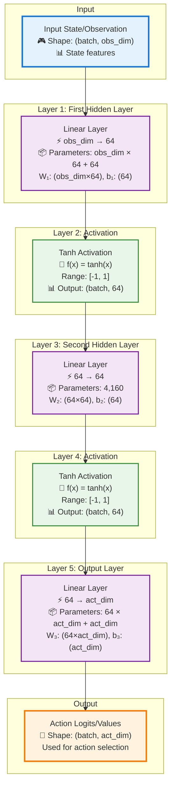

---

## Tensor Shape Transformations

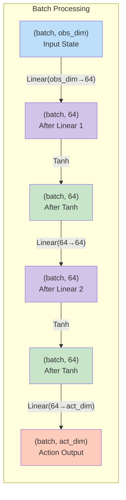

---

## Network Layer Stack

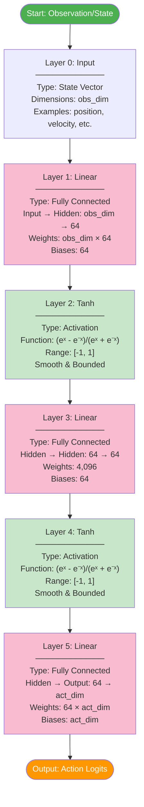

---

## Detailed Network Architecture

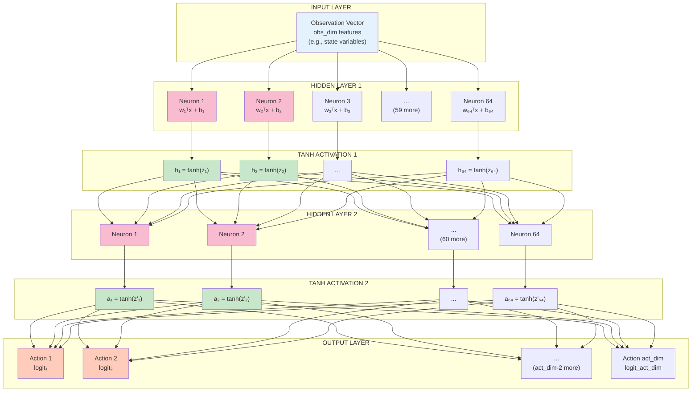

---

## Parameter Distribution

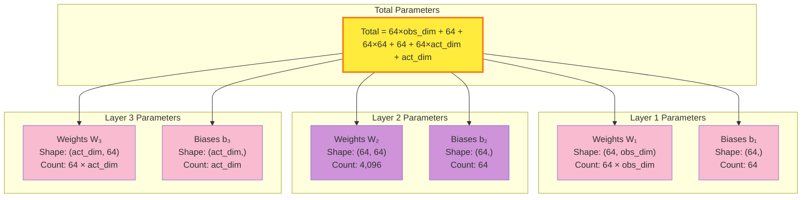

---

## Computation Flow Sequence

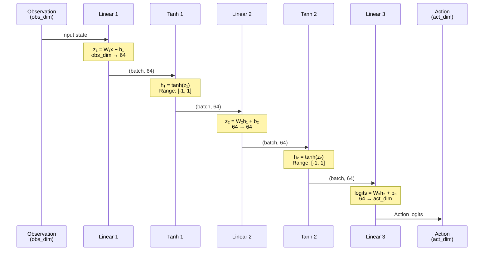

---

## Tanh Activation Function

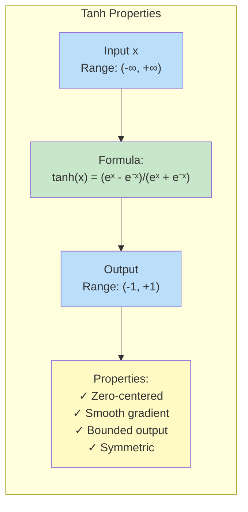

---

## Forward Pass Computation Graph

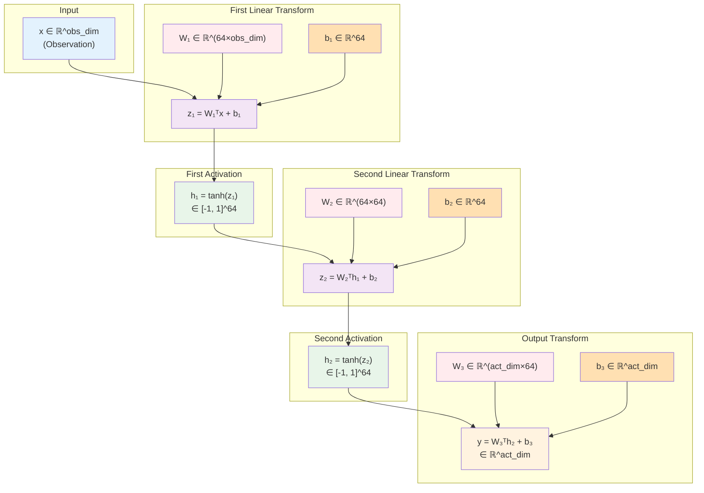

---

## Network Characteristics Mind Map

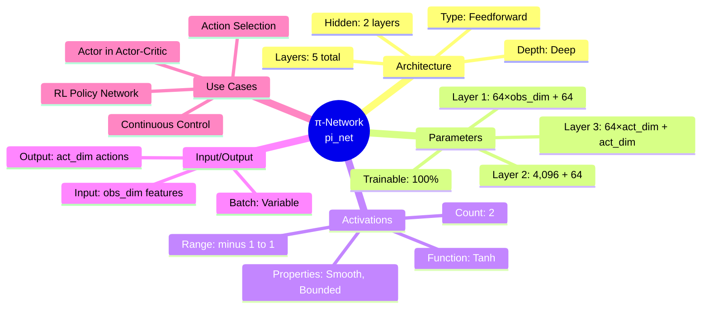

---

## Example Configurations

### Configuration 1: CartPole
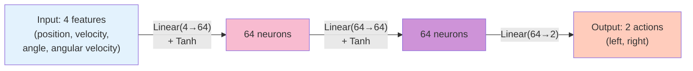

**Parameters**: 4×64 + 64 + 64×64 + 64 + 64×2 + 2 = **4,546 parameters**

### Configuration 2: LunarLander
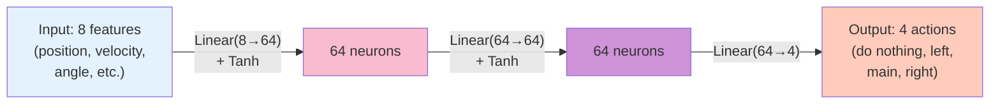

**Parameters**: 8×64 + 64 + 64×64 + 64 + 64×4 + 4 = **4,996 parameters**

---

## Usage in Reinforcement Learning

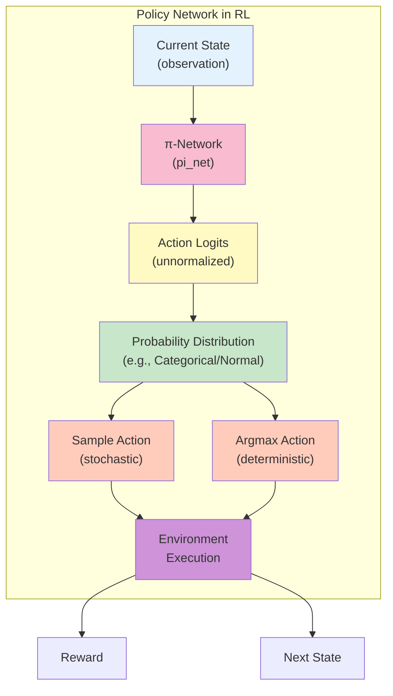

---

## Layer Summary Table

| Layer | Type | Input Shape | Output Shape | Parameters | Activation |
|-------|------|-------------|--------------|------------|------------|
| 0 | Input | - | (batch, obs_dim) | 0 | - |
| 1 | Linear | (batch, obs_dim) | (batch, 64) | 64×obs_dim + 64 | - |
| 2 | Tanh | (batch, 64) | (batch, 64) | 0 | tanh(x) |
| 3 | Linear | (batch, 64) | (batch, 64) | 4,096 + 64 = 4,160 | - |
| 4 | Tanh | (batch, 64) | (batch, 64) | 0 | tanh(x) |
| 5 | Linear | (batch, 64) | (batch, act_dim) | 64×act_dim + act_dim | - |

**Total Parameters**: **64×obs_dim + 64 + 4,160 + 64×act_dim + act_dim**

---

## Mathematical Formulation

### Complete Forward Pass

```
Input: x ∈ ℝ^obs_dim

Layer 1: z₁ = W₁x + b₁,  where W₁ ∈ ℝ^(64×obs_dim), b₁ ∈ ℝ^64
Layer 2: h₁ = tanh(z₁) ∈ [-1, 1]^64
Layer 3: z₂ = W₂h₁ + b₂, where W₂ ∈ ℝ^(64×64), b₂ ∈ ℝ^64
Layer 4: h₂ = tanh(z₂) ∈ [-1, 1]^64
Layer 5: y = W₃h₂ + b₃,  where W₃ ∈ ℝ^(act_dim×64), b₃ ∈ ℝ^act_dim

Output: y ∈ ℝ^act_dim (action logits)
```

### Tanh Function

```
tanh(x) = (eˣ - e⁻ˣ) / (eˣ + e⁻ˣ) = (e²ˣ - 1) / (e²ˣ + 1)

Properties:
- tanh(0) = 0
- tanh(-x) = -tanh(x)  (odd function)
- lim_{x→∞} tanh(x) = 1
- lim_{x→-∞} tanh(x) = -1
- d/dx tanh(x) = 1 - tanh²(x)
```

---

## Network Advantages for RL

✅ **Tanh Activation**: Zero-centered, better gradient flow than sigmoid  
✅ **Bounded Output**: Activations in [-1, 1] prevent explosion  
✅ **Two Hidden Layers**: Good capacity without over-parameterization  
✅ **64 Units**: Standard size balancing expressiveness and efficiency  
✅ **No Final Activation**: Allows flexible output interpretation  

---

## Common RL Applications

| Algorithm | Use of pi_net | Output Processing |
|-----------|---------------|-------------------|
| **PPO** | Policy network | Softmax for discrete / Gaussian for continuous |
| **A2C/A3C** | Actor network | Softmax for action probabilities |
| **TRPO** | Policy network | KL-constrained updates |
| **SAC** | Stochastic policy | Squashed Gaussian (tanh) |
| **REINFORCE** | Policy network | Softmax for discrete actions |

---

## Network Visualization Key

🎮 Input/Output related  
⚡ Linear transformation  
🎯 Activation function  
📦 Parameter storage  
📊 Shape information  
🎲 Stochastic/probability elements  

---

**Generated for PyTorch nn.Sequential Policy Network**  
*Commonly used in Reinforcement Learning algorithms*
