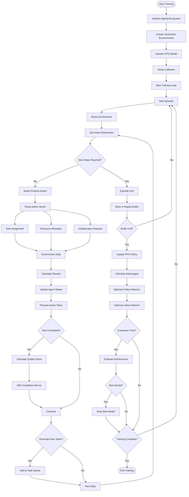

# Agentic RL Training Loop - Detailed Explanation

## Overview

The training loop in the agentic reinforcement learning system combines Proximal Policy Optimization (PPO) with multi-agent coordination to learn optimal task allocation and collaboration strategies. This document provides a comprehensive explanation of how the training process works.

## Training Pipeline Flowchart



## Detailed Component Explanations

### 1. System Initialization Phase

#### Initialize AgenticRLSystem
The training process begins by creating an instance of the `AgenticRLSystem` class, which serves as the orchestrator for the entire training pipeline. This system manages:
- Environment configuration
- Model architecture definition
- Training hyperparameters
- Metric tracking infrastructure

```python
system = AgenticRLSystem(
    env_class=MultiAgentTaskEnvironment,
    n_envs=4  # Number of parallel environments
)
```

#### Create Vectorized Environments
**Purpose**: Parallel environment execution for efficient experience collection.

Vectorized environments allow the system to run multiple independent environment instances simultaneously. This parallelization significantly speeds up training by collecting more diverse experiences per training step.

**Key Benefits**:
- **Increased Sample Efficiency**: Collects `n_envs` times more experience per step
- **Decorrelated Samples**: Each environment evolves independently, reducing correlation in training data
- **Better Gradient Estimates**: More diverse experiences lead to more stable policy updates

**Implementation Details**:
```python
self.env = DummyVecEnv([lambda: env_class() for _ in range(n_envs)])
```

Each environment maintains its own:
- Agent states (capacity, expertise, workload)
- Task queue with varying priorities and complexities
- Collaboration matrix tracking inter-agent relationships
- Independent random seeds for task generation

#### Initialize PPO Model
**Purpose**: Create the neural network architecture and optimization components.

The PPO model consists of two main networks:
1. **Policy Network (Actor)**: Outputs action probabilities
2. **Value Network (Critic)**: Estimates state values for advantage calculation

**Architecture Configuration**:
```python
policy_kwargs = dict(
    net_arch=[
        dict(pi=[256, 256, 128],  # Policy network layers
             vf=[256, 256, 128])   # Value network layers
    ],
    activation_fn=nn.ReLU
)
```

**Key PPO Hyperparameters**:
- `learning_rate=3e-4`: Step size for gradient descent
- `n_steps=2048`: Steps before policy update (trajectory length)
- `batch_size=64`: Minibatch size for optimization
- `n_epochs=10`: Number of optimization epochs per update
- `gamma=0.99`: Discount factor for future rewards
- `gae_lambda=0.95`: GAE parameter for advantage estimation
- `clip_range=0.2`: PPO clipping parameter to limit policy changes

### 2. Training Loop Phase

#### Episode Management
Each episode represents a complete sequence from initial state to terminal condition. The system manages multiple episodes across vectorized environments simultaneously.

**Episode Reset Process**:
1. Clear all active tasks and reset agent states
2. Initialize task queue with 3 random tasks
3. Reset collaboration matrix to default values
4. Set all agents to zero workload
5. Generate initial observation vector

#### Observation Construction
The observation vector encodes the complete state of the multi-agent system:

```python
def _get_observation(self) -> np.ndarray:
    obs = []
    
    # Agent states (7 features per agent)
    for agent in self.agents:
        obs.extend([
            agent.capacity,              # Available processing power
            agent.current_load,          # Current workload
            agent.completed_tasks / max(1, self.current_step),  # Productivity rate
            agent.success_rate,          # Historical success rate
            agent.collaboration_score,   # Collaboration effectiveness
            agent.expertise.get("research", 0),  # Research capability
            agent.expertise.get("analysis", 0)   # Analysis capability
        ])
    
    # Task queue state (5 features per task slot)
    for i in range(self.max_tasks):
        if i < len(self.task_queue):
            task = list(self.task_queue)[i]
            obs.extend([
                task.complexity,    # Task difficulty
                task.priority,      # Importance level
                task.deadline,      # Time constraint
                1.0,               # Task exists flag
                0.0                # Not yet assigned
            ])
        else:
            obs.extend([0, 0, 0, 0, 0])  # Empty slot
    
    # Collaboration matrix (n_agents × n_agents)
    obs.extend(self.collaboration_matrix.flatten())
    
    return np.array(obs, dtype=np.float32)
```

**Total Observation Dimensions**: 
- Agent features: `n_agents × 7`
- Task queue features: `max_tasks × 5`
- Collaboration features: `n_agents × n_agents`

### 3. Action Prediction and Parsing

#### Model Prediction
The PPO model processes the observation through its policy network to produce an action vector:

```python
action, _ = self.model.predict(obs, deterministic=False)
```

During training, actions are sampled stochastically from the policy distribution to ensure exploration.

#### Action Vector Structure
The action vector is reshaped into a matrix where each row represents an agent's decisions:

```python
action = action.reshape(self.n_agents, 3)
```

**For each agent, the action vector contains**:
1. **Task Assignment Decision** `[0, 1]`: Whether to accept a task from the queue
2. **Resource Allocation** `[0, 1]`: Proportion of capacity to allocate
3. **Collaboration Request** `[0, 1]`: Willingness to collaborate with others

#### Action Interpretation
**Task Assignment Logic**:
```python
for i, agent in enumerate(self.agents):
    if len(self.task_queue) > 0 and action[i, 0] > 0.5:
        task = self.task_queue.popleft()
        self._assign_task(agent, task)
```

**Collaboration Matrix Update**:
```python
for i in range(self.n_agents):
    for j in range(self.n_agents):
        if i != j and action[i, 2] > 0.7 and action[j, 2] > 0.7:
            self.collaboration_matrix[i, j] *= 1.01
            reward += 0.5  # Collaboration bonus
```

### 4. Environment Step Execution

#### Task Processing
Active tasks are processed based on agent capabilities:

```python
for task_id, (task, agent) in list(self.active_tasks.items()):
    # Calculate progress based on expertise match
    progress = agent.expertise.get(task.type, 0.5) * agent.capacity
    
    # Stochastic completion check
    if np.random.random() < progress:
        self._complete_task(task, agent)
```

#### Reward Calculation
The reward function balances multiple objectives:

**Components of the Reward Signal**:

1. **Task Assignment Reward**:
   ```python
   match_score = agent.expertise.get(task.type, 0.5)
   reward += match_score * task.priority
   ```

2. **Task Completion Reward**:
   ```python
   time_bonus = max(0, 1 - (self.current_step / task.deadline))
   quality = agent.expertise.get(task.type, 0.5) * agent.success_rate
   reward += (quality * task.priority * (1 + time_bonus)) * 10
   ```

3. **Collaboration Bonus**:
   ```python
   if agents_collaborating:
       reward += 0.5
   ```

4. **Penalties**:
   ```python
   queue_penalty = len(self.task_queue) * 0.1  # Penalize backlog
   overdue_penalty = sum(1 for t in self.active_tasks.values() 
                        if self.current_step > t[0].deadline) * 0.5
   reward -= (queue_penalty + overdue_penalty)
   ```

### 5. Experience Collection and Buffer Management

#### Trajectory Collection
The system collects trajectories (sequences of states, actions, rewards) for `n_steps` before triggering a policy update:

```python
# Trajectory storage structure
trajectory = {
    'observations': [],
    'actions': [],
    'rewards': [],
    'values': [],
    'log_probs': [],
    'dones': []
}
```

#### Experience Buffer
The replay buffer stores experiences from all parallel environments:
- **Buffer Size**: `n_steps × n_envs = 2048 × 4 = 8192` samples
- **Storage Format**: Flattened trajectories from all environments
- **Memory Efficiency**: Uses circular buffer to limit memory usage

### 6. PPO Policy Update

#### Advantage Calculation
Generalized Advantage Estimation (GAE) computes advantages that balance bias and variance:

```python
def calculate_advantages(rewards, values, dones, gamma=0.99, gae_lambda=0.95):
    advantages = np.zeros_like(rewards)
    last_advantage = 0
    
    for t in reversed(range(len(rewards))):
        if t == len(rewards) - 1:
            next_value = 0
        else:
            next_value = values[t + 1]
        
        delta = rewards[t] + gamma * next_value * (1 - dones[t]) - values[t]
        advantages[t] = last_advantage = delta + gamma * gae_lambda * (1 - dones[t]) * last_advantage
    
    return advantages
```

**GAE Benefits**:
- **Bias-Variance Tradeoff**: λ parameter controls the tradeoff
- **Credit Assignment**: Better attribution of rewards to actions
- **Stability**: Reduces high-variance gradient estimates

#### Policy Network Optimization
The policy network is updated using the PPO clipped objective:

```python
def ppo_loss(old_log_probs, new_log_probs, advantages, clip_range=0.2):
    ratio = torch.exp(new_log_probs - old_log_probs)
    
    # Unclipped objective
    surr1 = ratio * advantages
    
    # Clipped objective
    surr2 = torch.clamp(ratio, 1 - clip_range, 1 + clip_range) * advantages
    
    # Take minimum to be conservative
    policy_loss = -torch.min(surr1, surr2).mean()
    
    return policy_loss
```

**Clipping Mechanism**:
- Prevents large policy updates that could destabilize training
- Maintains trust region without complex second-order methods
- Allows multiple epochs of optimization on the same data

#### Value Network Optimization
The value network is trained to predict expected returns:

```python
def value_loss(predicted_values, returns, clip_range_vf=None):
    if clip_range_vf is not None:
        # Clip value function updates
        values_pred_clipped = old_values + torch.clamp(
            predicted_values - old_values, -clip_range_vf, clip_range_vf
        )
        loss_vf1 = (predicted_values - returns) ** 2
        loss_vf2 = (values_pred_clipped - returns) ** 2
        value_loss = torch.max(loss_vf1, loss_vf2).mean()
    else:
        value_loss = F.mse_loss(predicted_values, returns)
    
    return value_loss
```

#### Entropy Regularization
Entropy bonus encourages exploration:

```python
entropy_loss = -torch.mean(distribution.entropy())
total_loss = policy_loss + vf_coef * value_loss + ent_coef * entropy_loss
```

### 7. Evaluation and Checkpointing

#### Periodic Evaluation
Every `eval_freq` steps, the model is evaluated on a separate environment:

```python
def evaluate(self, n_episodes=10):
    episode_rewards = []
    task_completion_rates = []
    
    for episode in range(n_episodes):
        obs, _ = env.reset()
        done = False
        episode_reward = 0
        
        while not done:
            # Use deterministic actions for evaluation
            action, _ = self.model.predict(obs, deterministic=True)
            obs, reward, done, truncated, info = env.step(action)
            episode_reward += reward
```

**Evaluation Metrics**:
- **Mean Episode Reward**: Average total reward across episodes
- **Task Completion Rate**: Percentage of tasks successfully completed
- **Agent Utilization**: Average workload across agents
- **Collaboration Frequency**: How often agents collaborate

#### Best Model Selection
The system maintains the best performing model based on evaluation metrics:

```python
if current_mean_reward > best_mean_reward:
    best_mean_reward = current_mean_reward
    self.model.save("best_model")
```

#### Checkpoint Management
Regular checkpoints ensure training can be resumed:
- **Frequency**: Every 10,000 steps
- **Saved Components**: Model weights, optimizer state, replay buffer
- **Versioning**: Timestamps or step counts in filenames

### 8. Training Convergence

#### Convergence Criteria
Training continues until one of these conditions is met:
1. **Maximum Timesteps**: Reached predefined training budget
2. **Performance Plateau**: No improvement for N consecutive evaluations
3. **Target Performance**: Achieved desired task completion rate
4. **Early Stopping**: Triggered by declining performance

#### Adaptive Learning Rate
Learning rate scheduling improves convergence:

```python
def lr_schedule(progress_remaining):
    """
    Linear decay from initial_lr to 0.1 * initial_lr
    """
    return initial_lr * (0.1 + 0.9 * progress_remaining)
```

### 9. Multi-Agent Specific Considerations

#### Emergent Behaviors
Through training, the system learns:

1. **Role Specialization**: Agents develop preferences for task types matching their expertise
2. **Load Balancing**: Distribute tasks to maintain system efficiency
3. **Collaboration Patterns**: When and with whom to collaborate
4. **Queue Management**: Prioritize high-value tasks while maintaining throughput

#### Credit Assignment Challenge
In multi-agent settings, determining which agent's action led to success is complex:

**Solutions Implemented**:
- Individual agent rewards based on direct task completion
- Shared rewards for collaborative successes
- Collaboration matrix tracks pairwise effectiveness
- Success rate tracking per agent for long-term credit

#### Coordination Learning
Agents learn implicit coordination through:
- Observation of other agents' states
- Collaboration request signaling
- Shared reward structures
- Competition for high-priority tasks

## Performance Optimization Techniques

### 1. Vectorized Environment Benefits
- **4x Speed Increase**: From parallel experience collection
- **Reduced Correlation**: Independent environment evolution
- **GPU Utilization**: Batch processing of observations

### 2. Experience Replay Optimization
- **Prioritized Sampling**: Focus on high-value experiences
- **Buffer Management**: Circular buffer for memory efficiency
- **Batch Normalization**: Stable gradient estimates

### 3. Network Architecture Choices
- **Shared Layers**: Common feature extraction for policy and value
- **Separate Heads**: Specialized output layers
- **Layer Normalization**: Training stability

## Common Training Challenges and Solutions

### Challenge 1: Sparse Rewards
**Problem**: Agents receive rewards only on task completion.
**Solution**: 
- Dense reward shaping with intermediate progress rewards
- Curiosity-driven exploration bonuses
- Curriculum learning with increasingly complex tasks

### Challenge 2: Non-Stationary Environment
**Problem**: Agent behaviors change during training, creating a moving target.
**Solution**:
- PPO's conservative policy updates
- Experience replay from recent trajectories only
- Adaptive learning rates

### Challenge 3: Exploration vs Exploitation
**Problem**: Agents may converge to suboptimal policies too quickly.
**Solution**:
- Entropy regularization in loss function
- Stochastic action sampling during training
- Epsilon-greedy exploration in tool selection

### Challenge 4: Multi-Agent Coordination
**Problem**: Agents must learn to coordinate without explicit communication.
**Solution**:
- Shared observations including all agent states
- Collaboration bonuses in reward structure
- Emergent signaling through action patterns

## Hyperparameter Tuning Guidelines

### Critical Hyperparameters for Performance:

1. **Learning Rate** (3e-4)
   - Too high: Unstable training, policy collapse
   - Too low: Slow convergence, insufficient exploration
   - Optimal range: 1e-4 to 1e-3

2. **Clip Range** (0.2)
   - Too high: Large policy jumps, instability
   - Too low: Slow learning, overcautious updates
   - Optimal range: 0.1 to 0.3

3. **GAE Lambda** (0.95)
   - Higher values: Lower bias, higher variance
   - Lower values: Higher bias, lower variance
   - Optimal range: 0.9 to 0.99

4. **Batch Size** (64)
   - Larger: More stable gradients, slower updates
   - Smaller: Noisier gradients, faster adaptation
   - Optimal range: 32 to 256

5. **N Steps** (2048)
   - Longer: Better advantage estimates, slower updates
   - Shorter: More frequent updates, potentially biased
   - Optimal range: 512 to 4096

## Monitoring and Debugging

### Key Metrics to Track:

1. **Policy Loss**: Should decrease but not too rapidly
2. **Value Loss**: Should converge to low values
3. **Entropy**: Should decrease gradually (not too fast)
4. **Explained Variance**: Should increase toward 1.0
5. **KL Divergence**: Should stay within acceptable bounds
6. **Episode Rewards**: Should show upward trend
7. **Task Completion Rate**: Primary performance metric
8. **Agent Utilization**: Should balance across agents

### Warning Signs:

- **Sudden Performance Drop**: Policy collapse, reduce learning rate
- **Flat Learning Curve**: Insufficient exploration, increase entropy coefficient
- **High Variance in Rewards**: Unstable policy, reduce clip range
- **Exploding Gradients**: Gradient clipping needed
- **Vanishing Gradients**: Network architecture issues

## Conclusion

The training loop implements a sophisticated multi-agent reinforcement learning system that learns collaborative task execution strategies through PPO optimization. The combination of vectorized environments, careful reward design, and multi-agent coordination mechanisms enables the emergence of complex cooperative behaviors. The system's modular design allows for easy extension and adaptation to various task domains while maintaining training stability and efficiency.
