# Agentic RL Workflow - Architecture Diagrams

## Table of Contents
1. [System Overview Flowchart](#system-overview-flowchart)
2. [Training Pipeline Flowchart](#training-pipeline-flowchart)
3. [Agent Decision Process Flowchart](#agent-decision-process-flowchart)
4. [Class UML Diagrams](#class-uml-diagrams)
5. [Sequence Diagrams](#sequence-diagrams)

---

## System Overview Flowchart

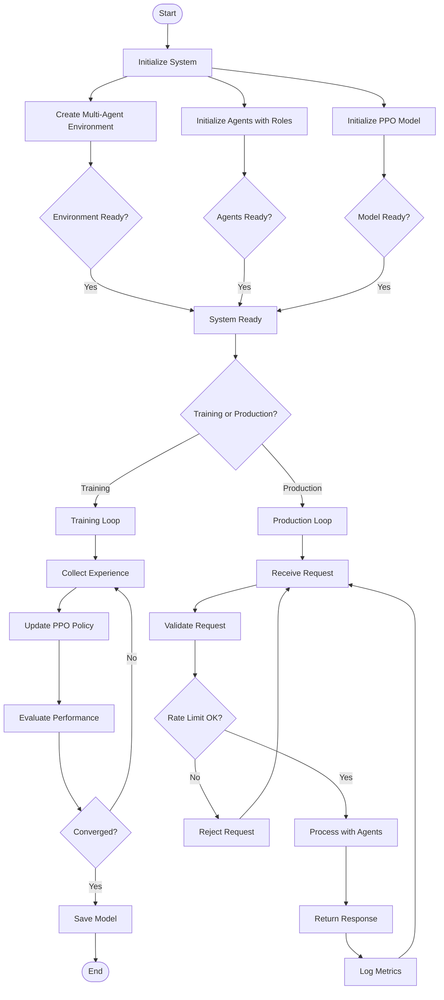

---

## Training Pipeline Flowchart

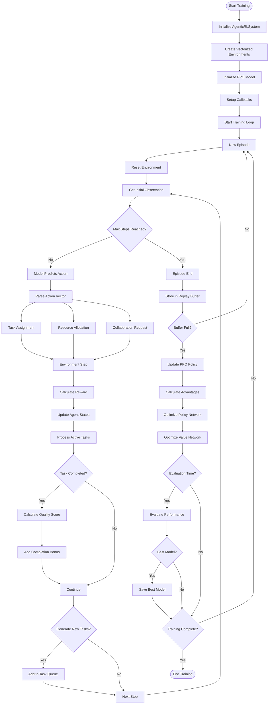

---

## Agent Decision Process Flowchart

```mermaid
flowchart LR
    Start([Agent Receives Task]) --> CheckCapacity{Check Capacity}
    
    CheckCapacity -->|Full| Decline[Decline Task]
    CheckCapacity -->|Available| EvalTask[Evaluate Task]
    
    EvalTask --> MatchExpertise[Match Task to Expertise]
    MatchExpertise --> CheckComplexity[Assess Complexity]
    
    CheckComplexity --> NeedCollab{Need Collaboration?}
    
    NeedCollab -->|Yes| RequestCollab[Request Collaboration]
    NeedCollab -->|No| SelectTool[Select Tool]
    
    RequestCollab --> FindPartner[Find Available Partner]
    FindPartner --> PartnerFound{Partner Found?}
    
    PartnerFound -->|Yes| CollabProcess[Collaborative Processing]
    PartnerFound -->|No| SoloProcess[Solo Processing]
    
    SelectTool --> CheckQTable{Q-Table Entry Exists?}
    CheckQTable -->|Yes| UseEpsilon{Explore or Exploit?}
    CheckQTable -->|No| InitQValues[Initialize Q-Values]
    
    InitQValues --> RandomTool[Select Random Tool]
    
    UseEpsilon -->|Explore| RandomTool
    UseEpsilon -->|Exploit| BestTool[Select Best Tool]
    
    RandomTool --> UseTool[Use Selected Tool]
    BestTool --> UseTool
    CollabProcess --> UseTool
    SoloProcess --> UseTool
    
    UseTool --> ProcessResult[Process Tool Result]
    ProcessResult --> CalcReward[Calculate Reward]
    
    CalcReward --> UpdateQTable[Update Q-Table]
    UpdateQTable --> UpdateMetrics[Update Agent Metrics]
    
    UpdateMetrics --> TaskDone{Task Complete?}
    TaskDone -->|No| SelectTool
    TaskDone -->|Yes| RecordCompletion[Record Completion]
    
    RecordCompletion --> UpdateSuccess[Update Success Rate]
    UpdateSuccess --> End([Task Completed])
    
    Decline --> End
```

---

## Class UML Diagrams

### Core System Classes

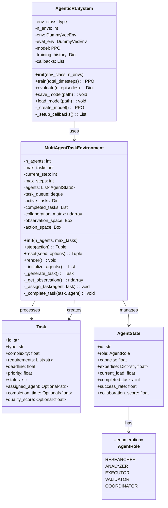

### Smart Agent and Tool System Classes

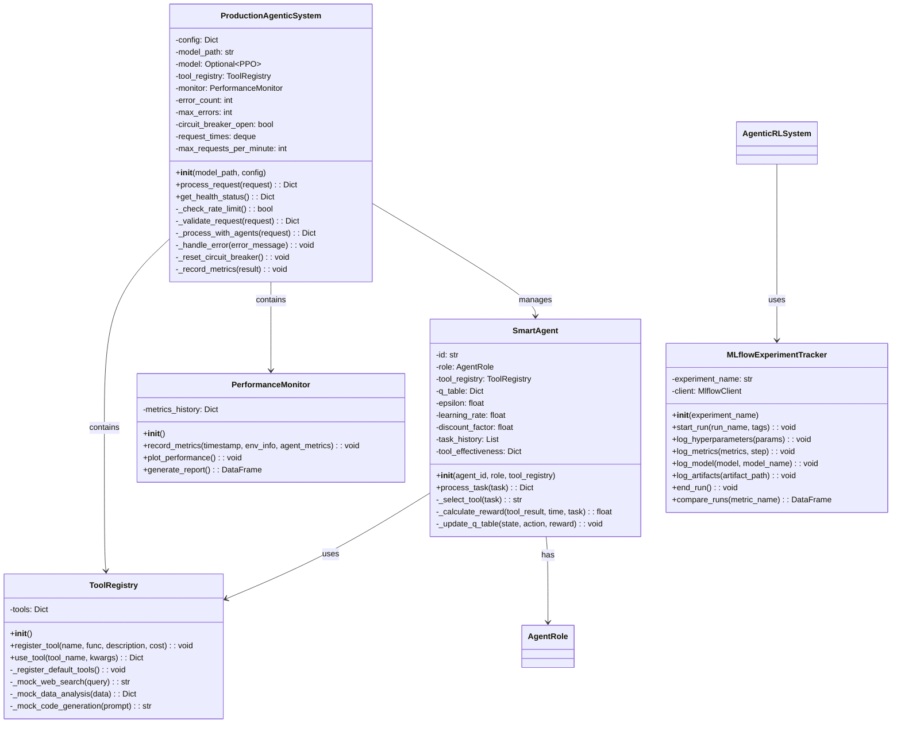

---

## Sequence Diagrams

### Training Sequence

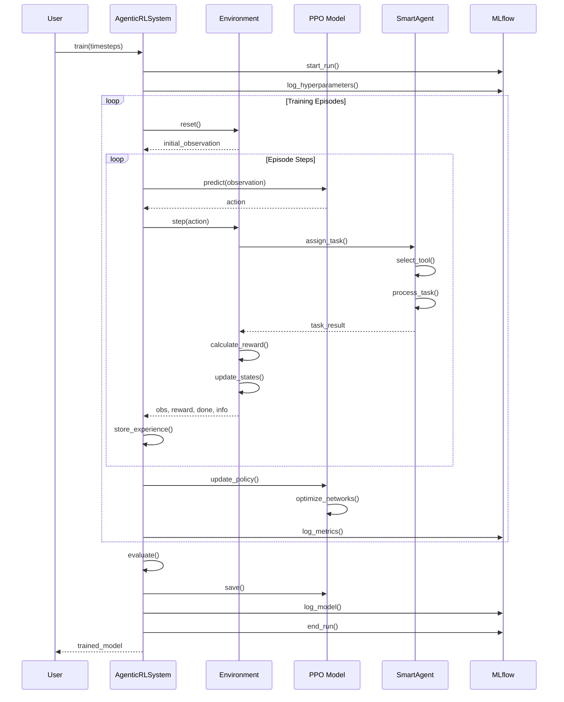

### Production Request Processing

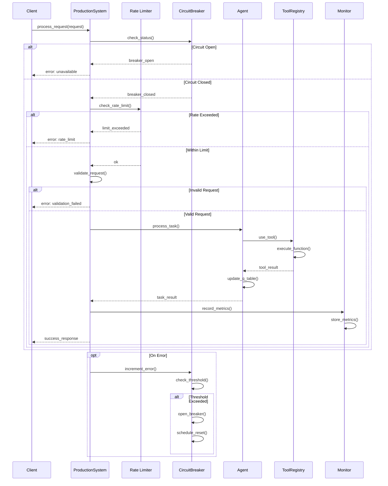

### Multi-Agent Collaboration Sequence

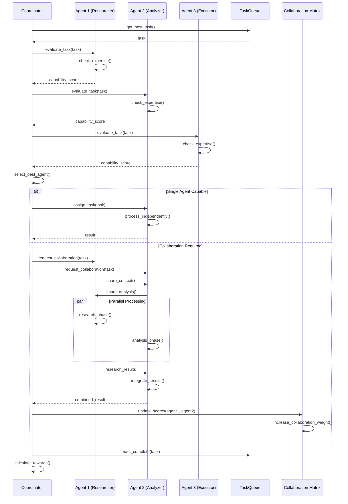

### Tool Selection Learning Sequence

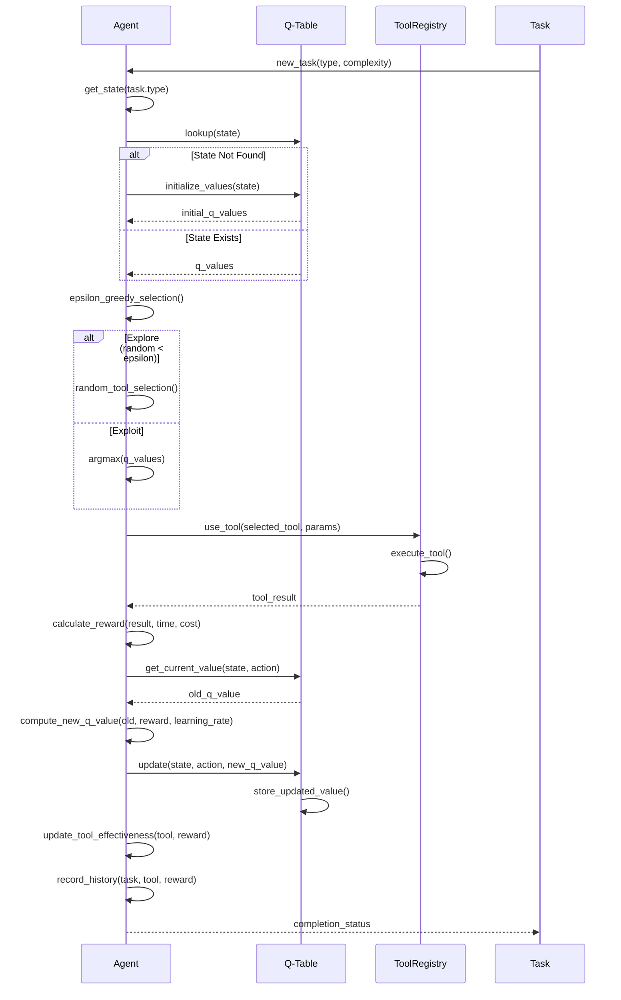

---

## Component Interaction Overview

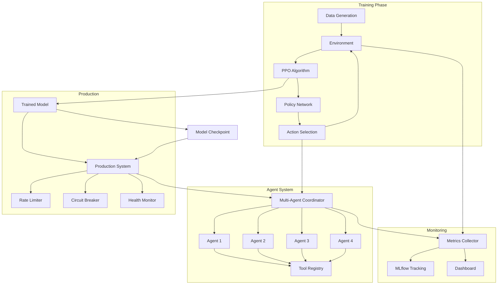

---

## State Machine Diagram

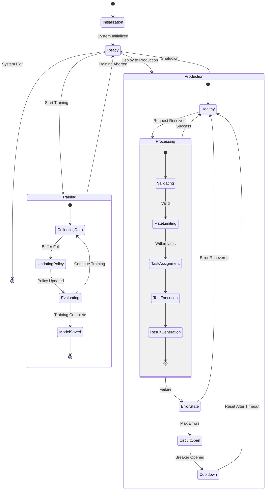

---

## Data Flow Diagram

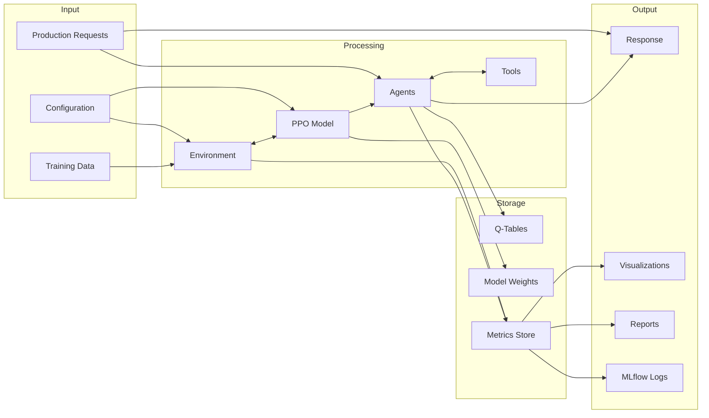

---

## Error Handling Flow

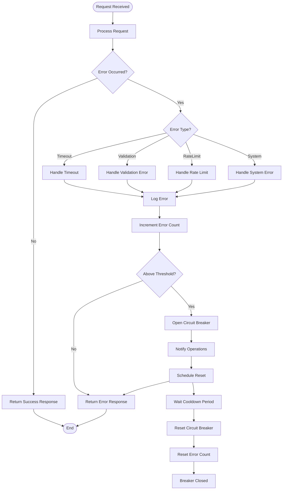

---

## Deployment Architecture

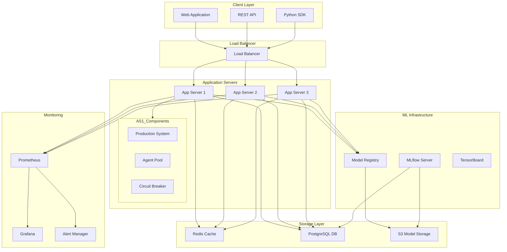

---

## Summary

These diagrams provide a comprehensive view of the agentic RL workflow system architecture:

1. **Flowcharts** show the logical flow of training, agent decisions, and system operations
2. **Class UML Diagrams** detail the object-oriented structure and relationships
3. **Sequence Diagrams** illustrate the temporal interactions between components
4. **State Machine Diagram** captures the system's behavioral states
5. **Data Flow Diagram** shows how information moves through the system
6. **Deployment Architecture** presents the production infrastructure

The diagrams cover all major aspects:
- Multi-agent coordination
- Reinforcement learning pipeline
- Tool selection and Q-learning
- Production patterns (circuit breakers, rate limiting)
- Monitoring and observability
- MLflow integration for experiment tracking

These visualizations can be rendered in any Markdown viewer that supports Mermaid diagrams (GitHub, GitLab, many documentation tools).
