# Task-Driven Agentic Workflow Visualization

This document provides comprehensive UML diagrams and flowcharts to visualize the task-driven agentic work distribution in the reinforcement learning workflow defined in `simulated_agentic_rl_workflow.ipynb`.

## Table of Contents
1. [System Overview](#1-system-overview)
2. [Class Diagram](#2-class-diagram)
3. [Agent Roles and Hierarchy](#3-agent-roles-and-hierarchy)
4. [Task Lifecycle Flowchart](#4-task-lifecycle-flowchart)
5. [Sequence Diagram: Task Processing](#5-sequence-diagram-task-processing)
6. [Sequence Diagram: Training Loop](#6-sequence-diagram-training-loop)
7. [State Diagram: Task States](#7-state-diagram-task-states)
8. [Activity Diagram: Agent Task Execution](#8-activity-diagram-agent-task-execution)
9. [Component Interaction Flowchart](#9-component-interaction-flowchart)
10. [Tool Selection and Q-Learning Flow](#10-tool-selection-and-q-learning-flow)
11. [Production System Architecture](#11-production-system-architecture)
12. [MLflow Experiment Tracking Flow](#12-mlflow-experiment-tracking-flow)

---

## 1. System Overview

High-level view of the agentic RL system showing the main components and their interactions.

---

## 2. Class Diagram

Complete class diagram showing all classes, their attributes, methods, and relationships.

---

## 3. Agent Roles and Hierarchy

Diagram showing the different agent roles and their specializations.

---

## 4. Task Lifecycle Flowchart

Complete flowchart showing a task's journey from generation to completion.

```mermaid
flowchart TD
    Start([Task Generated]) --> TQ[Add to Task Queue]
    TQ --> Check{Task Queue<br/>Not Empty?}
    
    Check -->|No| Wait[Wait for<br/>New Tasks]
    Wait --> TQ
    
    Check -->|Yes| SelectAgent{Select Best<br/>Agent via PPO}
    
    SelectAgent --> Assign[Assign Task<br/>to Agent]
    Assign --> UpdateLoad[Update Agent<br/>Current Load]
    UpdateLoad --> Active[Task Status:<br/>ACTIVE]
    
    Active --> Process[Agent Processes<br/>Task]
    Process --> ToolSelect{Select Tool<br/>ε-greedy}
    
    ToolSelect -->|Explore| RandomTool[Random Tool<br/>Selection]
    ToolSelect -->|Exploit| BestTool[Best Tool from<br/>Q-Table]
    
    RandomTool --> UseTool
    BestTool --> UseTool
    
    UseTool[Execute Tool] --> Progress{Check<br/>Progress}
    
    Progress -->|Random < expertise| Complete[Task Completed]
    Progress -->|Otherwise| Process
    
    Complete --> Quality[Calculate<br/>Quality Score]
    Quality --> UpdateQ[Update Q-Table]
    UpdateQ --> UpdateAgent[Update Agent<br/>Metrics]
    UpdateAgent --> Reward[Calculate<br/>Reward]
    
    Reward --> TimeBonus{Within<br/>Deadline?}
    TimeBonus -->|Yes| BonusReward[Add Time Bonus<br/>to Reward]
    TimeBonus -->|No| PenaltyReward[Apply Deadline<br/>Penalty]
    
    BonusReward --> Final
    PenaltyReward --> Final
    
    Final[Add to<br/>Completed Tasks] --> End([Task Lifecycle<br/>Complete])
    
    style Start fill:#c8e6c9
    style End fill:#c8e6c9
    style Active fill:#fff3e0
    style Complete fill:#e1f5fe
    style Reward fill:#f3e5f5
```

---

## 5. Sequence Diagram: Task Processing

Sequence diagram showing the interaction between components during task processing.

---

## 6. Sequence Diagram: Training Loop

Detailed sequence diagram of the PPO training loop with the multi-agent environment.

---

## 7. State Diagram: Task States

State diagram showing all possible states of a task and transitions.

```mermaid
stateDiagram-v2
    [*] --> Generated: Task Created
    
    Generated --> Pending: Add to Queue
    
    Pending --> Active: Agent Assignment<br/>(PPO Action > 0.5)
    
    Pending --> Pending: No Suitable<br/>Agent Available
    
    Active --> Processing: Agent Starts<br/>Processing
    
    Processing --> Processing: Using Tools<br/>(Q-Learning)
    
    Processing --> Completed: Progress Check<br/>Succeeds
    
    Processing --> Active: Tool Execution<br/>Complete
    
    Active --> Overdue: Deadline<br/>Exceeded
    
    Overdue --> Completed: Eventually<br/>Completed
    
    Completed --> [*]: Task Archived
    
    state Active {
        [*] --> Assigned
        Assigned --> InProgress: Start Processing
        InProgress --> ToolSelection: Need Tool
        ToolSelection --> ToolExecution: Tool Selected
        ToolExecution --> InProgress: Result Received
    }
    
    note right of Processing
        Tools: web_search,
        data_analysis,
        code_generation
    end note
    
    note right of Completed
        Quality Score =
        expertise × success_rate
    end note
```

---

## 8. Activity Diagram: Agent Task Execution

Activity diagram showing the detailed flow of an agent executing a task.

```mermaid
flowchart TD
    subgraph AgentExecution["Agent Task Execution"]
        Start([Receive Task<br/>Assignment]) --> CheckLoad{Current Load<br/>Below Capacity?}
        
        CheckLoad -->|No| QueueTask[Queue Task<br/>Locally]
        QueueTask --> Wait[Wait for<br/>Capacity]
        Wait --> CheckLoad
        
        CheckLoad -->|Yes| AcceptTask[Accept Task]
        AcceptTask --> AnalyzeTask[Analyze Task<br/>Requirements]
        
        AnalyzeTask --> EpsilonCheck{Random less than<br/>Epsilon?}
        
        EpsilonCheck -->|Yes| Explore[Explore:<br/>Random Tool]
        EpsilonCheck -->|No| Exploit[Exploit:<br/>Q-Table Lookup]
        
        Explore --> GetQValues[Get Q-Values<br/>for Task Type]
        Exploit --> GetQValues
        
        GetQValues --> SelectTool[Select Tool]
        SelectTool --> PrepareTool[Prepare Tool<br/>Parameters]
        
        PrepareTool --> CallTool[Call Tool<br/>via Registry]
        
        CallTool --> ToolResult{Tool<br/>Success?}
        
        ToolResult -->|Yes| ProcessResult[Process Tool<br/>Result]
        ToolResult -->|No| HandleError[Handle Tool<br/>Error]
        
        HandleError --> CalculateReward
        
        ProcessResult --> CalculateReward[Calculate<br/>Reward]
        
        CalculateReward --> BaseReward[Base: +1.0 success<br/>-0.5 failure]
        BaseReward --> TimePenalty[Time Penalty:<br/>-time × 0.1]
        TimePenalty --> CostPenalty[Cost Penalty:<br/>-cost × 0.5]
        CostPenalty --> PriorityBonus[Priority Bonus:<br/>+priority × 0.5]
        
        PriorityBonus --> UpdateQ[Update Q-Table<br/>using Learning Rate]
        
        UpdateQ --> UpdateEffectiveness[Update Tool<br/>Effectiveness]
        UpdateEffectiveness --> RecordHistory[Record in<br/>Task History]
        
        RecordHistory --> UpdateMetrics[Update Agent<br/>Metrics]
        UpdateMetrics --> End([Task Complete])
    end
    
    style Start fill:#c8e6c9
    style End fill:#c8e6c9
    style SelectTool fill:#e1f5fe
    style UpdateQ fill:#f3e5f5
```

---

## 9. Component Interaction Flowchart

Flowchart showing how all system components interact during runtime.

```mermaid
flowchart TB
    subgraph Input["Input Layer"]
        REQ[User Request]
        CONFIG[Configuration]
    end
    
    subgraph Production["Production Layer"]
        RATE[Rate Limiter]
        CB[Circuit Breaker]
        VAL[Request Validator]
    end
    
    subgraph Core["Core Processing"]
        direction TB
        
        subgraph Environment["RL Environment"]
            ENV_INIT[Initialize Env]
            OBS[Generate Observation]
            STEP[Environment Step]
            REWARD[Calculate Reward]
        end
        
        subgraph Agents["Multi-Agent System"]
            A1[Agent 1: Researcher]
            A2[Agent 2: Analyzer]
            A3[Agent 3: Executor]
            A4[Agent 4: Validator]
        end
        
        subgraph Learning["Learning Components"]
            PPO_POLICY[PPO Policy Network]
            Q_LEARN[Q-Learning Tables]
            COLLAB[Collaboration Matrix]
        end
    end
    
    subgraph Tools["Tool Layer"]
        WEB[🌐 Web Search<br/>Cost: 0.1]
        DATA[📊 Data Analysis<br/>Cost: 0.2]
        CODE[💻 Code Generation<br/>Cost: 0.3]
    end
    
    subgraph Monitor["Monitoring"]
        PERF[Performance Monitor]
        MLFLOW[MLflow Tracker]
        LOGS[Logging System]
    end
    
    REQ --> RATE
    CONFIG --> CB
    RATE --> CB
    CB --> VAL
    VAL --> ENV_INIT
    
    ENV_INIT --> OBS
    OBS --> PPO_POLICY
    PPO_POLICY --> STEP
    
    STEP --> A1 & A2 & A3 & A4
    
    A1 & A2 & A3 & A4 --> Q_LEARN
    Q_LEARN --> WEB & DATA & CODE
    
    WEB & DATA & CODE --> REWARD
    
    A1 & A2 & A3 & A4 --> COLLAB
    COLLAB --> REWARD
    
    REWARD --> OBS
    
    STEP --> PERF
    PPO_POLICY --> MLFLOW
    VAL --> LOGS
    
    style REQ fill:#e1f5fe
    style PPO_POLICY fill:#f3e5f5
    style REWARD fill:#e8f5e9
```

---

## 10. Tool Selection and Q-Learning Flow

Detailed flowchart of the Q-learning based tool selection mechanism.

```mermaid
flowchart TD
    subgraph QLearning["Q-Learning Tool Selection"]
        Start([Task Received]) --> GetState[Extract State:<br/>task.type]
        
        GetState --> CheckQTable{State in<br/>Q-Table?}
        
        CheckQTable -->|No| InitQ[Initialize Q-Values<br/>to 0.0 for all tools]
        CheckQTable -->|Yes| Proceed
        InitQ --> Proceed
        
        Proceed[Get Q-Values] --> Random{random less than<br/>epsilon?}
        
        Random -->|Yes| RandomSelect[Random Tool<br/>Selection]
        Random -->|No| GreedySelect[Select Best Tool<br/>from Q-Table]
        
        RandomSelect --> ExecuteTool
        GreedySelect --> ExecuteTool
        
        ExecuteTool[Execute Tool] --> GetResult{Success?}
        
        GetResult -->|Yes| BasePos[Base Reward: +1.0]
        GetResult -->|No| BaseNeg[Base Reward: -0.5]
        
        BasePos --> CalcTime[Time Penalty:<br/>-0.1 × time]
        BaseNeg --> CalcTime
        
        CalcTime --> CalcCost[Cost Penalty:<br/>-0.5 × tool_cost]
        CalcCost --> CalcPriority[Priority Bonus:<br/>+0.5 × priority]
        
        CalcPriority --> TotalReward[Total Reward: R]
        
        TotalReward --> UpdateRule[Q-Value Update<br/>Q = Q + lr * R - Q]
        
        UpdateRule --> UpdateEffect[Update Effectiveness<br/>0.95 * old + 0.05 * success]
        
        UpdateEffect --> End([Return Result])
    end
    
    subgraph Parameters["Learning Parameters"]
        P1[epsilon = 0.1<br/>Exploration Rate]
        P2[alpha = 0.1<br/>Learning Rate]
        P3[gamma = 0.95<br/>Discount Factor]
    end
    
    Parameters -.-> QLearning
    
    style Start fill:#c8e6c9
    style End fill:#c8e6c9
    style UpdateRule fill:#f3e5f5
    style TotalReward fill:#e1f5fe
```

---

## 11. Production System Architecture

Architecture diagram for the production-ready system with all safeguards.

---

## 12. MLflow Experiment Tracking Flow

Sequence showing how experiments are tracked with MLflow.

---

## Summary: Task-Driven Work Distribution

```mermaid
flowchart LR
    subgraph TaskFlow["Task-Driven Distribution"]
        direction TB
        
        T1[📋 Task Generated] --> T2[📥 Queue Assignment]
        T2 --> T3[🤖 PPO Policy<br/>Selects Agent]
        T3 --> T4[👤 Agent Assigned]
        T4 --> T5[🔧 Q-Learning<br/>Selects Tool]
        T5 --> T6[⚙️ Tool Executed]
        T6 --> T7[📊 Reward Calculated]
        T7 --> T8[🧠 Models Updated]
        T8 --> T9[✅ Task Complete]
    end
    
    subgraph Agents["Agent Specialization"]
        direction TB
        AG1[🔬 Researcher<br/>Research Tasks]
        AG2[📊 Analyzer<br/>Analysis Tasks]
        AG3[⚡ Executor<br/>Execution Tasks]
        AG4[✅ Validator<br/>Validation Tasks]
    end
    
    subgraph Learning["Learning Mechanisms"]
        direction TB
        L1[PPO: Task Assignment]
        L2[Q-Learning: Tool Selection]
        L3[Collaboration Matrix]
    end
    
    T3 -.-> AG1 & AG2 & AG3 & AG4
    T5 -.-> L2
    T3 -.-> L1
    T7 -.-> L3
    
    style T1 fill:#c8e6c9
    style T9 fill:#c8e6c9
    style L1 fill:#e1f5fe
    style L2 fill:#f3e5f5
    style L3 fill:#fff3e0
```

---

## Key Insights

### Task Distribution Strategy
1. **PPO Policy** decides which agent receives each task based on:
   - Agent capacity and current load
   - Task complexity and requirements
   - Historical success rates
   - Collaboration opportunities

2. **Q-Learning** enables each agent to learn optimal tool selection:
   - ε-greedy exploration balances learning vs exploitation
   - Rewards shape tool preferences per task type
   - Tool effectiveness tracking improves over time

3. **Collaboration Matrix** captures inter-agent synergies:
   - Agents requesting collaboration simultaneously get bonuses
   - Matrix values increase with successful collaborations
   - Enables emergent team behaviors

### Reward Structure
| Component | Value | Description |
|-----------|-------|-------------|
| Task Match | +0.0 to +1.0 | Agent expertise × task priority |
| Quality | +0.0 to +10.0 | (expertise × success_rate × priority) × time_bonus |
| Collaboration | +0.5 | Mutual collaboration bonus |
| Queue Penalty | -0.1/task | Discourages queue buildup |
| Overdue Penalty | -0.5/task | Penalizes missed deadlines |
