# RL-Based Prompt Optimization with Real LLM Calls — Architecture Diagrams

Comprehensive UML class diagrams, sequence diagrams, flowcharts, and state machines for `agentic_rl_workflow_LLM_calls.ipynb`.

## Table of Contents

1. [System Overview Flowchart](#1-system-overview-flowchart)
2. [Class Diagrams](#2-class-diagrams)
   - [Enums and Configuration Types](#21-enums-and-configuration-types)
   - [Data Models: Templates, Queries, and Profiles](#22-data-models-templates-queries-and-profiles)
   - [LLM Service Layer](#23-llm-service-layer)
   - [LLM-as-Judge Reward Model](#24-llm-as-judge-reward-model)
   - [Multi-Armed Bandit Hierarchy](#25-multi-armed-bandit-hierarchy)
   - [Q-Learning Agent](#26-q-learning-agent)
   - [Real LLM Environment](#27-real-llm-environment)
   - [LangGraph Workflow State](#28-langgraph-workflow-state)
   - [Production Optimizer](#29-production-optimizer)
   - [Full System Relationships](#210-full-system-relationships)
3. [Sequence Diagrams](#3-sequence-diagrams)
   - [Single Training Iteration (Q-Learning)](#31-single-training-iteration-q-learning)
   - [Single Training Iteration (Bandit)](#32-single-training-iteration-bandit)
   - [LLM Service Call](#33-llm-service-call)
   - [LLM-as-Judge Evaluation](#34-llm-as-judge-evaluation)
   - [Prompt Template Rendering](#35-prompt-template-rendering)
   - [Production Serve with Online Learning](#36-production-serve-with-online-learning)
4. [LangGraph Workflow Flowchart](#4-langgraph-workflow-flowchart)
5. [RL Training Pipeline Flowchart](#5-rl-training-pipeline-flowchart)
6. [Q-Learning Action Selection Flowchart](#6-q-learning-action-selection-flowchart)
7. [Thompson Sampling Decision Flowchart](#7-thompson-sampling-decision-flowchart)
8. [Prompt Configuration Space Flowchart](#8-prompt-configuration-space-flowchart)
9. [Reward Computation Flowchart](#9-reward-computation-flowchart)
10. [State Machine Diagrams](#10-state-machine-diagrams)
    - [Training State Machine](#101-training-state-machine)
    - [Production State Machine](#102-production-state-machine)
11. [Data Flow Diagram](#11-data-flow-diagram)
12. [Component Interaction Overview](#12-component-interaction-overview)

---

## 1. System Overview Flowchart

High-level view of the entire system: setup, dual-algorithm training via LangGraph, and production serving.

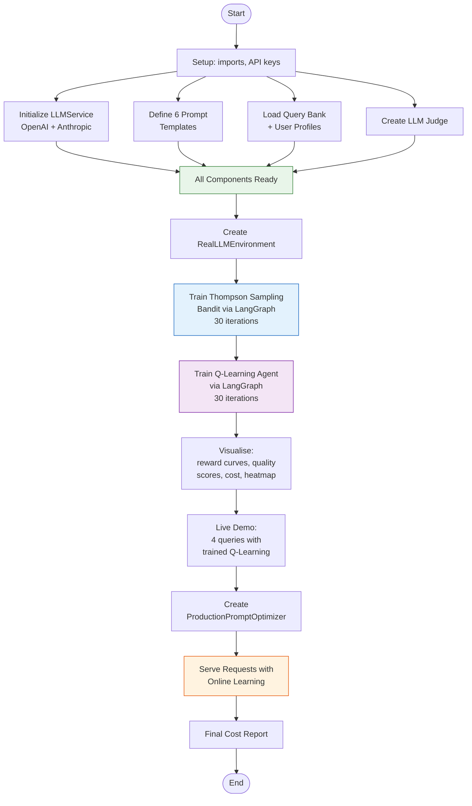
```mermaid
flowchart TB
    Start([Start]) --> Setup[Setup: imports, API keys]

    Setup --> InitLLM[Initialize LLMService<br/>OpenAI + Anthropic]
    Setup --> InitTemplates[Define 6 Prompt<br/>Templates]
    Setup --> InitQueries[Load Query Bank<br/>+ User Profiles]
    Setup --> InitJudge[Create LLM Judge]

    InitLLM --> Ready
    InitTemplates --> Ready
    InitQueries --> Ready
    InitJudge --> Ready

    Ready[All Components Ready] --> Env[Create RealLLMEnvironment]

    Env --> TrainBandit[Train Thompson Sampling<br/>Bandit via LangGraph<br/>30 iterations]
    TrainBandit --> TrainQL[Train Q-Learning Agent<br/>via LangGraph<br/>30 iterations]

    TrainQL --> Visualise[Visualise:<br/>reward curves, quality<br/>scores, cost, heatmap]
    Visualise --> Demo[Live Demo:<br/>4 queries with<br/>trained Q-Learning]

    Demo --> Prod[Create<br/>ProductionPromptOptimizer]
    Prod --> Serve[Serve Requests with<br/>Online Learning]
    Serve --> CostReport[Final Cost Report]
    CostReport --> Done([End])

    style Ready fill:#e8f5e9,stroke:#2e7d32
    style TrainBandit fill:#e3f2fd,stroke:#1565c0
    style TrainQL fill:#f3e5f5,stroke:#7b1fa2
    style Serve fill:#fff3e0,stroke:#e65100
```

**Explanation.** The notebook trains two RL agents sequentially on the same LLM infrastructure. The **Thompson Sampling bandit** learns which *template* works best per query type (a simpler, faster-converging approach). The **Q-Learning agent** searches over the full prompt configuration space (template × tone × detail × chain-of-thought × provider). Both use a LangGraph state machine for orchestration and an LLM-as-Judge for automated reward signals. After training, a `ProductionPromptOptimizer` wraps the trained Q-Learning agent for deployment with optional online learning.

---

## 2. Class Diagrams

### 2.1 Enums and Configuration Types

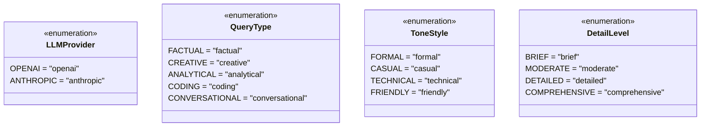
```mermaid
classDiagram
    class LLMProvider {
        <<enumeration>>
        OPENAI = "openai"
        ANTHROPIC = "anthropic"
    }

    class QueryType {
        <<enumeration>>
        FACTUAL = "factual"
        CREATIVE = "creative"
        ANALYTICAL = "analytical"
        CODING = "coding"
        CONVERSATIONAL = "conversational"
    }

    class ToneStyle {
        <<enumeration>>
        FORMAL = "formal"
        CASUAL = "casual"
        TECHNICAL = "technical"
        FRIENDLY = "friendly"
    }

    class DetailLevel {
        <<enumeration>>
        BRIEF = "brief"
        MODERATE = "moderate"
        DETAILED = "detailed"
        COMPREHENSIVE = "comprehensive"
    }
```

**Explanation.** Four enums define the discrete dimensions of the optimization problem. `LLMProvider` selects the backend (OpenAI or Anthropic). `QueryType` categorises incoming queries into five domains — each may benefit from a different prompt strategy. `ToneStyle` and `DetailLevel` control the generated system prompt's writing style and verbosity. Together, these enums form the combinatorial action space explored by the RL agents.

---

### 2.2 Data Models: Templates, Queries, and Profiles

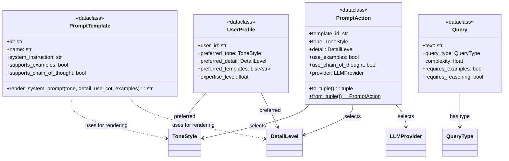
```mermaid
classDiagram
    class PromptTemplate {
        <<dataclass>>
        +id: str
        +name: str
        +system_instruction: str
        +supports_examples: bool
        +supports_chain_of_thought: bool
        +render_system_prompt(tone, detail, use_cot, examples): str
    }

    class Query {
        <<dataclass>>
        +text: str
        +query_type: QueryType
        +complexity: float
        +requires_examples: bool
        +requires_reasoning: bool
    }

    class UserProfile {
        <<dataclass>>
        +user_id: str
        +preferred_tone: ToneStyle
        +preferred_detail: DetailLevel
        +preferred_templates: List~str~
        +expertise_level: float
    }

    class PromptAction {
        <<dataclass>>
        +template_id: str
        +tone: ToneStyle
        +detail: DetailLevel
        +use_examples: bool
        +use_chain_of_thought: bool
        +provider: LLMProvider
        +to_tuple(): tuple
        +from_tuple(t): PromptAction$
    }

    PromptTemplate ..> ToneStyle : uses for rendering
    PromptTemplate ..> DetailLevel : uses for rendering
    Query --> QueryType : has type
    UserProfile --> ToneStyle : preferred
    UserProfile --> DetailLevel : preferred
    PromptAction --> ToneStyle : selects
    PromptAction --> DetailLevel : selects
    PromptAction --> LLMProvider : selects
```

**Explanation.** `PromptTemplate` is the core building block — six templates are defined (standard, expert, teacher, concise, creative, analyst), each with a base system instruction. The `render_system_prompt()` method composes the full prompt by appending tone instructions, detail-level guidelines, optional examples, and optional chain-of-thought instructions. `PromptAction` bundles a complete RL action as a tuple of (template, tone, detail, examples, CoT, provider) — this is what the Q-Learning agent selects. `Query` and `UserProfile` provide the state representation for the RL problem.

---

### 2.3 LLM Service Layer

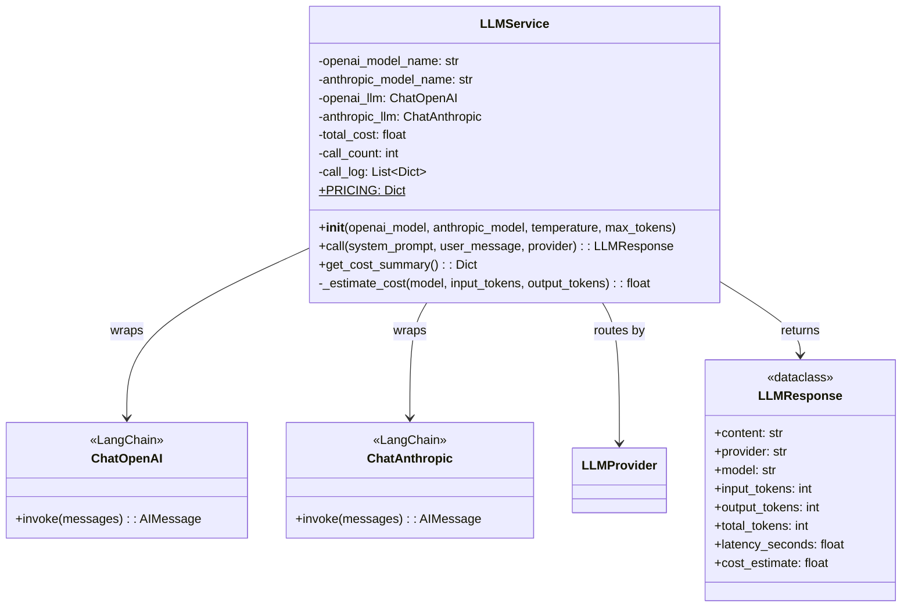
```mermaid
classDiagram
    class LLMService {
        -openai_model_name: str
        -anthropic_model_name: str
        -openai_llm: ChatOpenAI
        -anthropic_llm: ChatAnthropic
        -total_cost: float
        -call_count: int
        -call_log: List~Dict~
        +PRICING: Dict$
        +__init__(openai_model, anthropic_model, temperature, max_tokens)
        +call(system_prompt, user_message, provider): LLMResponse
        +get_cost_summary(): Dict
        -_estimate_cost(model, input_tokens, output_tokens): float
    }

    class LLMResponse {
        <<dataclass>>
        +content: str
        +provider: str
        +model: str
        +input_tokens: int
        +output_tokens: int
        +total_tokens: int
        +latency_seconds: float
        +cost_estimate: float
    }

    class ChatOpenAI {
        <<LangChain>>
        +invoke(messages): AIMessage
    }

    class ChatAnthropic {
        <<LangChain>>
        +invoke(messages): AIMessage
    }

    LLMService --> ChatOpenAI : wraps
    LLMService --> ChatAnthropic : wraps
    LLMService --> LLMProvider : routes by
    LLMService --> LLMResponse : returns
```

**Explanation.** `LLMService` is the unified gateway for all LLM interactions. It holds two pre-configured LangChain chat models and routes calls based on `LLMProvider`. Every call is timed, token-counted, and cost-estimated using a per-model pricing table. The `call_log` list accumulates metadata for every call, enabling the end-of-run cost summary. This class is shared by both the agent execution calls and the judge evaluation calls — so total cost is tracked holistically.

---

### 2.4 LLM-as-Judge Reward Model

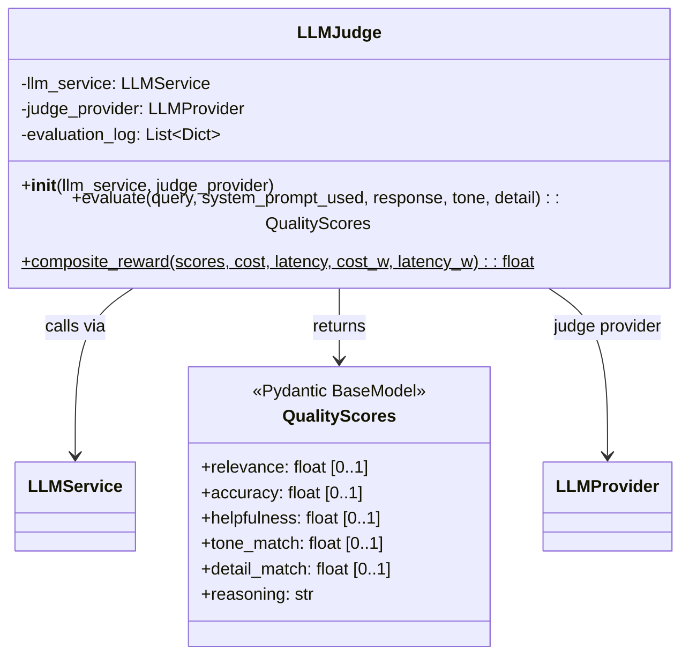
```mermaid
classDiagram
    class QualityScores {
        <<Pydantic BaseModel>>
        +relevance: float [0..1]
        +accuracy: float [0..1]
        +helpfulness: float [0..1]
        +tone_match: float [0..1]
        +detail_match: float [0..1]
        +reasoning: str
    }

    class LLMJudge {
        -llm_service: LLMService
        -judge_provider: LLMProvider
        -evaluation_log: List~Dict~
        +__init__(llm_service, judge_provider)
        +evaluate(query, system_prompt_used, response, tone, detail): QualityScores
        +composite_reward(scores, cost, latency, cost_w, latency_w): float$
    }

    LLMJudge --> LLMService : calls via
    LLMJudge --> QualityScores : returns
    LLMJudge --> LLMProvider : judge provider
```

**Explanation.** The `LLMJudge` class replaces heuristic reward functions with a real LLM evaluation. It sends a structured prompt to the judge LLM requesting JSON output with five quality scores plus a reasoning string. The static `composite_reward()` method combines the mean quality score with normalised penalties for cost (15% weight, reference = $0.002) and latency (5% weight, reference = 4 seconds). Note that the judge scores five dimensions here (relevance, accuracy, helpfulness, tone_match, detail_match), compared to four in the multi-agent notebook — the extra dimensions (`helpfulness`, `tone_match`, `detail_match`) are specific to prompt optimisation.

---

### 2.5 Multi-Armed Bandit Hierarchy

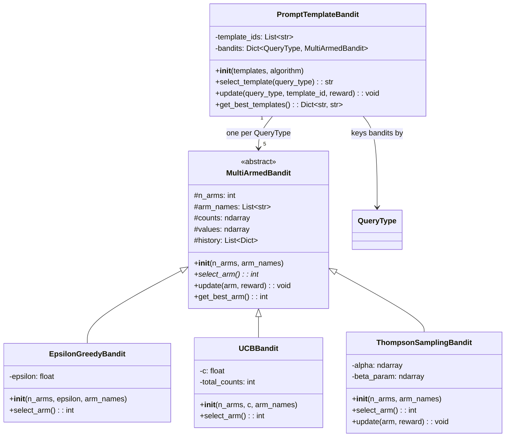
```mermaid
classDiagram
    class MultiArmedBandit {
        <<abstract>>
        #n_arms: int
        #arm_names: List~str~
        #counts: ndarray
        #values: ndarray
        #history: List~Dict~
        +__init__(n_arms, arm_names)
        +select_arm(): int*
        +update(arm, reward): void
        +get_best_arm(): int
    }

    class EpsilonGreedyBandit {
        -epsilon: float
        +__init__(n_arms, epsilon, arm_names)
        +select_arm(): int
    }

    class UCBBandit {
        -c: float
        -total_counts: int
        +__init__(n_arms, c, arm_names)
        +select_arm(): int
    }

    class ThompsonSamplingBandit {
        -alpha: ndarray
        -beta_param: ndarray
        +__init__(n_arms, arm_names)
        +select_arm(): int
        +update(arm, reward): void
    }

    class PromptTemplateBandit {
        -template_ids: List~str~
        -bandits: Dict~QueryType, MultiArmedBandit~
        +__init__(templates, algorithm)
        +select_template(query_type): str
        +update(query_type, template_id, reward): void
        +get_best_templates(): Dict~str, str~
    }

    MultiArmedBandit <|-- EpsilonGreedyBandit
    MultiArmedBandit <|-- UCBBandit
    MultiArmedBandit <|-- ThompsonSamplingBandit

    PromptTemplateBandit "1" --> "5" MultiArmedBandit : one per QueryType
    PromptTemplateBandit --> QueryType : keys bandits by
```

**Explanation.** The bandit hierarchy implements three classic multi-armed bandit algorithms sharing a common interface. `MultiArmedBandit` is an abstract base class with shared bookkeeping (counts, values, history) and an `update()` method using incremental mean estimation. Each subclass overrides `select_arm()`:

- **EpsilonGreedyBandit** explores randomly with probability ε, otherwise exploits the best-known arm.
- **UCBBandit** uses Upper Confidence Bound exploration — it prefers arms with high uncertainty (low visit count), with exploration strength controlled by parameter `c`.
- **ThompsonSamplingBandit** maintains Beta distribution posteriors (α, β) per arm and samples from them — arms with higher reward probability are sampled more often.

`PromptTemplateBandit` is a composite wrapper that maintains **one bandit per query type**, so each query type learns its own template preferences independently. The arms correspond to the 6 prompt templates.

---

### 2.6 Q-Learning Agent

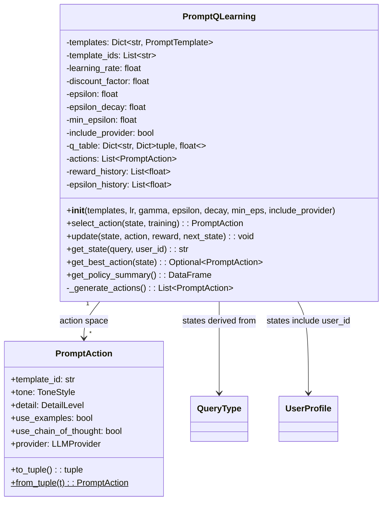
```mermaid
classDiagram
    class PromptQLearning {
        -templates: Dict~str, PromptTemplate~
        -template_ids: List~str~
        -learning_rate: float
        -discount_factor: float
        -epsilon: float
        -epsilon_decay: float
        -min_epsilon: float
        -include_provider: bool
        -q_table: Dict~str, Dict~tuple, float~~
        -actions: List~PromptAction~
        -reward_history: List~float~
        -epsilon_history: List~float~
        +__init__(templates, lr, gamma, epsilon, decay, min_eps, include_provider)
        +select_action(state, training): PromptAction
        +update(state, action, reward, next_state): void
        +get_state(query, user_id): str
        +get_best_action(state): Optional~PromptAction~
        +get_policy_summary(): DataFrame
        -_generate_actions(): List~PromptAction~
    }

    class PromptAction {
        +template_id: str
        +tone: ToneStyle
        +detail: DetailLevel
        +use_examples: bool
        +use_chain_of_thought: bool
        +provider: LLMProvider
        +to_tuple(): tuple
        +from_tuple(t): PromptAction$
    }

    PromptQLearning "1" --> "*" PromptAction : action space
    PromptQLearning --> QueryType : states derived from
    PromptQLearning --> UserProfile : states include user_id
```

**Explanation.** `PromptQLearning` implements tabular Q-Learning over the full prompt configuration space. The state is a string combining `query_type` and optionally `user_id` (e.g., `"factual_tech_expert"`). The action space is generated combinatorially: 6 templates × 4 tones × 4 detail levels × 2 CoT options (filtered by template support) × 2 providers — resulting in roughly 352 possible actions. The Q-table is a nested `defaultdict(defaultdict(float))` mapping state → action-tuple → Q-value. Actions are serialised to/from tuples for use as dictionary keys. The `update()` method applies the standard TD(0) Q-Learning rule with epsilon decay after each step.

---

### 2.7 Real LLM Environment

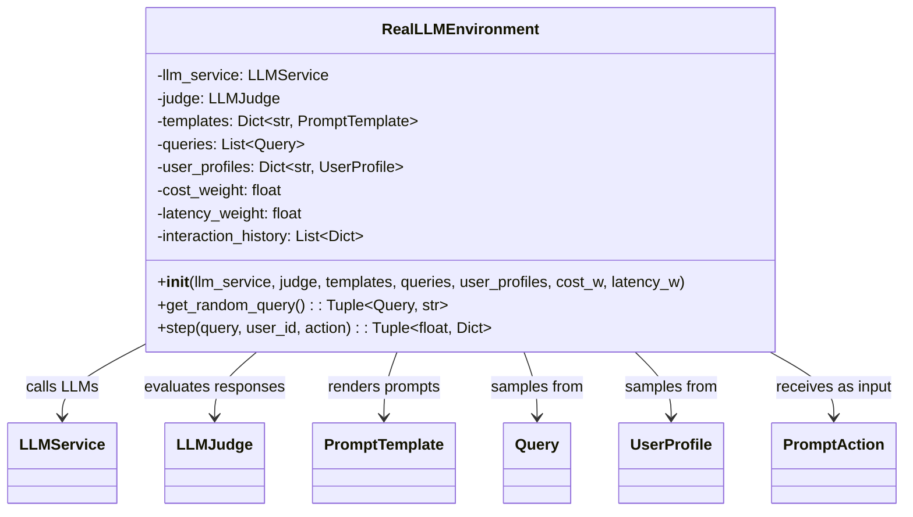
```mermaid
classDiagram
    class RealLLMEnvironment {
        -llm_service: LLMService
        -judge: LLMJudge
        -templates: Dict~str, PromptTemplate~
        -queries: List~Query~
        -user_profiles: Dict~str, UserProfile~
        -cost_weight: float
        -latency_weight: float
        -interaction_history: List~Dict~
        +__init__(llm_service, judge, templates, queries, user_profiles, cost_w, latency_w)
        +get_random_query(): Tuple~Query, str~
        +step(query, user_id, action): Tuple~float, Dict~
    }

    RealLLMEnvironment --> LLMService : calls LLMs
    RealLLMEnvironment --> LLMJudge : evaluates responses
    RealLLMEnvironment --> PromptTemplate : renders prompts
    RealLLMEnvironment --> Query : samples from
    RealLLMEnvironment --> UserProfile : samples from
    RealLLMEnvironment --> PromptAction : receives as input
```

**Explanation.** `RealLLMEnvironment` is the RL environment wrapper that encapsulates the full step cycle: (1) render the system prompt from the RL-selected `PromptAction`, (2) call the real LLM, (3) judge the response with a separate LLM call, and (4) compute the composite reward. It logs every interaction into `interaction_history` for post-training analysis. While defined in the notebook, the LangGraph workflow (`build_rl_workflow`) re-implements this logic as individual graph nodes rather than calling `env.step()` directly — allowing finer-grained state tracking.

---

### 2.8 LangGraph Workflow State

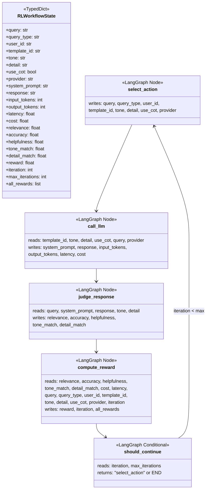
```mermaid
classDiagram
    class RLWorkflowState {
        <<TypedDict>>
        +query: str
        +query_type: str
        +user_id: str
        +template_id: str
        +tone: str
        +detail: str
        +use_cot: bool
        +provider: str
        +system_prompt: str
        +response: str
        +input_tokens: int
        +output_tokens: int
        +latency: float
        +cost: float
        +relevance: float
        +accuracy: float
        +helpfulness: float
        +tone_match: float
        +detail_match: float
        +reward: float
        +iteration: int
        +max_iterations: int
        +all_rewards: list
    }

    class select_action {
        <<LangGraph Node>>
        writes: query, query_type, user_id,
        template_id, tone, detail, use_cot, provider
    }

    class call_llm {
        <<LangGraph Node>>
        reads: template_id, tone, detail, use_cot, query, provider
        writes: system_prompt, response, input_tokens,
        output_tokens, latency, cost
    }

    class judge_response {
        <<LangGraph Node>>
        reads: query, system_prompt, response, tone, detail
        writes: relevance, accuracy, helpfulness,
        tone_match, detail_match
    }

    class compute_reward {
        <<LangGraph Node>>
        reads: relevance, accuracy, helpfulness,
        tone_match, detail_match, cost, latency,
        query, query_type, user_id, template_id,
        tone, detail, use_cot, provider, iteration
        writes: reward, iteration, all_rewards
    }

    class should_continue {
        <<LangGraph Conditional>>
        reads: iteration, max_iterations
        returns: "select_action" or END
    }

    select_action --> call_llm
    call_llm --> judge_response
    judge_response --> compute_reward
    compute_reward --> should_continue
    should_continue --> select_action : iteration < max
```

**Explanation.** `RLWorkflowState` is a `TypedDict` with 22 fields that flows through the LangGraph state machine. Each node reads some fields and writes others — shown above. The state is richer than the multi-agent notebook because prompt optimisation requires tracking the full prompt configuration (template, tone, detail, CoT, provider) and five judge dimensions instead of four. The `all_rewards` list is accumulated in `compute_reward` using the idiomatic LangGraph pattern of constructing a new list (`prev + [reward]`). The `build_rl_workflow()` factory function parameterises the graph by agent type (`"qlearning"` or `"bandit"`), so the same graph topology serves both algorithms.

---

### 2.9 Production Optimizer

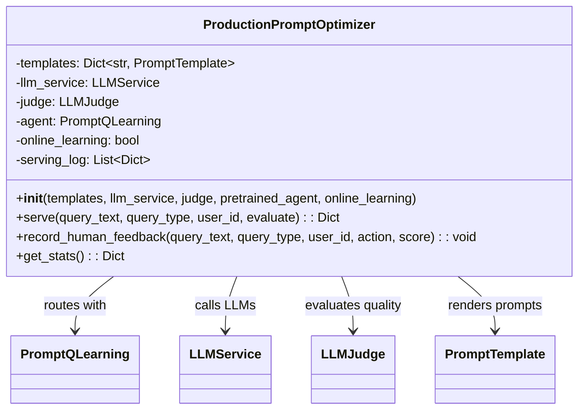
```mermaid
classDiagram
    class ProductionPromptOptimizer {
        -templates: Dict~str, PromptTemplate~
        -llm_service: LLMService
        -judge: LLMJudge
        -agent: PromptQLearning
        -online_learning: bool
        -serving_log: List~Dict~
        +__init__(templates, llm_service, judge, pretrained_agent, online_learning)
        +serve(query_text, query_type, user_id, evaluate): Dict
        +record_human_feedback(query_text, query_type, user_id, action, score): void
        +get_stats(): Dict
    }

    ProductionPromptOptimizer --> PromptQLearning : routes with
    ProductionPromptOptimizer --> LLMService : calls LLMs
    ProductionPromptOptimizer --> LLMJudge : evaluates quality
    ProductionPromptOptimizer --> PromptTemplate : renders prompts
```

**Explanation.** `ProductionPromptOptimizer` is a deployment-ready wrapper that integrates all trained components into a single `serve()` method. Key features:

- **Greedy exploitation**: sets `training=False` on `select_action()` so no random exploration in production.
- **Optional online learning**: if `online_learning=True` and `evaluate=True`, each served request is also judged and the reward is fed back into the Q-table for continuous improvement.
- **Human feedback**: `record_human_feedback()` supports RLHF-style updates — a human can provide an explicit score that directly updates the Q-table.
- **Statistics**: `get_stats()` returns a summary of total requests served, cumulative cost, average latency, and average reward.

---

### 2.10 Full System Relationships

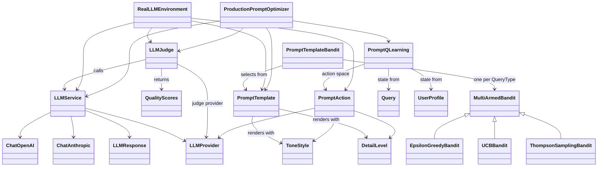
```mermaid
classDiagram
    LLMService --> ChatOpenAI
    LLMService --> ChatAnthropic
    LLMService --> LLMResponse
    LLMService --> LLMProvider

    LLMJudge --> LLMService : calls
    LLMJudge --> QualityScores : returns
    LLMJudge --> LLMProvider : judge provider

    PromptTemplate --> ToneStyle : renders with
    PromptTemplate --> DetailLevel : renders with

    PromptAction --> ToneStyle
    PromptAction --> DetailLevel
    PromptAction --> LLMProvider

    MultiArmedBandit <|-- EpsilonGreedyBandit
    MultiArmedBandit <|-- UCBBandit
    MultiArmedBandit <|-- ThompsonSamplingBandit

    PromptTemplateBandit --> MultiArmedBandit : one per QueryType
    PromptTemplateBandit --> PromptTemplate : selects from

    PromptQLearning --> PromptAction : action space
    PromptQLearning --> Query : state from
    PromptQLearning --> UserProfile : state from

    RealLLMEnvironment --> LLMService
    RealLLMEnvironment --> LLMJudge
    RealLLMEnvironment --> PromptTemplate
    RealLLMEnvironment --> PromptAction

    ProductionPromptOptimizer --> PromptQLearning
    ProductionPromptOptimizer --> LLMService
    ProductionPromptOptimizer --> LLMJudge
    ProductionPromptOptimizer --> PromptTemplate
```

**Explanation.** This diagram shows every dependency in the system. The architecture separates concerns cleanly: `LLMService` handles transport, `PromptTemplate` handles prompt construction, `LLMJudge` handles evaluation, and the RL agents (`PromptTemplateBandit` / `PromptQLearning`) handle decision-making. The bandit operates at the template level only (6 arms), while Q-Learning operates over the full configuration space (~352 actions). Both share the same `LLMService` and `LLMJudge` infrastructure.

---

## 3. Sequence Diagrams

### 3.1 Single Training Iteration (Q-Learning)

One pass through the LangGraph pipeline when `agent_type="qlearning"`.

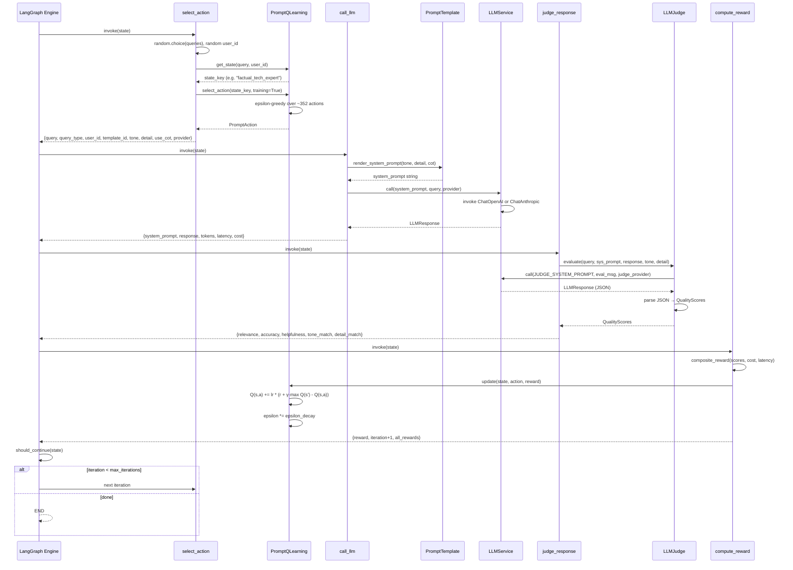
```mermaid
sequenceDiagram
    participant Graph as LangGraph Engine
    participant Select as select_action
    participant QL as PromptQLearning
    participant CallLLM as call_llm
    participant Tmpl as PromptTemplate
    participant LLM as LLMService
    participant JudgeNode as judge_response
    participant Judge as LLMJudge
    participant Reward as compute_reward

    Graph->>Select: invoke(state)
    Select->>Select: random.choice(queries), random user_id
    Select->>QL: get_state(query, user_id)
    QL-->>Select: state_key (e.g. "factual_tech_expert")
    Select->>QL: select_action(state_key, training=True)
    QL->>QL: epsilon-greedy over ~352 actions
    QL-->>Select: PromptAction
    Select-->>Graph: {query, query_type, user_id, template_id, tone, detail, use_cot, provider}

    Graph->>CallLLM: invoke(state)
    CallLLM->>Tmpl: render_system_prompt(tone, detail, cot)
    Tmpl-->>CallLLM: system_prompt string
    CallLLM->>LLM: call(system_prompt, query, provider)
    LLM->>LLM: invoke ChatOpenAI or ChatAnthropic
    LLM-->>CallLLM: LLMResponse
    CallLLM-->>Graph: {system_prompt, response, tokens, latency, cost}

    Graph->>JudgeNode: invoke(state)
    JudgeNode->>Judge: evaluate(query, sys_prompt, response, tone, detail)
    Judge->>LLM: call(JUDGE_SYSTEM_PROMPT, eval_msg, judge_provider)
    LLM-->>Judge: LLMResponse (JSON)
    Judge->>Judge: parse JSON → QualityScores
    Judge-->>JudgeNode: QualityScores
    JudgeNode-->>Graph: {relevance, accuracy, helpfulness, tone_match, detail_match}

    Graph->>Reward: invoke(state)
    Reward->>Reward: composite_reward(scores, cost, latency)
    Reward->>QL: update(state, action, reward)
    QL->>QL: Q(s,a) += lr * (r + γ·max Q(s') - Q(s,a))
    QL->>QL: epsilon *= epsilon_decay
    Reward-->>Graph: {reward, iteration+1, all_rewards}

    Graph->>Graph: should_continue(state)
    alt iteration < max_iterations
        Graph->>Select: next iteration
    else done
        Graph-->>Graph: END
    end
```

**Explanation.** Each Q-Learning training iteration makes exactly **two real LLM API calls**: one in `call_llm` (the agent generating a response) and one inside `judge_response` (the judge evaluating it). The Q-Learning agent's state combines query type and user ID, while the action is a full `PromptAction` tuple. After computing the composite reward, the Q-table is updated with the TD(0) rule and epsilon is decayed. The LangGraph engine manages state merging between nodes automatically.

---

### 3.2 Single Training Iteration (Bandit)

One pass through the LangGraph pipeline when `agent_type="bandit"`.

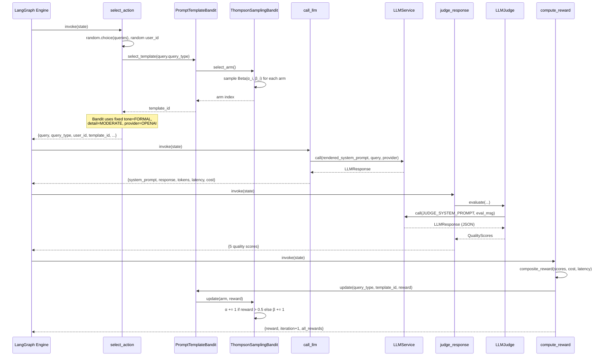
```mermaid
sequenceDiagram
    participant Graph as LangGraph Engine
    participant Select as select_action
    participant Bandit as PromptTemplateBandit
    participant TS as ThompsonSamplingBandit
    participant CallLLM as call_llm
    participant LLM as LLMService
    participant JudgeNode as judge_response
    participant Judge as LLMJudge
    participant Reward as compute_reward

    Graph->>Select: invoke(state)
    Select->>Select: random.choice(queries), random user_id
    Select->>Bandit: select_template(query.query_type)
    Bandit->>TS: select_arm()
    TS->>TS: sample Beta(α_i, β_i) for each arm
    TS-->>Bandit: arm index
    Bandit-->>Select: template_id
    Note over Select: Bandit uses fixed tone=FORMAL,<br/>detail=MODERATE, provider=OPENAI
    Select-->>Graph: {query, query_type, user_id, template_id, ...}

    Graph->>CallLLM: invoke(state)
    CallLLM->>LLM: call(rendered_system_prompt, query, provider)
    LLM-->>CallLLM: LLMResponse
    CallLLM-->>Graph: {system_prompt, response, tokens, latency, cost}

    Graph->>JudgeNode: invoke(state)
    JudgeNode->>Judge: evaluate(...)
    Judge->>LLM: call(JUDGE_SYSTEM_PROMPT, eval_msg)
    LLM-->>Judge: LLMResponse (JSON)
    Judge-->>JudgeNode: QualityScores
    JudgeNode-->>Graph: {5 quality scores}

    Graph->>Reward: invoke(state)
    Reward->>Reward: composite_reward(scores, cost, latency)
    Reward->>Bandit: update(query_type, template_id, reward)
    Bandit->>TS: update(arm, reward)
    TS->>TS: α += 1 if reward > 0.5 else β += 1
    Reward-->>Graph: {reward, iteration+1, all_rewards}
```

**Explanation.** The bandit pathway is simpler: it only selects the *template* (6 options), using fixed defaults for tone, detail, and provider. Thompson Sampling maintains Beta-distribution posteriors per arm. After each reward, the posterior is updated: rewards above 0.5 increment α (successes), below 0.5 increment β (failures). The bandit has one separate instance per query type, so template preferences are learned independently for factual vs. creative vs. coding queries, etc.

---

### 3.3 LLM Service Call

Detail of a single `LLMService.call()` invocation.

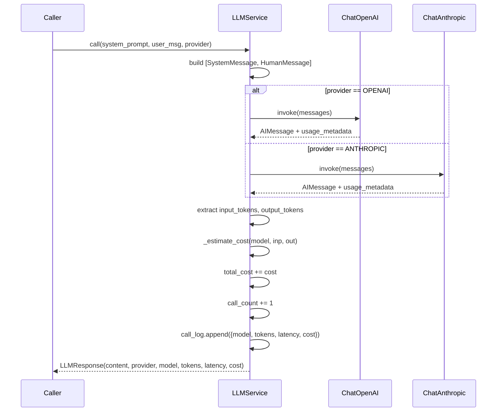
```mermaid
sequenceDiagram
    participant Caller
    participant Service as LLMService
    participant OAI as ChatOpenAI
    participant ANT as ChatAnthropic

    Caller->>Service: call(system_prompt, user_msg, provider)
    Service->>Service: build [SystemMessage, HumanMessage]

    alt provider == OPENAI
        Service->>OAI: invoke(messages)
        OAI-->>Service: AIMessage + usage_metadata
    else provider == ANTHROPIC
        Service->>ANT: invoke(messages)
        ANT-->>Service: AIMessage + usage_metadata
    end

    Service->>Service: extract input_tokens, output_tokens
    Service->>Service: _estimate_cost(model, inp, out)
    Service->>Service: total_cost += cost
    Service->>Service: call_count += 1
    Service->>Service: call_log.append({model, tokens, latency, cost})

    Service-->>Caller: LLMResponse(content, provider, model, tokens, latency, cost)
```

**Explanation.** The service abstracts away provider differences. It measures wall-clock latency, extracts token counts from the response metadata, and computes a USD cost estimate using per-model pricing tables. The `call_log` list grows with every call and powers the cumulative cost report at the end of the notebook. Max tokens is set to 512 for this notebook (vs 768 in the multi-agent notebook) to keep costs lower during prompt-optimisation exploration.

---

### 3.4 LLM-as-Judge Evaluation

Detail of how `LLMJudge.evaluate()` scores a response.

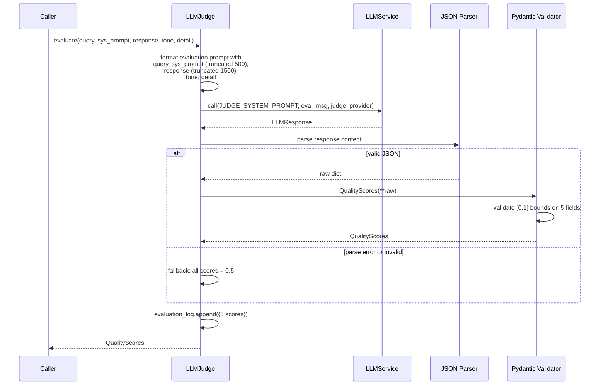
```mermaid
sequenceDiagram
    participant Caller
    participant Judge as LLMJudge
    participant Service as LLMService
    participant Parser as JSON Parser
    participant Validator as Pydantic Validator

    Caller->>Judge: evaluate(query, sys_prompt, response, tone, detail)
    Judge->>Judge: format evaluation prompt with<br/>query, sys_prompt (truncated 500),<br/>response (truncated 1500),<br/>tone, detail

    Judge->>Service: call(JUDGE_SYSTEM_PROMPT, eval_msg, judge_provider)
    Service-->>Judge: LLMResponse

    Judge->>Parser: parse response.content

    alt valid JSON
        Parser-->>Judge: raw dict
        Judge->>Validator: QualityScores(**raw)
        Validator->>Validator: validate [0,1] bounds on 5 fields
        Validator-->>Judge: QualityScores
    else parse error or invalid
        Judge->>Judge: fallback: all scores = 0.5
    end

    Judge->>Judge: evaluation_log.append({5 scores})
    Judge-->>Caller: QualityScores
```

**Explanation.** The judge prompt includes the original query, the system prompt that was used (truncated to 500 chars), the AI response (truncated to 1500 chars), and the requested tone/detail level. This gives the judge full context to evaluate tone-match and detail-match in addition to relevance, accuracy, and helpfulness. If the LLM returns malformed JSON, all five scores default to 0.5 — a neutral signal that prevents training from crashing on rare parse failures.

---

### 3.5 Prompt Template Rendering

How `PromptTemplate.render_system_prompt()` builds the final prompt string.

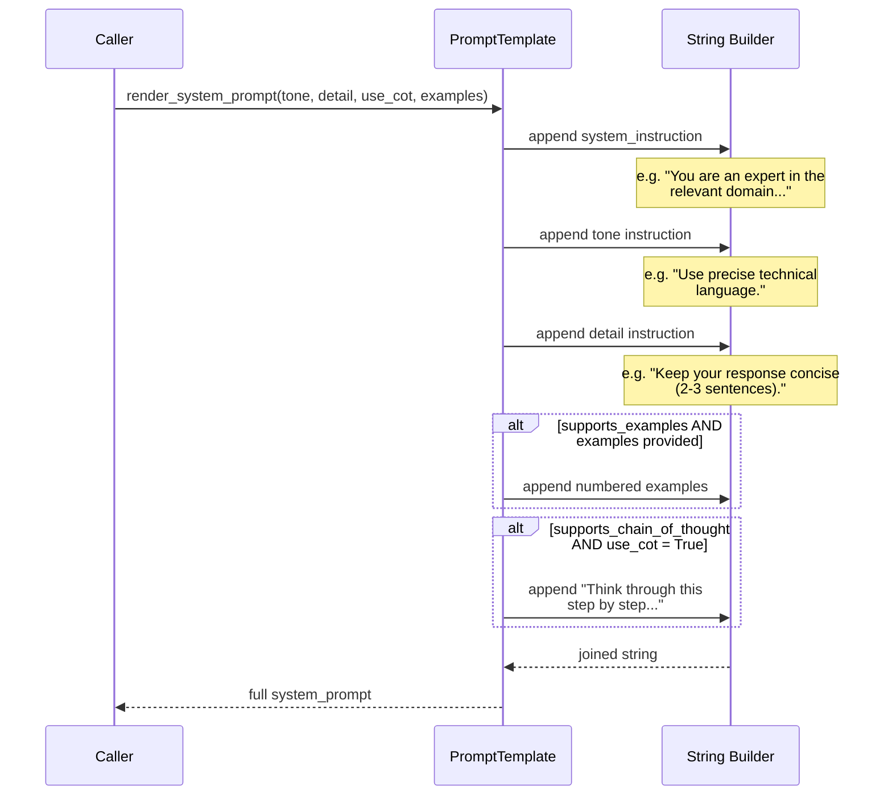
```mermaid
sequenceDiagram
    participant Caller
    participant Tmpl as PromptTemplate
    participant Builder as String Builder

    Caller->>Tmpl: render_system_prompt(tone, detail, use_cot, examples)

    Tmpl->>Builder: append system_instruction
    Note over Builder: e.g. "You are an expert in the<br/>relevant domain..."

    Tmpl->>Builder: append tone instruction
    Note over Builder: e.g. "Use precise technical<br/>language."

    Tmpl->>Builder: append detail instruction
    Note over Builder: e.g. "Keep your response concise<br/>(2-3 sentences)."

    alt supports_examples AND examples provided
        Tmpl->>Builder: append numbered examples
    end

    alt supports_chain_of_thought AND use_cot = True
        Tmpl->>Builder: append "Think through this<br/>step by step..."
    end

    Builder-->>Tmpl: joined string
    Tmpl-->>Caller: full system_prompt
```

**Explanation.** The rendering is fully compositional: the base instruction defines the agent persona, then tone and detail modifiers are appended, followed by optional few-shot examples and chain-of-thought instructions. Not all templates support CoT — the `concise` template has `supports_chain_of_thought=False`, which means the RL agent can never select CoT for that template. This constraint is enforced at action-generation time in `PromptQLearning._generate_actions()`.

---

### 3.6 Production Serve with Online Learning

End-to-end flow of `ProductionPromptOptimizer.serve()`.

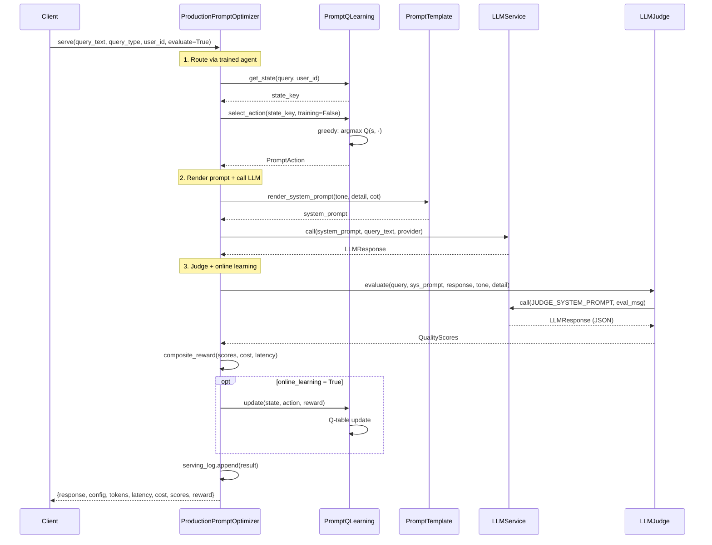
```mermaid
sequenceDiagram
    participant Client
    participant Prod as ProductionPromptOptimizer
    participant QL as PromptQLearning
    participant Tmpl as PromptTemplate
    participant LLM as LLMService
    participant Judge as LLMJudge

    Client->>Prod: serve(query_text, query_type, user_id, evaluate=True)

    Note over Prod: 1. Route via trained agent
    Prod->>QL: get_state(query, user_id)
    QL-->>Prod: state_key
    Prod->>QL: select_action(state_key, training=False)
    QL->>QL: greedy: argmax Q(s, ·)
    QL-->>Prod: PromptAction

    Note over Prod: 2. Render prompt + call LLM
    Prod->>Tmpl: render_system_prompt(tone, detail, cot)
    Tmpl-->>Prod: system_prompt
    Prod->>LLM: call(system_prompt, query_text, provider)
    LLM-->>Prod: LLMResponse

    Note over Prod: 3. Judge + online learning
    Prod->>Judge: evaluate(query, sys_prompt, response, tone, detail)
    Judge->>LLM: call(JUDGE_SYSTEM_PROMPT, eval_msg)
    LLM-->>Judge: LLMResponse (JSON)
    Judge-->>Prod: QualityScores
    Prod->>Prod: composite_reward(scores, cost, latency)

    opt online_learning = True
        Prod->>QL: update(state, action, reward)
        QL->>QL: Q-table update
    end

    Prod->>Prod: serving_log.append(result)
    Prod-->>Client: {response, config, tokens, latency, cost, scores, reward}
```

**Explanation.** In production, the agent always acts greedily (`training=False`). Each served request can optionally be judged (costing one extra LLM call), and the resulting reward is fed back into the Q-table for continuous improvement. The `record_human_feedback()` method (not shown) allows explicit human scores to be used instead of or in addition to the LLM judge, enabling RLHF-style updates.

---

## 4. LangGraph Workflow Flowchart

The four-node state machine built by `build_rl_workflow()`.

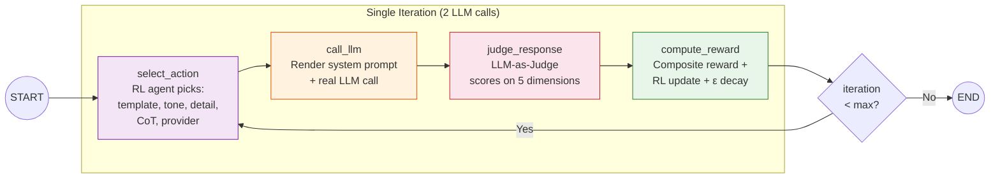
```mermaid
flowchart LR
    START((START)) --> select_action

    subgraph iteration["Single Iteration (2 LLM calls)"]
        select_action["select_action<br/>RL agent picks:<br/>template, tone, detail,<br/>CoT, provider"]
        call_llm["call_llm<br/>Render system prompt<br/>+ real LLM call"]
        judge_response["judge_response<br/>LLM-as-Judge<br/>scores on 5 dimensions"]
        compute_reward["compute_reward<br/>Composite reward +<br/>RL update + ε decay"]

        select_action --> call_llm
        call_llm --> judge_response
        judge_response --> compute_reward
    end

    compute_reward --> check{iteration<br/>< max?}
    check -->|Yes| select_action
    check -->|No| STOP((END))

    style select_action fill:#f3e5f5,stroke:#7b1fa2
    style call_llm fill:#fff3e0,stroke:#e65100
    style judge_response fill:#fce4ec,stroke:#c62828
    style compute_reward fill:#e8f5e9,stroke:#2e7d32
```

**Explanation.** The LangGraph `StateGraph` compiles into a four-node pipeline with a conditional edge at the end. This is parametric: the same graph topology works for both bandit and Q-Learning agents — the difference is which RL agent is called inside `select_action` and `compute_reward`. The `build_rl_workflow()` factory function accepts an `agent_type` parameter to switch behaviour. Each iteration produces exactly 2 LLM API calls.

---

## 5. RL Training Pipeline Flowchart

Complete training procedure including both algorithms and post-training analysis.

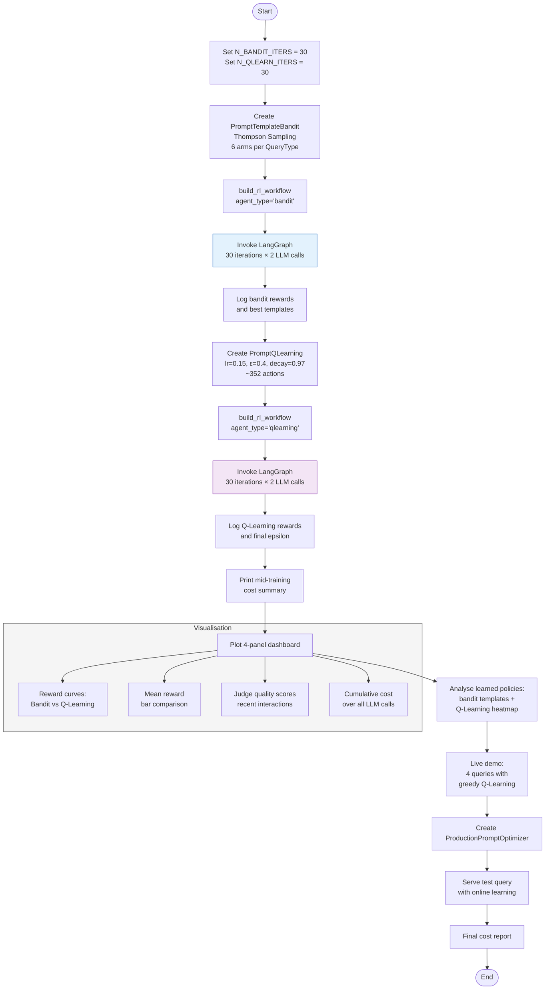
```mermaid
flowchart TD
    Start([Start]) --> Config[Set N_BANDIT_ITERS = 30<br/>Set N_QLEARN_ITERS = 30]

    Config --> CreateBandit[Create PromptTemplateBandit<br/>Thompson Sampling<br/>6 arms per QueryType]
    CreateBandit --> BuildBanditGraph[build_rl_workflow<br/>agent_type='bandit']
    BuildBanditGraph --> RunBandit[Invoke LangGraph<br/>30 iterations × 2 LLM calls]
    RunBandit --> BanditDone[Log bandit rewards<br/>and best templates]

    BanditDone --> CreateQL[Create PromptQLearning<br/>lr=0.15, ε=0.4, decay=0.97<br/>~352 actions]
    CreateQL --> BuildQLGraph[build_rl_workflow<br/>agent_type='qlearning']
    BuildQLGraph --> RunQL[Invoke LangGraph<br/>30 iterations × 2 LLM calls]
    RunQL --> QLDone[Log Q-Learning rewards<br/>and final epsilon]

    QLDone --> CostMid[Print mid-training<br/>cost summary]
    CostMid --> Viz[Plot 4-panel dashboard]

    subgraph Visualisation
        Viz --> V1[Reward curves:<br/>Bandit vs Q-Learning]
        Viz --> V2[Mean reward<br/>bar comparison]
        Viz --> V3[Judge quality scores<br/>recent interactions]
        Viz --> V4[Cumulative cost<br/>over all LLM calls]
    end

    Viz --> Policy[Analyse learned policies:<br/>bandit templates +<br/>Q-Learning heatmap]
    Policy --> Demo[Live demo:<br/>4 queries with<br/>greedy Q-Learning]
    Demo --> ProdCreate[Create ProductionPromptOptimizer]
    ProdCreate --> ProdTest[Serve test query<br/>with online learning]
    ProdTest --> FinalCost[Final cost report]
    FinalCost --> Done([End])

    style RunBandit fill:#e3f2fd,stroke:#1565c0
    style RunQL fill:#f3e5f5,stroke:#7b1fa2
    style Visualisation fill:#f5f5f5,stroke:#616161
```

**Explanation.** The training pipeline trains two algorithms sequentially (bandit first, then Q-Learning), sharing the same `LLMService` and `LLMJudge` instances. This means cost tracking is cumulative across both training runs. After training, the notebook compares both algorithms on a 4-panel dashboard, analyses the learned policies (bandit's best-template map and Q-Learning's full configuration heatmap), runs a live demo with 4 diverse queries, and finally creates a production wrapper for deployment.

---

## 6. Q-Learning Action Selection Flowchart

How `PromptQLearning.select_action()` chooses a prompt configuration.

```mermaid
flowchart TD
    Input([Receive query +<br/>user_id]) --> State[Compute state key<br/>e.g. 'factual_tech_expert']

    State --> Training{training<br/>mode?}

    Training -->|No| Lookup

    Training -->|Yes| Sample[Sample r ~ U(0, 1)]
    Sample --> Explore{r < epsilon?}

    Explore -->|Yes: Explore| Random[Select random<br/>PromptAction from<br/>~352 options]
    Explore -->|No: Exploit| Lookup[Look up<br/>Q-table for state]

    Lookup --> HasEntries{Q-table has<br/>entries for state?}
    HasEntries -->|No| Random
    HasEntries -->|Yes| ArgMax[Select action tuple<br/>with highest Q-value]

    Random --> Decode[Decode PromptAction:<br/>template, tone, detail,<br/>CoT, provider]
    ArgMax --> Decode

    Decode --> Return([Return PromptAction])

    style Explore fill:#fff3e0,stroke:#e65100
    style Random fill:#e3f2fd,stroke:#1565c0
    style ArgMax fill:#e8f5e9,stroke:#2e7d32
```

**Explanation.** The action space is much larger than in the multi-agent notebook (~352 vs 8 actions). During training, epsilon starts at 0.4 and decays by 0.97 per iteration. In production (`training=False`), the agent always exploits. If the Q-table has no entries for a state (cold start), a random action is selected even in exploit mode. This ensures graceful handling of unseen state-query combinations.

---

## 7. Thompson Sampling Decision Flowchart

How `ThompsonSamplingBandit.select_arm()` chooses a template.

```mermaid
flowchart TD
    Input([Receive query_type]) --> Lookup[Get bandit instance<br/>for this QueryType]

    Lookup --> Sample["For each arm i (6 templates):<br/>sample θ_i ~ Beta(α_i, β_i)"]

    Sample --> Pick[Select arm with<br/>highest θ_i sample]

    Pick --> Template[Map arm index<br/>to template_id]

    Template --> Return([Return template_id])

    subgraph After Reward
        Reward([Receive reward]) --> Check{reward > 0.5?}
        Check -->|Yes| IncAlpha["α_arm += 1<br/>(more successes)"]
        Check -->|No| IncBeta["β_arm += 1<br/>(more failures)"]
    end

    style Sample fill:#e3f2fd,stroke:#1565c0
    style Pick fill:#e8f5e9,stroke:#2e7d32
    style IncAlpha fill:#e8f5e9,stroke:#2e7d32
    style IncBeta fill:#fce4ec,stroke:#c62828
```

**Explanation.** Thompson Sampling is a Bayesian exploration strategy. Each arm (template) has a Beta posterior parameterised by (α, β), initialised to Beta(1, 1) = Uniform. At each step, a sample is drawn from each arm's posterior, and the arm with the highest sample is chosen. After observing a reward, the posterior is updated: reward > 0.5 is treated as a "success" (α += 1), otherwise a "failure" (β += 1). This naturally balances exploration and exploitation — uncertain arms get explored, high-quality arms get exploited.

---

## 8. Prompt Configuration Space Flowchart

Visualisation of the combinatorial action space explored by Q-Learning.

```mermaid
flowchart TD
    Action([PromptAction]) --> T[Template<br/>6 options]
    Action --> Tone[ToneStyle<br/>4 options]
    Action --> Detail[DetailLevel<br/>4 options]
    Action --> CoT[Chain of Thought<br/>2 options*]
    Action --> Prov[Provider<br/>2 options]

    T --> T1[standard]
    T --> T2[expert]
    T --> T3[teacher]
    T --> T4[concise*]
    T --> T5[creative]
    T --> T6[analyst]

    Tone --> FORMAL
    Tone --> CASUAL
    Tone --> TECHNICAL
    Tone --> FRIENDLY

    Detail --> BRIEF
    Detail --> MODERATE
    Detail --> DETAILED
    Detail --> COMPREHENSIVE

    CoT --> CoTTrue[True]
    CoT --> CoTFalse[False]

    Prov --> OpenAI
    Prov --> Anthropic

    Note1["*concise template does not<br/>support CoT → only False<br/>Total: 5×(4×4×2×2) + 1×(4×4×1×2)<br/>= 320 + 32 = 352 actions"]

    style T fill:#e3f2fd,stroke:#1565c0
    style Tone fill:#f3e5f5,stroke:#7b1fa2
    style Detail fill:#fff3e0,stroke:#e65100
    style CoT fill:#fce4ec,stroke:#c62828
    style Prov fill:#e8f5e9,stroke:#2e7d32
```

**Explanation.** The Q-Learning action space is the Cartesian product of all prompt dimensions, with the constraint that the `concise` template disallows chain-of-thought. This produces 352 unique configurations. The bandit, by contrast, only optimises the template dimension (6 options) with fixed defaults for all other dimensions — making it much faster to converge but less expressive.

---

## 9. Reward Computation Flowchart

How the composite reward is computed from 5 judge scores, API cost, and latency.

```mermaid
flowchart TD
    Input([Judge returns QualityScores]) --> Extract[Extract 5 scores:<br/>relevance, accuracy,<br/>helpfulness, tone_match,<br/>detail_match]

    Extract --> Quality["quality = mean of 5 scores"]

    Input2([LLM response metadata]) --> Cost["norm_cost = min(cost / 0.002, 1.0)"]
    Input2 --> Latency["norm_latency = min(latency / 4.0, 1.0)"]

    Quality --> Combine["raw = quality<br/>− 0.15 × norm_cost<br/>− 0.05 × norm_latency"]
    Cost --> Combine
    Latency --> Combine

    Combine --> Clip["reward = clip(raw, 0, 1)"]
    Clip --> Return([Return scalar reward])

    style Quality fill:#e8f5e9,stroke:#2e7d32
    style Cost fill:#fce4ec,stroke:#c62828
    style Latency fill:#fff3e0,stroke:#e65100
    style Clip fill:#e3f2fd,stroke:#1565c0
```

**Explanation.** The composite reward uses five quality dimensions (vs four in the multi-agent notebook). Cost is penalised more heavily here (15% weight vs 10%) because prompt optimisation has a wider cost range — verbose prompts with chain-of-thought and comprehensive detail can cost significantly more than concise ones. Latency is normalised against 4 seconds (vs 5 seconds in the multi-agent notebook). The final reward is clipped to [0, 1] so Q-values remain bounded.

---

## 10. State Machine Diagrams

### 10.1 Training State Machine

```mermaid
stateDiagram-v2
    [*] --> Setup

    Setup --> Initialized : LLMService + Templates + Judge ready

    state BanditTraining {
        [*] --> BSelectAction
        BSelectAction --> BCallLLM : template selected
        BCallLLM --> BJudge : response received
        BJudge --> BComputeReward : scores computed
        BComputeReward --> BCheck : posterior updated

        BCheck --> BSelectAction : iteration < 30
        BCheck --> [*] : done
    }

    Initialized --> BanditTraining : build bandit workflow

    state QLearningTraining {
        [*] --> QSelectAction
        QSelectAction --> QCallLLM : full config selected
        QCallLLM --> QJudge : response received
        QJudge --> QComputeReward : scores computed
        QComputeReward --> QCheck : Q-table updated

        QCheck --> QSelectAction : iteration < 30
        QCheck --> [*] : done
    }

    BanditTraining --> QLearningTraining : build Q-Learning workflow

    QLearningTraining --> Visualisation : final states returned
    Visualisation --> PolicyAnalysis : plots rendered
    PolicyAnalysis --> LiveDemo : heatmaps rendered
    LiveDemo --> ProductionSetup : 4 demo queries served
    ProductionSetup --> [*] : optimizer created
```

**Explanation.** Training proceeds through two complete LangGraph execution cycles. The bandit training loop runs first (30 iterations), learning template preferences per query type. Then the Q-Learning training loop runs (30 iterations), learning full prompt configurations. Both loops share the same infrastructure. After training, the notebook enters a post-training phase with visualisation, policy analysis, live demo, and production setup.

---

### 10.2 Production State Machine

```mermaid
stateDiagram-v2
    [*] --> Ready

    Ready --> Routing : serve() called

    Routing --> PromptBuilding : PromptAction selected (greedy)
    PromptBuilding --> Executing : system prompt rendered
    Executing --> ResponseReady : LLM response received

    ResponseReady --> EvalCheck : check evaluate flag

    state EvalCheck {
        [*] --> Check
        Check --> Judging : evaluate = True
        Check --> SkipJudge : evaluate = False
    }

    state Judging {
        [*] --> JudgeLLM
        JudgeLLM --> Scoring : judge scores parsed
        Scoring --> OnlineUpdate : reward computed

        state OnlineUpdate {
            [*] --> LearningCheck
            LearningCheck --> UpdateQ : online_learning = True
            LearningCheck --> SkipUpdate : online_learning = False
            UpdateQ --> [*]
            SkipUpdate --> [*]
        }

        OnlineUpdate --> [*]
    }

    EvalCheck --> Logging : evaluation complete or skipped
    Logging --> Ready : result returned to caller

    state HumanFeedback {
        [*] --> ReceiveFeedback
        ReceiveFeedback --> DirectUpdate : record_human_feedback()
        DirectUpdate --> [*] : Q-table updated
    }

    Ready --> HumanFeedback : external feedback received
    HumanFeedback --> Ready
```

**Explanation.** The production optimizer supports three modes of operation: (1) serve-only (evaluate=False) — cheapest, just one LLM call; (2) serve + auto-evaluate (evaluate=True, online_learning=True) — two LLM calls with continuous improvement; (3) human feedback — `record_human_feedback()` injects explicit scores directly into the Q-table without any LLM call, supporting RLHF-style training loops.

---

## 11. Data Flow Diagram

How data moves through the system from query bank to final outputs.

```mermaid
flowchart LR
    subgraph Inputs
        QB[(Query Bank<br/>11 queries)]
        UP[(User Profiles<br/>4 profiles)]
        PT[(Prompt Templates<br/>6 templates)]
        AK[API Keys<br/>OpenAI + Anthropic]
    end

    subgraph Processing
        Bandit[Thompson Sampling<br/>Bandit]
        QL[Q-Learning<br/>Agent]
        LS[LLM Service]
        JD[LLM Judge]
        TR[Template<br/>Renderer]

        QB --> Bandit
        QB --> QL
        UP --> QL
        PT --> TR
        TR --> LS
        AK --> LS
        LS --> JD
        JD --> Bandit
        JD --> QL
    end

    subgraph State
        BP[(Beta Posteriors<br/>5 × 6 matrix)]
        QT[(Q-Table<br/>state→action→value)]
        CL[(Call Log<br/>all LLM calls)]
        EL[(Evaluation Log<br/>all judge scores)]

        Bandit --> BP
        QL --> QT
        LS --> CL
        JD --> EL
    end

    subgraph Outputs
        RC[Reward Curves<br/>Bandit vs Q-Learning]
        QH[Q-Table Heatmap<br/>template × query_type]
        BT[Best Templates<br/>per query type]
        CC[Cumulative Cost<br/>Chart]
        LR2[Live Responses<br/>Demo + Production]

        BP --> BT
        QT --> QH
        CL --> CC
        QL --> RC
        Bandit --> RC
        LS --> LR2
    end

    style Inputs fill:#e3f2fd,stroke:#1565c0
    style Processing fill:#fff3e0,stroke:#e65100
    style State fill:#f3e5f5,stroke:#7b1fa2
    style Outputs fill:#e8f5e9,stroke:#2e7d32
```

**Explanation.** Data flows from left to right: inputs (queries, profiles, templates, API keys) feed into the processing layer (two RL agents sharing the same LLM service and judge). The processing layer writes into persistent state (Beta posteriors for the bandit, Q-table for Q-Learning, cumulative call log, and evaluation log). State drives the outputs: the bandit produces a best-template map, Q-Learning produces a configuration heatmap, the call log produces a cost chart, and both agents produce reward curves for comparison.

---

## 12. Component Interaction Overview

Birds-eye view of how all components connect across training and production.

```mermaid
graph TB
    subgraph Core["Core Infrastructure"]
        LLMSvc[LLMService<br/>OpenAI + Anthropic]
        Judge[LLMJudge<br/>5-Dimension Scorer]
        Templates[PromptTemplate Pool<br/>6 templates]
    end

    subgraph Data["Data Layer"]
        Queries[(Query Bank)]
        Profiles[(User Profiles)]
        Enums[QueryType, ToneStyle,<br/>DetailLevel, LLMProvider]
    end

    subgraph RL_Agents["RL Agents"]
        Bandit[PromptTemplateBandit<br/>Thompson Sampling]
        QLAgent[PromptQLearning<br/>Q-Learning]
        BanditState[(Beta Posteriors<br/>α, β per arm)]
        QLState[(Q-Table<br/>state→action→value)]

        Bandit --> BanditState
        QLAgent --> QLState
    end

    subgraph Training["Training (LangGraph)"]
        N1[select_action]
        N2[call_llm]
        N3[judge_response]
        N4[compute_reward]
        N1 --> N2 --> N3 --> N4
        N4 -.->|loop| N1
    end

    subgraph Production["Production"]
        Prod[ProductionPromptOptimizer]
        OnlineLearning[Online Q-table Updates]
        RLHF[Human Feedback Path]
    end

    subgraph Outputs["Outputs"]
        Dashboard[Training Dashboard]
        Heatmap[Q-Table Heatmap]
        CostReport[Cost Report]
        LiveResp[Live Responses]
    end

    Queries --> N1
    Profiles --> N1
    Templates --> N2
    Enums --> N1

    N1 --> Bandit
    N1 --> QLAgent
    N2 --> LLMSvc
    N3 --> Judge
    Judge --> LLMSvc
    N4 --> Bandit
    N4 --> QLAgent

    QLAgent --> Prod
    Templates --> Prod
    LLMSvc --> Prod
    Judge --> Prod
    Prod --> OnlineLearning
    OnlineLearning --> QLAgent
    Prod --> RLHF
    RLHF --> QLAgent

    QLState --> Heatmap
    N4 --> Dashboard
    LLMSvc --> CostReport
    Prod --> LiveResp

    style Core fill:#e3f2fd,stroke:#1565c0
    style Data fill:#f3e5f5,stroke:#7b1fa2
    style RL_Agents fill:#fff3e0,stroke:#e65100
    style Training fill:#fce4ec,stroke:#c62828
    style Production fill:#e8f5e9,stroke:#2e7d32
    style Outputs fill:#fff9c4,stroke:#f57f17
```

---

## Summary

These diagrams provide a comprehensive view of the `prompt_optimization/agentic_rl_workflow_LLM_calls.ipynb` architecture:

| Diagram Type | What It Shows | Count |
|---|---|---|
| **Flowcharts** | System overview, training pipeline, LangGraph pipeline, Q-Learning decision, Thompson Sampling decision, prompt config space, reward computation | 7 |
| **Class Diagrams** | Enums, data models, LLM service, LLM judge, bandit hierarchy, Q-Learning, environment, LangGraph state, production optimizer, full relationships | 10 |
| **Sequence Diagrams** | Q-Learning training iteration, bandit training iteration, LLM call, judge evaluation, prompt rendering, production serve | 6 |
| **State Machine Diagrams** | Training lifecycle (dual-algorithm), production lifecycle (3 modes) | 2 |
| **Data Flow / Interaction** | End-to-end data flow, component interaction overview | 2 |

Key architectural properties of this notebook:

- **Dual RL algorithm comparison**: Thompson Sampling bandit (simple, fast convergence on 6-arm template selection) vs. Q-Learning (richer ~352-action configuration space)
- **2 LLM calls per iteration**: one for the response, one for the judge — identical cost structure for both algorithms
- **5-dimension quality evaluation**: relevance, accuracy, helpfulness, tone_match, detail_match
- **Compositional prompt rendering**: template × tone × detail × CoT × examples, all cleanly separated
- **Parametric LangGraph factory**: `build_rl_workflow()` produces the same graph topology for both bandit and Q-Learning
- **Three production modes**: serve-only, serve+auto-evaluate+online-learn, and explicit human feedback (RLHF)
- **Cost-aware optimisation**: larger cost penalty weight (15%) naturally pushes toward efficient configurations

All diagrams use Mermaid syntax and render in any compatible viewer (GitHub, GitLab, VS Code, Jupyter, etc.).
